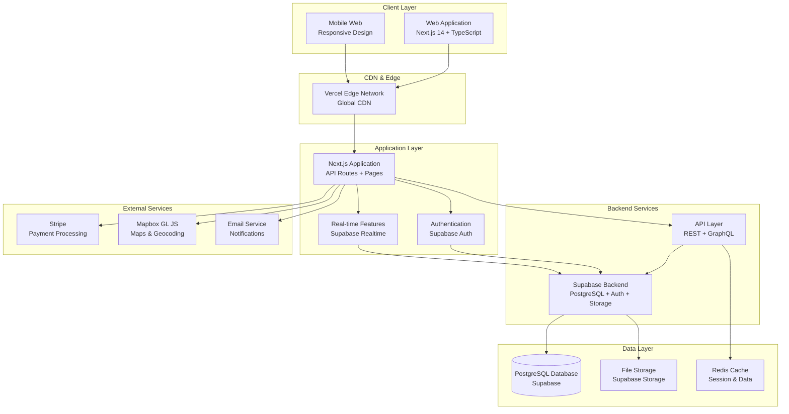
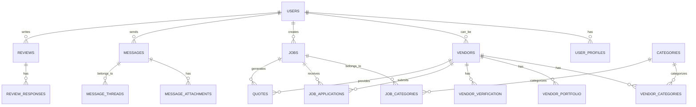
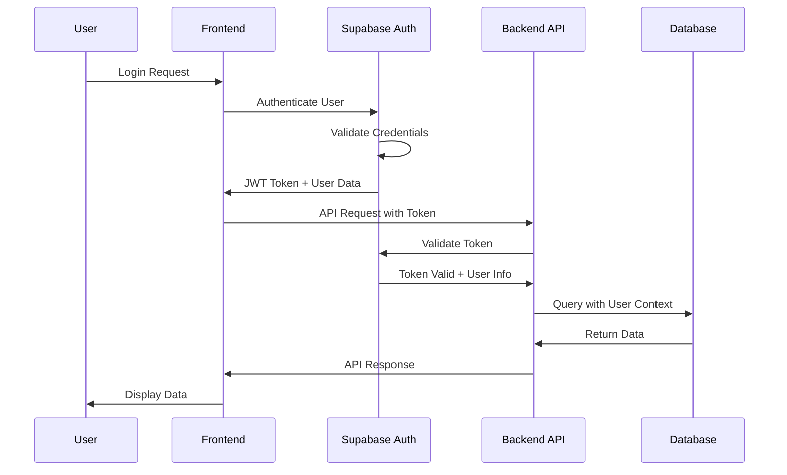
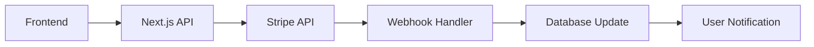
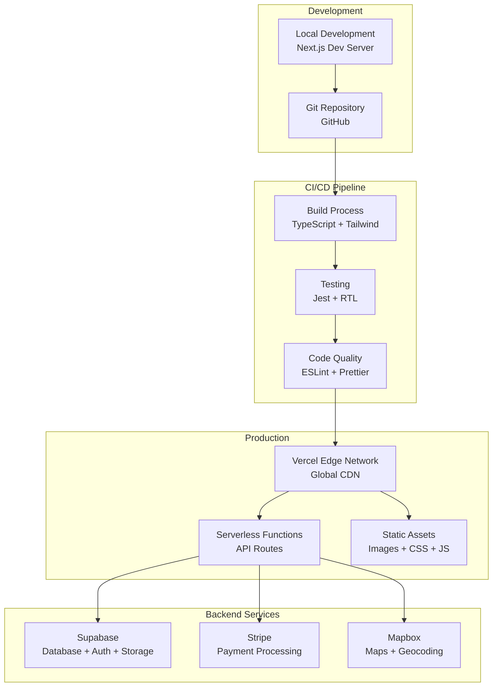

# Event Pros NZ System Architecture

## Table of Contents

1. [System Overview](#system-overview)
2. [High-Level Architecture](#high-level-architecture)
3. [Database Schema & Data Models](#database-schema--data-models)
4. [API Architecture](#api-architecture)
5. [Authentication & Authorization](#authentication--authorization)
6. [External Service Integrations](#external-service-integrations)
7. [Deployment & Infrastructure](#deployment--infrastructure)
8. [Security & Compliance](#security--compliance)
9. [Performance & Scalability](#performance--scalability)
10. [Monitoring & Maintenance](#monitoring--maintenance)

---

## System Overview

### Purpose

Event Pros NZ is a comprehensive marketplace platform connecting event organizers with trusted, vetted event service providers across New Zealand. The system facilitates discovery, evaluation, booking, and communication between vendors and event organizers through a centralized, mobile-first platform.

### Key Business Goals

- Create New Zealand's premier event professional directory platform
- Connect event organizers with trusted, vetted event service providers
- Streamline the event planning process through centralized discovery and booking
- Establish a sustainable revenue model through tiered vendor subscriptions
- Launch MVP within 2 months with 100+ vendors and 500+ event organizers
- Achieve 80% vendor booking success rate within 6 months

### Core Capabilities

- **Vendor Discovery**: Searchable directory with location-based and category filtering
- **Profile Management**: Comprehensive vendor profiles with portfolios and verification
- **Job Management**: Event organizers can post requirements and manage applications
- **Communication**: Real-time messaging between organizers and vendors
- **Payment Processing**: Subscription management and payment handling via Stripe
- **Trust & Safety**: Verification system, reviews, and safety features
- **Mobile-First**: Fully responsive design optimized for mobile event planning

### Technology Stack

- **Frontend**: Next.js 14 with TypeScript and Tailwind CSS
- **Backend**: Supabase (PostgreSQL, Authentication, Real-time subscriptions)
- **External Services**: Stripe (payments), Mapbox GL JS (mapping)
- **Deployment**: Vercel with zero-config deployment
- **Testing**: Jest and React Testing Library

---

## High-Level Architecture

### System Architecture Diagram



### Architecture Principles

#### 1. **Mobile-First Design**

- Responsive design optimized for mobile devices
- Touch-friendly interfaces and interactions
- Progressive Web App (PWA) capabilities
- Offline functionality for core features

#### 2. **Microservices-Ready Monolith**

- Next.js full-stack application as starting point
- Modular architecture enabling future microservices extraction
- Clear separation of concerns between layers
- API-first design for external integrations

#### 3. **Real-Time Capabilities**

- Supabase real-time subscriptions for messaging
- Live updates for notifications and status changes
- WebSocket connections for instant communication
- Event-driven architecture for system updates

#### 4. **Security by Design**

- End-to-end encryption for sensitive data
- Role-based access control (RBAC)
- Input validation and sanitization
- PCI DSS compliance for payment processing

#### 5. **Performance Optimization**

- Edge computing with Vercel
- Image optimization and lazy loading
- Code splitting and bundle optimization
- Caching strategies at multiple layers

#### 6. **Scalability Considerations**

- Horizontal scaling capabilities
- Database indexing for search performance
- CDN distribution for global reach
- Load balancing for high availability

### System Components

#### Frontend Layer

- **Next.js 14 Application**: Full-stack React application with TypeScript
- **Tailwind CSS**: Utility-first CSS framework for responsive design
- **Component Library**: Reusable UI components with design system
- **State Management**: React Context and hooks for state management
- **Routing**: Next.js App Router for client-side navigation

#### Backend Layer

- **Supabase Backend**: PostgreSQL database with built-in authentication
- **API Routes**: Next.js API routes for server-side logic
- **Real-time Subscriptions**: WebSocket connections for live updates
- **File Storage**: Supabase Storage for images and documents
- **Database Functions**: PostgreSQL functions for complex queries

#### External Services

- **Stripe**: Payment processing and subscription management
- **Mapbox GL JS**: Interactive mapping and geocoding services
- **Email Service**: Transactional and marketing email delivery
- **Analytics**: User behavior and performance tracking

#### Infrastructure

- **Vercel**: Hosting, deployment, and edge computing
- **Supabase**: Database, authentication, and real-time features
- **CDN**: Global content delivery for optimal performance
- **Monitoring**: Application performance and error tracking

### Data Flow

#### 1. **User Authentication Flow**

```
User Login → Supabase Auth → JWT Token → Client Storage → API Authorization
```

#### 2. **Vendor Discovery Flow**

```
Search Query → API Route → Database Query → Filtered Results → Client Display
```

#### 3. **Real-Time Messaging Flow**

```
Message Send → API Route → Database Insert → Real-time Subscription → Recipient Update
```

#### 4. **Payment Processing Flow**

```
Payment Request → Stripe API → Webhook → Database Update → User Notification
```

### System Boundaries

#### Internal Components

- Next.js application and API routes
- Supabase database and authentication
- File storage and real-time features
- Internal caching and session management

#### External Dependencies

- Stripe payment processing
- Mapbox mapping services
- Email delivery services
- Third-party analytics tools

#### Integration Points

- RESTful APIs for external services
- Webhook endpoints for service callbacks
- OAuth flows for third-party authentication
- Real-time WebSocket connections

---

## Database Schema & Data Models

### Database Technology

- **Primary Database**: PostgreSQL via Supabase
- **Features**: Full-text search, JSON support, real-time subscriptions
- **Security**: Row Level Security (RLS) policies
- **Performance**: Optimized indexing for search operations

### Core Entity Relationships



### Core Tables Overview

#### 1. Users & Authentication

- **auth.users**: Managed by Supabase Auth (id, email, password, etc.)
- **user_profiles**: Extended user information with roles and preferences
- **Roles**: organizer, vendor, admin

#### 2. Vendors & Business Information

- **vendors**: Business profiles with subscription tiers
- **vendor_categories**: Many-to-many relationship with service categories
- **vendor_portfolio**: Image galleries and work samples
- **vendor_verification**: Trust and safety verification documents

#### 3. Jobs & Applications

- **jobs**: Event organizer job postings
- **job_applications**: Vendor responses to job postings
- **quotes**: Detailed pricing and service proposals

#### 4. Communication

- **message_threads**: Conversation threads between users
- **messages**: Individual messages with attachments
- **file_attachments**: Shared files and documents

#### 5. Reviews & Trust

- **reviews**: Multi-dimensional rating system
- **review_responses**: Vendor responses to reviews

#### 6. Subscriptions & Payments

- **subscriptions**: Stripe subscription management
- **payment_transactions**: Payment history and tracking

### Key Database Features

#### Full-Text Search

- PostgreSQL full-text search for vendor and job discovery
- Optimized indexes for search performance
- Location-based search with PostGIS extensions

#### Real-Time Capabilities

- Supabase real-time subscriptions for messaging
- Live updates for notifications and status changes
- WebSocket connections for instant communication

#### Security & Access Control

- Row Level Security (RLS) policies for data protection
- Role-based access control (RBAC)
- Encrypted sensitive data storage

#### Performance Optimization

- Strategic indexing for search operations
- Query optimization for large datasets
- Caching strategies for frequently accessed data

_[Detailed table schemas and implementation details will be added in subsequent iterations]_

---

## API Architecture

### API Design Principles

#### 1. **RESTful Design**

- Consistent HTTP methods and status codes
- Resource-based URL structure
- Stateless communication
- JSON request/response format

#### 2. **Authentication & Authorization**

- JWT tokens for API authentication
- Role-based access control (RBAC)
- Rate limiting and request validation
- Secure headers and CORS configuration

#### 3. **Performance & Scalability**

- Response caching strategies
- Pagination for large datasets
- Request/response compression
- Database query optimization

#### 4. **Error Handling**

- Consistent error response format
- Appropriate HTTP status codes
- Detailed error messages for debugging
- Client-friendly error descriptions

### API Structure

#### Base Configuration

```typescript
// API Base Configuration
const API_CONFIG = {
  baseUrl: process.env.NEXT_PUBLIC_API_URL || "/api",
  version: "v1",
  timeout: 30000,
  retries: 3,
};

// Response Format
interface ApiResponse<T> {
  success: boolean;
  data?: T;
  error?: {
    code: string;
    message: string;
    details?: any;
  };
  meta?: {
    pagination?: PaginationMeta;
    timestamp: string;
  };
}
```

### Core API Endpoints

#### 1. Authentication Endpoints

```typescript
// Authentication Routes
POST / api / auth / register; // User registration
POST / api / auth / login; // User login
POST / api / auth / logout; // User logout
POST / api / auth / refresh; // Token refresh
POST / api / auth / forgot - password; // Password reset request
POST / api / auth / reset - password; // Password reset confirmation
GET / api / auth / me; // Get current user
PUT / api / auth / me; // Update user profile
```

#### 2. Vendor Management Endpoints

```typescript
// Vendor Discovery
GET    /api/vendors                // List vendors with filters
GET    /api/vendors/search         // Search vendors
GET    /api/vendors/:id            // Get vendor details
GET    /api/vendors/:id/portfolio  // Get vendor portfolio
GET    /api/vendors/:id/reviews    // Get vendor reviews

// Vendor Management (Authenticated)
POST   /api/vendors                // Create vendor profile
PUT    /api/vendors/:id            // Update vendor profile
DELETE /api/vendors/:id            // Delete vendor profile
POST   /api/vendors/:id/portfolio  // Upload portfolio images
PUT    /api/vendors/:id/portfolio/:imageId  // Update portfolio image
DELETE /api/vendors/:id/portfolio/:imageId  // Delete portfolio image
```

#### 3. Job Management Endpoints

```typescript
// Job Discovery
GET    /api/jobs                   // List jobs with filters
GET    /api/jobs/search            // Search jobs
GET    /api/jobs/:id               // Get job details
GET    /api/jobs/:id/applications  // Get job applications (organizer only)

// Job Management (Organizer)
POST   /api/jobs                   // Create job posting
PUT    /api/jobs/:id               // Update job posting
DELETE /api/jobs/:id               // Delete job posting
POST   /api/jobs/:id/publish       // Publish job
POST   /api/jobs/:id/close         // Close job

// Job Applications (Vendor)
POST   /api/jobs/:id/apply         // Apply to job
PUT    /api/applications/:id       // Update application
DELETE /api/applications/:id       // Withdraw application
GET    /api/applications           // Get vendor's applications
```

#### 4. Messaging Endpoints

```typescript
// Message Threads
GET    /api/messages/threads       // List message threads
POST   /api/messages/threads       // Create new thread
GET    /api/messages/threads/:id   // Get thread details
PUT    /api/messages/threads/:id   // Update thread (mark as read)

// Messages
GET    /api/messages/threads/:id/messages  // Get thread messages
POST   /api/messages/threads/:id/messages  // Send message
PUT    /api/messages/:id           // Update message
DELETE /api/messages/:id           // Delete message
POST   /api/messages/:id/read      // Mark message as read
```

#### 5. Review & Rating Endpoints

```typescript
// Reviews
GET    /api/reviews                // List reviews
GET    /api/reviews/vendor/:id     // Get vendor reviews
POST   /api/reviews                // Create review
PUT    /api/reviews/:id            // Update review
DELETE /api/reviews/:id            // Delete review

// Review Responses
POST   /api/reviews/:id/response   // Respond to review
PUT    /api/review-responses/:id   // Update response
DELETE /api/review-responses/:id   // Delete response
```

#### 6. Subscription & Payment Endpoints

```typescript
// Subscriptions
GET    /api/subscriptions          // Get user subscriptions
POST   /api/subscriptions          // Create subscription
PUT    /api/subscriptions/:id      // Update subscription
DELETE /api/subscriptions/:id      // Cancel subscription
POST   /api/subscriptions/:id/upgrade  // Upgrade subscription

// Payments
GET    /api/payments               // Get payment history
POST   /api/payments               // Process payment
GET    /api/payments/:id           // Get payment details
POST   /api/payments/:id/refund    // Process refund
```

### API Request/Response Examples

#### Vendor Search Request

```typescript
// GET /api/vendors/search
interface VendorSearchRequest {
  query?: string;
  categories?: string[];
  location?: {
    lat: number;
    lng: number;
    radius: number; // in km
  };
  priceRange?: "budget" | "moderate" | "premium" | "luxury";
  rating?: number; // minimum rating
  availability?: {
    startDate: string;
    endDate: string;
  };
  pagination?: {
    page: number;
    limit: number;
  };
  sortBy?: "relevance" | "rating" | "distance" | "price";
}

// Response
interface VendorSearchResponse {
  success: true;
  data: {
    vendors: Vendor[];
    total: number;
    page: number;
    limit: number;
    hasMore: boolean;
  };
  meta: {
    pagination: {
      page: number;
      limit: number;
      total: number;
      totalPages: number;
    };
    timestamp: string;
  };
}
```

#### Job Creation Request

```typescript
// POST /api/jobs
interface JobCreationRequest {
  title: string;
  description: string;
  eventType:
    | "wedding"
    | "corporate"
    | "birthday"
    | "anniversary"
    | "conference"
    | "seminar"
    | "party"
    | "celebration"
    | "other";
  eventDate: string; // ISO date
  eventEndDate?: string;
  eventTime?: string; // ISO time
  eventDurationHours?: number;
  guestCount: number;
  budgetMin: number;
  budgetMax: number;
  location: {
    address: string;
    city: string;
    region: string;
    coordinates: {
      lat: number;
      lng: number;
    };
  };
  categories: string[]; // Service category IDs
  specialRequirements?: string;
  contactPreferences: {
    email: boolean;
    phone: boolean;
    preferredTime?: string;
  };
  applicationDeadline?: string; // ISO datetime
  isUrgent?: boolean;
}
```

### API Middleware & Utilities

#### Authentication Middleware

```typescript
// Authentication middleware
export async function authenticateRequest(
  req: NextRequest
): Promise<AuthUser | null> {
  const token = req.headers.get("authorization")?.replace("Bearer ", "");
  if (!token) return null;

  try {
    const {
      data: { user },
      error,
    } = await supabase.auth.getUser(token);
    if (error) throw error;
    return user;
  } catch (error) {
    console.error("Authentication error:", error);
    return null;
  }
}

// Role-based access control
export function requireRole(roles: string[]) {
  return (req: NextRequest, user: AuthUser) => {
    if (!roles.includes(user.role)) {
      throw new Error("Insufficient permissions");
    }
  };
}
```

#### Rate Limiting

```typescript
// Rate limiting configuration
const rateLimits = {
  "/api/auth/login": { requests: 5, window: "15m" },
  "/api/vendors/search": { requests: 100, window: "1h" },
  "/api/messages": { requests: 200, window: "1h" },
  "/api/reviews": { requests: 10, window: "1h" },
  default: { requests: 1000, window: "1h" },
};
```

#### Error Handling

```typescript
// Standardized error responses
export class ApiError extends Error {
  constructor(
    public statusCode: number,
    public code: string,
    message: string,
    public details?: any
  ) {
    super(message);
  }
}

// Error response format
export function createErrorResponse(error: ApiError): ApiResponse<null> {
  return {
    success: false,
    error: {
      code: error.code,
      message: error.message,
      details: error.details,
    },
    meta: {
      timestamp: new Date().toISOString(),
    },
  };
}
```

### Real-Time API Features

#### WebSocket Endpoints

```typescript
// Real-time messaging
ws://api.eventprosnz.com/messages/:threadId
// Real-time notifications
ws://api.eventprosnz.com/notifications/:userId
// Real-time job updates
ws://api.eventprosnz.com/jobs/:jobId
```

#### Supabase Real-time Subscriptions

```typescript
// Real-time message updates
const messageSubscription = supabase
  .channel("messages")
  .on(
    "postgres_changes",
    {
      event: "INSERT",
      schema: "public",
      table: "messages",
      filter: `thread_id=eq.${threadId}`,
    },
    (payload) => {
      // Handle new message
    }
  )
  .subscribe();
```

### API Documentation

#### OpenAPI Specification

- Comprehensive API documentation using OpenAPI 3.0
- Interactive API explorer (Swagger UI)
- Request/response examples
- Authentication requirements
- Error code documentation

#### API Versioning

- URL-based versioning: `/api/v1/`
- Backward compatibility maintenance
- Deprecation notices for old versions
- Migration guides for breaking changes

### Performance Considerations

#### Caching Strategy

```typescript
// Redis caching for frequently accessed data
const cacheConfig = {
  "vendors:search": { ttl: 300 }, // 5 minutes
  categories: { ttl: 3600 }, // 1 hour
  "user:profile": { ttl: 1800 }, // 30 minutes
  "jobs:public": { ttl: 600 }, // 10 minutes
};
```

#### Database Query Optimization

- Efficient database queries with proper indexing
- Connection pooling for database connections
- Query result caching
- Pagination for large datasets

#### Response Compression

- Gzip compression for API responses
- Image optimization and compression
- Minification of JSON responses
- CDN integration for static assets

This API architecture provides a comprehensive, scalable, and maintainable foundation for the Event Pros NZ platform, supporting all functional requirements while ensuring optimal performance and security.

---

## Authentication & Authorization

### Authentication Architecture

#### 1. **Supabase Auth Integration**

- **Primary Provider**: Supabase Auth for user management
- **JWT Tokens**: Secure token-based authentication
- **Session Management**: Automatic token refresh and validation
- **Multi-Factor Authentication**: Optional 2FA support

#### 2. **Authentication Flow**



### User Roles & Permissions

#### 1. **Role Hierarchy**

- **ADMIN**: Platform administrators with full access
- **ORGANIZER**: Event organizers who create jobs and contact vendors
- **VENDOR**: Service providers who respond to jobs and manage profiles

#### 2. **Permission Matrix**

- **Vendor Permissions**: Profile management, job applications, portfolio management
- **Organizer Permissions**: Job creation, vendor contact, booking management
- **Admin Permissions**: User management, content moderation, platform analytics

### Security Features

#### 1. **Password Security**

- Minimum 8 characters with complexity requirements
- Password strength validation
- Secure password hashing via Supabase

#### 2. **Session Management**

- Short-lived access tokens (1 hour)
- Long-lived refresh tokens (30 days)
- Automatic token refresh
- Session invalidation on logout

#### 3. **Rate Limiting**

- Login attempts: 5 per 15 minutes
- Registration: 3 per hour
- Password reset: 3 per hour
- Progressive blocking for repeated failures

### Multi-Factor Authentication (MFA)

#### 1. **TOTP Support**

- Time-based One-Time Password (TOTP)
- QR code generation for authenticator apps
- Backup codes for account recovery

#### 2. **MFA Enforcement**

- Optional for organizers and vendors
- Required for admin accounts
- Grace period for MFA setup

### Social Authentication

#### 1. **OAuth Providers**

- Google OAuth integration
- Facebook OAuth integration
- Seamless account linking

#### 2. **Account Linking**

- Link social accounts to existing profiles
- Merge account data when linking
- Prevent duplicate account creation

### Security Monitoring

#### 1. **Login Attempt Tracking**

- Monitor failed login attempts
- IP address tracking
- User agent analysis
- Geographic location monitoring

#### 2. **Suspicious Activity Detection**

- Unusual login patterns
- Multiple failed attempts
- Account takeover prevention
- Automated security alerts

_[Detailed implementation code and advanced security features will be added in subsequent iterations]_

---

## External Service Integrations

### Integration Overview

The Event Pros NZ platform integrates with several external services to provide comprehensive functionality. Each integration is designed to be modular, secure, and maintainable.

### 1. Stripe Payment Processing

#### **Purpose**

- Subscription management for vendor tiers
- Payment processing for premium features
- Revenue tracking and analytics
- Webhook handling for payment events

#### **Integration Architecture**



#### **Key Features**

- **Subscription Tiers**: Essential (Free), Showcase ($29/month), Spotlight ($99/month)
- **Payment Methods**: Credit cards, bank transfers, digital wallets
- **Webhook Processing**: Real-time payment status updates
- **Tax Handling**: NZ GST compliance
- **Refund Management**: Automated and manual refund processing

#### **Implementation**

```typescript
// Stripe configuration
const stripeConfig = {
  publishableKey: process.env.NEXT_PUBLIC_STRIPE_PUBLISHABLE_KEY,
  secretKey: process.env.STRIPE_SECRET_KEY,
  webhookSecret: process.env.STRIPE_WEBHOOK_SECRET,
  currency: "nzd",
  taxRate: 0.15, // NZ GST
};

// Create subscription
export async function createSubscription(customerId: string, priceId: string) {
  const subscription = await stripe.subscriptions.create({
    customer: customerId,
    items: [{ price: priceId }],
    payment_behavior: "default_incomplete",
    payment_settings: { save_default_payment_method: "on_subscription" },
    expand: ["latest_invoice.payment_intent"],
  });

  return subscription;
}
```

### 2. Mapbox GL JS Integration

#### **Purpose**

- Interactive vendor location mapping
- Geocoding and address validation
- Location-based search and filtering
- Route planning and distance calculations

#### **Integration Features**

- **Interactive Maps**: Custom map styling with vendor pins
- **Geocoding API**: Address to coordinates conversion
- **Search API**: Location-based vendor discovery
- **Directions API**: Route planning for vendors
- **Clustering**: Pin clustering for dense areas

#### **Implementation**

```typescript
// Mapbox configuration
const mapboxConfig = {
  accessToken: process.env.NEXT_PUBLIC_MAPBOX_ACCESS_TOKEN,
  style: "mapbox://styles/mapbox/streets-v11",
  center: [174.7762, -41.2865], // Wellington, NZ
  zoom: 6,
};

// Geocoding service
export async function geocodeAddress(address: string) {
  const response = await fetch(
    `https://api.mapbox.com/geocoding/v5/mapbox.places/${encodeURIComponent(
      address
    )}.json?access_token=${mapboxConfig.accessToken}&country=nz`
  );

  const data = await response.json();
  return data.features[0]?.geometry.coordinates;
}
```

### 3. Email Service Integration

#### **Purpose**

- Transactional email delivery
- User notifications and alerts
- Marketing communications
- System-generated emails

#### **Service Options**

- **Primary**: SendGrid for transactional emails
- **Backup**: Supabase Edge Functions for simple emails
- **Marketing**: Mailchimp for newsletter campaigns

#### **Email Types**

- **Authentication**: Welcome emails, password reset, email verification
- **Notifications**: New messages, job applications, review notifications
- **Marketing**: Newsletter, feature updates, promotional content
- **System**: Error alerts, admin notifications, maintenance notices

#### **Implementation**

```typescript
// Email service configuration
const emailConfig = {
  sendgrid: {
    apiKey: process.env.SENDGRID_API_KEY,
    fromEmail: "noreply@eventprosnz.com",
    fromName: "Event Pros NZ",
  },
  templates: {
    welcome: "d-1234567890",
    passwordReset: "d-1234567891",
    newMessage: "d-1234567892",
  },
};

// Send transactional email
export async function sendEmail(to: string, templateId: string, data: any) {
  const response = await fetch("https://api.sendgrid.com/v3/mail/send", {
    method: "POST",
    headers: {
      Authorization: `Bearer ${emailConfig.sendgrid.apiKey}`,
      "Content-Type": "application/json",
    },
    body: JSON.stringify({
      personalizations: [
        {
          to: [{ email: to }],
          dynamic_template_data: data,
        },
      ],
      from: {
        email: emailConfig.sendgrid.fromEmail,
        name: emailConfig.sendgrid.fromName,
      },
      template_id: templateId,
    }),
  });

  return response.ok;
}
```

### 4. File Storage Integration

#### **Purpose**

- Vendor portfolio image storage
- Document uploads (insurance certificates, business licenses)
- File sharing between users
- Image optimization and resizing

#### **Storage Solution**

- **Primary**: Supabase Storage for all file types
- **CDN**: Vercel Edge Network for global delivery
- **Image Processing**: On-the-fly resizing and optimization

#### **File Categories**

- **Portfolio Images**: Vendor work samples and galleries
- **Profile Photos**: User avatars and business logos
- **Documents**: Verification documents and contracts
- **Attachments**: Message attachments and shared files

#### **Implementation**

```typescript
// File upload service
export async function uploadFile(file: File, bucket: string, path: string) {
  const { data, error } = await supabase.storage
    .from(bucket)
    .upload(path, file, {
      cacheControl: "3600",
      upsert: false,
    });

  if (error) throw error;

  // Get public URL
  const { data: urlData } = supabase.storage.from(bucket).getPublicUrl(path);

  return {
    path: data.path,
    url: urlData.publicUrl,
  };
}
```

### 5. Analytics & Monitoring Integration

#### **Purpose**

- User behavior tracking
- Performance monitoring
- Error tracking and debugging
- Business intelligence and reporting

#### **Services**

- **Google Analytics 4**: User behavior and conversion tracking
- **Sentry**: Error tracking and performance monitoring
- **Hotjar**: User session recordings and heatmaps
- **Vercel Analytics**: Core Web Vitals and performance metrics

#### **Implementation**

```typescript
// Analytics configuration
const analyticsConfig = {
  googleAnalytics: {
    measurementId: process.env.NEXT_PUBLIC_GA_MEASUREMENT_ID,
  },
  sentry: {
    dsn: process.env.NEXT_PUBLIC_SENTRY_DSN,
    environment: process.env.NODE_ENV,
  },
};

// Track custom events
export function trackEvent(eventName: string, parameters: any) {
  if (typeof window !== "undefined" && window.gtag) {
    window.gtag("event", eventName, parameters);
  }
}
```

### 6. SMS Service Integration

#### **Purpose**

- Two-factor authentication codes
- Critical notifications
- Emergency communications
- Marketing messages (opt-in)

#### **Service Provider**

- **Primary**: Twilio for SMS delivery
- **Backup**: Supabase Edge Functions with alternative provider

#### **SMS Types**

- **Authentication**: 2FA codes and verification
- **Notifications**: Urgent alerts and reminders
- **Marketing**: Promotional messages (with consent)
- **System**: Admin alerts and monitoring

### 7. Business Verification Services

#### **Purpose**

- NZ business registration verification
- Identity document validation
- Insurance certificate verification
- Professional license validation

#### **Integration Points**

- **NZ Companies Office API**: Business registration lookup
- **Document Verification**: OCR and validation services
- **Insurance Verification**: Certificate authenticity checks

### Integration Security

#### **API Key Management**

- Environment variable storage
- Key rotation policies
- Access logging and monitoring
- Secure key distribution

#### **Webhook Security**

- Signature verification
- IP whitelisting
- Rate limiting
- Error handling and retry logic

#### **Data Privacy**

- GDPR compliance
- Data encryption in transit
- Secure data storage
- User consent management

### Error Handling & Resilience

#### **Circuit Breaker Pattern**

- Automatic service degradation
- Fallback mechanisms
- Service health monitoring
- Graceful error handling

#### **Retry Logic**

- Exponential backoff
- Maximum retry attempts
- Dead letter queues
- Error notification systems

#### **Monitoring & Alerting**

- Service health checks
- Performance monitoring
- Error rate tracking
- Automated alerting

This comprehensive integration architecture ensures the Event Pros NZ platform can leverage external services effectively while maintaining security, reliability, and performance.

---

## Deployment & Infrastructure

### Infrastructure Overview

The Event Pros NZ platform is built on a modern, cloud-native infrastructure designed for scalability, reliability, and performance. The architecture leverages Vercel for hosting and Supabase for backend services, providing a robust foundation for the marketplace platform.

### Hosting & Deployment

#### 1. **Vercel Platform**

- **Primary Hosting**: Vercel for Next.js application deployment
- **Global CDN**: Edge network for optimal performance worldwide
- **Automatic Scaling**: Serverless functions scale based on demand
- **Zero-Config Deployment**: Seamless CI/CD integration

#### 2. **Deployment Architecture**



### Environment Configuration

#### 1. **Environment Variables**

```typescript
// Environment configuration
const envConfig = {
  development: {
    NEXT_PUBLIC_SITE_URL: "http://localhost:3000",
    NEXT_PUBLIC_SUPABASE_URL: "https://xxx.supabase.co",
    NEXT_PUBLIC_SUPABASE_ANON_KEY: "xxx",
    STRIPE_SECRET_KEY: "sk_test_xxx",
    NEXT_PUBLIC_STRIPE_PUBLISHABLE_KEY: "pk_test_xxx",
    NEXT_PUBLIC_MAPBOX_ACCESS_TOKEN: "pk.xxx",
  },
  production: {
    NEXT_PUBLIC_SITE_URL: "https://eventprosnz.com",
    NEXT_PUBLIC_SUPABASE_URL: "https://xxx.supabase.co",
    NEXT_PUBLIC_SUPABASE_ANON_KEY: "xxx",
    STRIPE_SECRET_KEY: "sk_live_xxx",
    NEXT_PUBLIC_STRIPE_PUBLISHABLE_KEY: "pk_live_xxx",
    NEXT_PUBLIC_MAPBOX_ACCESS_TOKEN: "pk.xxx",
  },
};
```

#### 2. **Secrets Management**

- **Vercel Environment Variables**: Secure storage for API keys
- **Supabase Secrets**: Database credentials and service keys
- **Stripe Keys**: Payment processing credentials
- **Third-party APIs**: Mapbox, SendGrid, analytics keys

### Database Infrastructure

#### 1. **Supabase Backend**

- **PostgreSQL Database**: Managed PostgreSQL with automatic backups
- **Real-time Subscriptions**: WebSocket connections for live updates
- **Authentication**: Built-in user management and JWT tokens
- **Storage**: File storage with CDN integration
- **Edge Functions**: Serverless functions for custom logic

#### 2. **Database Configuration**

```sql
-- Database settings
CREATE DATABASE eventprosnz;
-- Connection pooling
SET max_connections = 100;
-- Performance tuning
SET shared_buffers = '256MB';
SET effective_cache_size = '1GB';
-- Backup configuration
SET archive_mode = on;
SET archive_command = 'test ! -f /backup/%f && cp %p /backup/%f';
```

### CDN & Performance

#### 1. **Vercel Edge Network**

- **Global Distribution**: 100+ edge locations worldwide
- **Automatic Optimization**: Image optimization and compression
- **Caching Strategy**: Intelligent caching for static and dynamic content
- **HTTP/2 Support**: Modern protocol for improved performance

#### 2. **Performance Optimization**

```typescript
// Next.js configuration for performance
const nextConfig = {
  images: {
    domains: ["supabase.co", "eventprosnz.com"],
    formats: ["image/webp", "image/avif"],
    deviceSizes: [640, 750, 828, 1080, 1200, 1920, 2048, 3840],
    imageSizes: [16, 32, 48, 64, 96, 128, 256, 384],
  },
  compress: true,
  poweredByHeader: false,
  generateEtags: true,
  httpAgentOptions: {
    keepAlive: true,
  },
};
```

### CI/CD Pipeline

#### 1. **Automated Deployment**

```yaml
# GitHub Actions workflow
name: Deploy to Vercel
on:
  push:
    branches: [main, staging, develop]
  pull_request:
    branches: [main]

jobs:
  test:
    runs-on: ubuntu-latest
    steps:
      - uses: actions/checkout@v3
      - uses: actions/setup-node@v3
        with:
          node-version: "18"
      - run: npm ci
      - run: npm run test
      - run: npm run lint
      - run: npm run build

  deploy-staging:
    needs: test
    runs-on: ubuntu-latest
    if: github.ref == 'refs/heads/staging'
    steps:
      - uses: actions/checkout@v3
      - uses: amondnet/vercel-action@v20
        with:
          vercel-token: ${{ secrets.VERCEL_TOKEN }}
          vercel-org-id: ${{ secrets.ORG_ID }}
          vercel-project-id: ${{ secrets.PROJECT_ID }}
          vercel-args: "--target staging"

  deploy-production:
    needs: test
    runs-on: ubuntu-latest
    if: github.ref == 'refs/heads/main'
    steps:
      - uses: actions/checkout@v3
      - uses: amondnet/vercel-action@v20
        with:
          vercel-token: ${{ secrets.VERCEL_TOKEN }}
          vercel-org-id: ${{ secrets.ORG_ID }}
          vercel-project-id: ${{ secrets.PROJECT_ID }}
          vercel-args: "--prod"
```

#### 2. **Quality Gates**

- **Code Quality**: ESLint and Prettier checks
- **Testing**: Unit and integration test coverage
- **Security**: Dependency vulnerability scanning
- **Performance**: Lighthouse CI performance audits

### Deployment Procedures

#### 1. **Manual Deployment Procedures**

**Staging Deployment:**

```bash
# Deploy to staging
vercel --target staging

# Verify deployment
curl -I https://staging.eventprosnz.com/health
```

**Production Deployment:**

```bash
# Deploy to production
vercel --prod

# Verify deployment
curl -I https://eventprosnz.com/health
```

#### 2. **Database Migration Deployment**

**Supabase Migration:**

```bash
# Run migrations
supabase db push

# Verify migration
supabase db diff

# Rollback if needed
supabase db reset
```

### Rollback Procedures

#### 1. **Vercel Rollback**

**Automatic Rollback:**

- Vercel automatically rolls back on deployment failure
- Previous deployment remains available

**Manual Rollback:**

```bash
# List deployments
vercel ls

# Rollback to specific deployment
vercel rollback [deployment-url]

# Verify rollback
curl -I https://eventprosnz.com/health
```

#### 2. **Database Rollback**

**Supabase Rollback:**

```bash
# Reset to previous migration
supabase db reset

# Or restore from backup
supabase db restore [backup-id]
```

#### 3. **Emergency Rollback Checklist**

- [ ] Identify last known good deployment
- [ ] Execute Vercel rollback command
- [ ] Verify application functionality
- [ ] Check database integrity
- [ ] Notify stakeholders
- [ ] Document incident

### Staging Environment Strategy

#### 1. **Staging Environment Setup**

**Domain:** `staging.eventprosnz.com`
**Purpose:** Pre-production testing and validation
**Data:** Anonymized production data or test data

#### 2. **Staging Deployment Process**

1. **Code Promotion:**

   - Feature branches → `staging` branch
   - Automatic deployment on push
   - No manual approval required

2. **Testing Protocol:**

   - Automated test suite execution
   - Manual smoke testing
   - Performance validation
   - Security scanning

3. **Production Promotion:**
   - `staging` → `main` branch
   - Manual approval required
   - Production deployment

#### 3. **Staging Environment Configuration**

```typescript
// Staging-specific configuration
const stagingConfig = {
  environment: "staging",
  apiUrl: "https://staging.eventprosnz.com/api",
  supabaseUrl: process.env.NEXT_PUBLIC_SUPABASE_URL,
  stripeKey: process.env.STRIPE_SECRET_KEY, // Test key
  mapboxToken: process.env.NEXT_PUBLIC_MAPBOX_ACCESS_TOKEN,
  analytics: {
    enabled: true,
    debug: true,
  },
  features: {
    newFeatureFlag: true,
    experimentalFeatures: true,
  },
};
```

### Database Migration Deployment Procedures

#### 1. **Migration Strategy**

**Development → Staging:**

```bash
# Create migration
supabase migration new [migration-name]

# Apply to staging
supabase db push --target staging

# Verify migration
supabase db diff
```

**Staging → Production:**

```bash
# Apply to production
supabase db push --target production

# Verify migration
supabase db diff
```

#### 2. **Migration Safety Checks**

- [ ] Migration tested in development
- [ ] Migration tested in staging
- [ ] Backup created before production migration
- [ ] Rollback plan prepared
- [ ] Team notified of migration

#### 3. **Migration Rollback Plan**

```bash
# If migration fails
supabase db reset

# Restore from backup
supabase db restore [backup-id]

# Verify data integrity
supabase db diff
```

### Monitoring & Observability

#### 1. **Application Monitoring**

- **Vercel Analytics**: Core Web Vitals and performance metrics
- **Sentry**: Error tracking and performance monitoring
- **Uptime Monitoring**: Service availability tracking
- **Custom Metrics**: Business-specific KPIs

#### 2. **Infrastructure Monitoring**

```typescript
// Custom monitoring setup
const monitoringConfig = {
  sentry: {
    dsn: process.env.NEXT_PUBLIC_SENTRY_DSN,
    environment: process.env.NODE_ENV,
    tracesSampleRate: 1.0,
    replaysSessionSampleRate: 0.1,
    replaysOnErrorSampleRate: 1.0,
  },
  analytics: {
    googleAnalytics: process.env.NEXT_PUBLIC_GA_MEASUREMENT_ID,
    vercelAnalytics: true,
  },
};
```

### Security Infrastructure

#### 1. **SSL/TLS Configuration**

- **Automatic SSL**: Vercel provides free SSL certificates
- **HTTP/2 Support**: Modern protocol for security and performance
- **Security Headers**: HSTS, CSP, and other security headers
- **Certificate Management**: Automatic renewal and updates

#### 2. **Security Headers**

```typescript
// Security headers configuration
const securityHeaders = [
  {
    key: "X-DNS-Prefetch-Control",
    value: "on",
  },
  {
    key: "Strict-Transport-Security",
    value: "max-age=63072000; includeSubDomains; preload",
  },
  {
    key: "X-XSS-Protection",
    value: "1; mode=block",
  },
  {
    key: "X-Frame-Options",
    value: "SAMEORIGIN",
  },
  {
    key: "X-Content-Type-Options",
    value: "nosniff",
  },
  {
    key: "Referrer-Policy",
    value: "origin-when-cross-origin",
  },
];
```

### Backup & Disaster Recovery

#### 1. **Database Backups**

- **Automatic Backups**: Daily automated backups via Supabase
- **Point-in-Time Recovery**: Restore to any point in the last 7 days
- **Cross-Region Replication**: Data replicated across multiple regions
- **Backup Testing**: Regular restore testing to ensure data integrity

#### 2. **Disaster Recovery Plan**

- **RTO (Recovery Time Objective)**: 4 hours maximum
- **RPO (Recovery Point Objective)**: 1 hour maximum data loss
- **Failover Procedures**: Automated failover to backup systems
- **Communication Plan**: Stakeholder notification procedures

### Scalability & Performance

#### 1. **Auto-Scaling Configuration**

- **Serverless Functions**: Automatic scaling based on demand
- **Database Scaling**: Supabase handles database scaling automatically
- **CDN Scaling**: Global edge network scales with traffic
- **Cost Optimization**: Pay-per-use model for optimal cost efficiency

#### 2. **Performance Targets**

- **Page Load Time**: < 3 seconds on 3G connection
- **API Response Time**: < 2 seconds for all user interactions
- **Uptime**: 99.9% availability during business hours
- **Concurrent Users**: Support up to 10,000 concurrent users

### Cost Management

#### 1. **Infrastructure Costs**

- **Vercel Hosting**: $20/month for Pro plan
- **Supabase Database**: $25/month for Pro plan
- **Stripe Processing**: 2.9% + 30¢ per transaction
- **Mapbox Usage**: $0.50 per 1,000 requests
- **Total Estimated**: ~$100-200/month for MVP

#### 2. **Cost Optimization**

- **Image Optimization**: Automatic WebP conversion and resizing
- **Code Splitting**: Lazy loading for optimal bundle sizes
- **Caching**: Aggressive caching to reduce API calls
- **Monitoring**: Cost tracking and optimization alerts

This infrastructure architecture provides a robust, scalable, and cost-effective foundation for the Event Pros NZ platform, ensuring high availability and optimal performance for users across New Zealand.

---

## Security & Compliance

### Security Architecture Overview

The Event Pros NZ platform implements a comprehensive security strategy designed to protect user data, ensure platform integrity, and maintain compliance with relevant regulations. Security is built into every layer of the application, from the frontend to the database.

### Data Protection & Privacy

#### 1. **Data Classification**

- **Public Data**: Vendor profiles, job postings, reviews (with consent)
- **Internal Data**: User analytics, system logs, performance metrics
- **Confidential Data**: Personal information, payment details, private messages
- **Restricted Data**: Admin credentials, API keys, system configurations

#### 2. **Data Encryption**

```typescript
// Encryption configuration
const encryptionConfig = {
  // Data at rest
  database: {
    algorithm: "AES-256-GCM",
    keyRotation: "90 days",
  },
  // Data in transit
  transport: {
    protocol: "TLS 1.3",
    cipherSuites: ["TLS_AES_256_GCM_SHA384", "TLS_CHACHA20_POLY1305_SHA256"],
  },
  // Application level
  application: {
    sensitiveFields: ["password", "payment_info", "personal_data"],
    encryptionKey: process.env.ENCRYPTION_KEY,
  },
};
```

#### 3. **Privacy Compliance**

- **GDPR Compliance**: EU data protection regulations
- **NZ Privacy Act**: New Zealand privacy requirements
- **Data Minimization**: Collect only necessary data
- **User Consent**: Explicit consent for data processing
- **Right to Erasure**: Data deletion upon request

### Authentication & Authorization Security

#### 1. **Password Security**

```typescript
// Password requirements
const passwordPolicy = {
  minLength: 8,
  maxLength: 128,
  requireUppercase: true,
  requireLowercase: true,
  requireNumbers: true,
  requireSpecialChars: true,
  preventCommonPasswords: true,
  preventUserInfo: true,
  maxAge: 365, // days
  historyCount: 5, // prevent reuse
};

// Password hashing
const bcryptConfig = {
  rounds: 12,
  algorithm: "bcrypt",
};
```

#### 2. **Session Management**

- **JWT Tokens**: Secure token-based authentication
- **Token Expiration**: Short-lived access tokens (1 hour)
- **Refresh Tokens**: Long-lived refresh tokens (30 days)
- **Session Invalidation**: Immediate logout on security events
- **Concurrent Sessions**: Limit to 5 active sessions per user

#### 3. **Multi-Factor Authentication (MFA)**

- **TOTP Support**: Time-based One-Time Passwords
- **SMS Backup**: SMS codes for account recovery
- **Recovery Codes**: One-time use backup codes
- **MFA Enforcement**: Required for admin accounts

### API Security

#### 1. **Input Validation & Sanitization**

```typescript
// Input validation schema
const validationSchemas = {
  userRegistration: {
    email: { type: "email", required: true, maxLength: 255 },
    password: { type: "string", required: true, minLength: 8 },
    firstName: {
      type: "string",
      required: true,
      maxLength: 100,
      pattern: /^[a-zA-Z\s]+$/,
    },
    lastName: {
      type: "string",
      required: true,
      maxLength: 100,
      pattern: /^[a-zA-Z\s]+$/,
    },
  },
  vendorProfile: {
    businessName: { type: "string", required: true, maxLength: 200 },
    description: { type: "string", required: true, maxLength: 2000 },
    website: { type: "url", required: false, maxLength: 500 },
  },
};
```

#### 2. **Rate Limiting**

```typescript
// Rate limiting configuration
const rateLimits = {
  "/api/auth/login": { requests: 5, window: "15m", blockDuration: "1h" },
  "/api/auth/register": { requests: 3, window: "1h", blockDuration: "24h" },
  "/api/vendors/search": { requests: 100, window: "1h" },
  "/api/messages": { requests: 200, window: "1h" },
  "/api/reviews": { requests: 10, window: "1h" },
  default: { requests: 1000, window: "1h" },
};
```

#### 3. **CORS Configuration**

```typescript
// CORS settings
const corsConfig = {
  origin: [
    "https://eventprosnz.com",
    "https://www.eventprosnz.com",
    "https://staging.eventprosnz.com",
  ],
  methods: ["GET", "POST", "PUT", "DELETE", "OPTIONS"],
  allowedHeaders: ["Content-Type", "Authorization", "X-Requested-With"],
  credentials: true,
  maxAge: 86400, // 24 hours
};
```

### Database Security

#### 1. **Row Level Security (RLS)**

```sql
-- Example RLS policy
CREATE POLICY "Users can only view their own profile" ON user_profiles
  FOR SELECT USING (auth.uid() = user_id);

CREATE POLICY "Vendors can only update their own data" ON vendors
  FOR UPDATE USING (auth.uid() = user_id);

CREATE POLICY "Public can view active vendors" ON vendors
  FOR SELECT USING (is_active = true);
```

#### 2. **Database Access Control**

- **Connection Encryption**: TLS 1.3 for all database connections
- **IP Whitelisting**: Restrict database access to known IPs
- **User Permissions**: Principle of least privilege
- **Audit Logging**: Track all database access and changes

#### 3. **Data Backup Security**

- **Encrypted Backups**: All backups encrypted at rest
- **Access Control**: Limited access to backup systems
- **Retention Policy**: 7 years for financial data, 3 years for other data
- **Testing**: Regular backup restoration testing

### Payment Security (PCI DSS Compliance)

#### 1. **PCI DSS Requirements**

- **Level 1 Compliance**: Through Stripe's PCI DSS Level 1 certification
- **No Card Storage**: Never store credit card data locally
- **Tokenization**: Use Stripe tokens for payment processing
- **Secure Transmission**: All payment data encrypted in transit

#### 2. **Payment Security Implementation**

```typescript
// Stripe security configuration
const stripeSecurity = {
  // Never store card details
  cardDataHandling: "tokenization_only",
  // Use Stripe Elements for secure input
  frontendIntegration: "stripe_elements",
  // Webhook signature verification
  webhookVerification: true,
  // 3D Secure for additional security
  threeDSecure: "automatic",
};
```

### Infrastructure Security

#### 1. **Network Security**

- **HTTPS Everywhere**: All traffic encrypted with TLS 1.3
- **Security Headers**: Comprehensive security headers
- **DDoS Protection**: Cloudflare protection against attacks
- **WAF (Web Application Firewall)**: Filter malicious requests

#### 2. **Server Security**

- **Container Security**: Secure Docker containers
- **Dependency Scanning**: Regular vulnerability scanning
- **Security Updates**: Automated security patch management
- **Access Logging**: Comprehensive access and audit logs

### Monitoring & Incident Response

#### 1. **Security Monitoring**

```typescript
// Security event monitoring
const securityEvents = {
  failedLogins: { threshold: 5, window: "15m", action: "block_ip" },
  suspiciousActivity: { threshold: 10, window: "1h", action: "alert_admin" },
  dataBreach: { threshold: 1, window: "1m", action: "immediate_response" },
  adminAccess: { threshold: 1, window: "1m", action: "log_and_alert" },
};
```

#### 2. **Incident Response Plan**

- **Detection**: Automated security event detection
- **Analysis**: Security team analysis and classification
- **Containment**: Immediate threat containment
- **Eradication**: Remove threat and vulnerabilities
- **Recovery**: Restore normal operations
- **Lessons Learned**: Post-incident review and improvements

### Compliance Requirements

#### 1. **New Zealand Privacy Act 2020**

- **Data Collection**: Lawful, fair, and transparent
- **Purpose Limitation**: Collect only for stated purposes
- **Data Minimization**: Collect only necessary data
- **Accuracy**: Keep data accurate and up-to-date
- **Storage Limitation**: Delete data when no longer needed
- **Security**: Protect data with appropriate measures

#### 2. **GDPR Compliance (EU Users)**

- **Lawful Basis**: Clear legal basis for processing
- **Data Subject Rights**: Right to access, rectification, erasure
- **Consent Management**: Granular consent options
- **Data Protection Impact Assessment**: For high-risk processing
- **Breach Notification**: 72-hour notification requirement

#### 3. **Industry Standards**

- **ISO 27001**: Information security management
- **SOC 2 Type II**: Security, availability, and confidentiality
- **OWASP Top 10**: Web application security risks
- **NIST Cybersecurity Framework**: Risk management approach

### Security Testing & Validation

#### 1. **Automated Security Testing**

- **SAST (Static Application Security Testing)**: Code analysis
- **DAST (Dynamic Application Security Testing)**: Runtime testing
- **Dependency Scanning**: Third-party vulnerability scanning
- **Container Scanning**: Docker image security analysis

#### 2. **Penetration Testing**

- **Quarterly Testing**: Regular penetration testing
- **Third-Party Audits**: Independent security assessments
- **Bug Bounty Program**: Community-driven security testing
- **Red Team Exercises**: Simulated attack scenarios

### Security Training & Awareness

#### 1. **Developer Security Training**

- **Secure Coding Practices**: OWASP guidelines
- **Security Code Reviews**: Mandatory security reviews
- **Threat Modeling**: Identify and mitigate threats
- **Incident Response Training**: Security incident handling

#### 2. **User Security Education**

- **Password Best Practices**: Strong password guidance
- **Phishing Awareness**: Recognize and avoid phishing
- **Two-Factor Authentication**: MFA setup guidance
- **Privacy Settings**: Control data sharing preferences

This comprehensive security and compliance framework ensures the Event Pros NZ platform maintains the highest standards of security while meeting all regulatory requirements and protecting user data.

---

## Performance & Scalability

### Performance Requirements

The Event Pros NZ platform is designed to meet strict performance requirements while supporting growth from MVP to enterprise scale. Performance optimization is built into every layer of the architecture.

#### 1. **Core Performance Targets**

- **Page Load Time**: < 3 seconds on 3G connection (per PRD NFR2)
- **API Response Time**: < 2 seconds for all user interactions
- **Time to Interactive**: < 5 seconds on mobile devices
- **First Contentful Paint**: < 1.5 seconds
- **Largest Contentful Paint**: < 2.5 seconds
- **Cumulative Layout Shift**: < 0.1
- **First Input Delay**: < 100ms

#### 2. **Scalability Targets**

- **Concurrent Users**: Support up to 10,000 concurrent users (per PRD NFR3)
- **Database Queries**: Handle 100,000+ queries per hour
- **File Storage**: Support 1TB+ of vendor portfolio images
- **Real-time Connections**: 1,000+ concurrent WebSocket connections
- **API Throughput**: 10,000+ requests per minute

### Frontend Performance Optimization

#### 1. **Next.js Optimization**

- **Image Optimization**: WebP/AVIF formats, responsive sizing, lazy loading
- **Code Splitting**: Dynamic imports, route-based splitting
- **Bundle Optimization**: Tree shaking, minification, compression
- **Caching Strategy**: Browser caching, CDN caching, service worker

#### 2. **Performance Techniques**

- **Critical CSS**: Inline critical styles for above-the-fold content
- **Resource Hints**: Preload, prefetch, preconnect for key resources
- **Lazy Loading**: Images, components, and routes loaded on demand
- **Progressive Enhancement**: Core functionality works without JavaScript

### Backend Performance Optimization

#### 1. **Database Optimization**

- **Query Optimization**: Efficient indexes, query analysis, materialized views
- **Connection Pooling**: Optimized database connections
- **Caching Strategy**: Redis caching for frequently accessed data
- **Read Replicas**: Distribute read queries across multiple replicas

#### 2. **API Performance**

- **Response Caching**: Cache API responses at multiple levels
- **Pagination**: Efficient pagination for large datasets
- **Compression**: Gzip compression for API responses
- **Rate Limiting**: Prevent abuse while maintaining performance

### Real-Time Performance

#### 1. **WebSocket Optimization**

- **Connection Management**: Efficient WebSocket connection handling
- **Message Batching**: Batch real-time updates for efficiency
- **Room Management**: Optimized room-based messaging
- **Heartbeat Monitoring**: Keep connections alive and detect failures

#### 2. **Real-Time Features**

- **Live Messaging**: Instant message delivery
- **Live Notifications**: Real-time user notifications
- **Live Updates**: Real-time data synchronization
- **Presence Indicators**: Online/offline user status

### CDN & Edge Optimization

#### 1. **Vercel Edge Network**

- **Global Distribution**: 100+ edge locations worldwide
- **Edge Functions**: Serverless functions at the edge
- **Static Asset Delivery**: Optimized delivery of images, CSS, JS
- **Geographic Optimization**: Serve content from nearest location

#### 2. **Caching Strategy**

- **Browser Caching**: Long-term caching for static assets
- **CDN Caching**: Edge caching for dynamic content
- **API Caching**: Cache API responses at multiple levels
- **Database Caching**: Cache frequently accessed data

### Monitoring & Performance Tracking

#### 1. **Performance Metrics**

- **Core Web Vitals**: LCP, FID, CLS monitoring
- **Custom Metrics**: Business-specific performance indicators
- **Real-Time Monitoring**: Live performance tracking
- **Alerting**: Automated alerts for performance issues

#### 2. **Performance Tools**

- **Vercel Analytics**: Built-in performance monitoring
- **Sentry**: Error tracking and performance monitoring
- **Google Analytics**: User behavior and conversion tracking
- **Custom Dashboards**: Business-specific performance dashboards

### Scalability Architecture

#### 1. **Horizontal Scaling**

- **Serverless Functions**: Automatic scaling based on demand
- **Database Scaling**: Read replicas and connection pooling
- **CDN Scaling**: Global edge network scales with traffic
- **Microservices Ready**: Architecture supports future service extraction

#### 2. **Load Balancing**

- **API Load Balancing**: Distribute API requests across instances
- **Database Load Balancing**: Balance read queries across replicas
- **Health Checks**: Monitor service health and availability
- **Failover**: Automatic failover for high availability

#### 3. **Auto-Scaling Policies**

- **CPU Threshold**: Scale up at 70% CPU usage
- **Memory Threshold**: Scale up at 80% memory usage
- **Request Rate**: Scale up at 1000 requests/minute
- **Response Time**: Scale up at 2 second average response time

This comprehensive performance and scalability architecture ensures the Event Pros NZ platform can handle growth from MVP to enterprise scale while maintaining optimal user experience.

---

## Monitoring & Maintenance

### Monitoring Strategy Overview

The Event Pros NZ platform implements comprehensive monitoring and maintenance strategies to ensure system reliability, performance, and user satisfaction. Monitoring covers all layers from infrastructure to user experience.

### Application Monitoring

#### 1. **Error Tracking & Performance**

- **Sentry Integration**: Real-time error tracking and performance monitoring
- **Error Classification**: Automatic error categorization and prioritization
- **Performance Tracking**: Core Web Vitals and custom performance metrics
- **User Session Recording**: Replay user sessions for debugging

#### 2. **Business Metrics Monitoring**

```typescript
// Key business metrics
const businessMetrics = {
  // User metrics
  userRegistration: { target: 50, current: 0 },
  userRetention: { target: 0.8, current: 0 },
  userEngagement: { target: 0.6, current: 0 },

  // Vendor metrics
  vendorRegistration: { target: 100, current: 0 },
  vendorVerification: { target: 0.9, current: 0 },
  vendorSatisfaction: { target: 4.5, current: 0 },

  // Platform metrics
  jobPostings: { target: 200, current: 0 },
  successfulBookings: { target: 50, current: 0 },
  platformRevenue: { target: 5000, current: 0 },
};
```

#### 3. **Real-Time Monitoring Dashboard**

- **System Health**: Overall platform status and availability
- **Performance Metrics**: Response times, throughput, error rates
- **User Activity**: Active users, page views, feature usage
- **Business KPIs**: Revenue, conversions, user satisfaction

### Infrastructure Monitoring

#### 1. **Server & Database Monitoring**

- **Vercel Analytics**: Built-in performance and usage analytics
- **Supabase Monitoring**: Database performance and connection monitoring
- **Uptime Monitoring**: Service availability and response time tracking
- **Resource Utilization**: CPU, memory, and storage monitoring

#### 2. **External Service Monitoring**

```typescript
// External service health checks
const serviceHealthChecks = {
  stripe: {
    endpoint: "/api/health/stripe",
    interval: "5m",
    timeout: 10000,
    alertThreshold: 2,
  },
  mapbox: {
    endpoint: "/api/health/mapbox",
    interval: "10m",
    timeout: 5000,
    alertThreshold: 3,
  },
  supabase: {
    endpoint: "/api/health/supabase",
    interval: "2m",
    timeout: 5000,
    alertThreshold: 1,
  },
};
```

### Security Monitoring

#### 1. **Security Event Detection**

- **Failed Login Attempts**: Monitor and alert on suspicious activity
- **API Abuse**: Detect unusual API usage patterns
- **Data Breach Detection**: Monitor for unauthorized data access
- **Malicious Activity**: Detect and prevent security threats

#### 2. **Compliance Monitoring**

- **Data Privacy**: Monitor data handling compliance
- **Access Logging**: Track all data access and modifications
- **Audit Trails**: Maintain comprehensive audit logs
- **Regulatory Compliance**: Ensure adherence to NZ Privacy Act and GDPR

### User Experience Monitoring

#### 1. **Core Web Vitals**

- **Largest Contentful Paint (LCP)**: < 2.5 seconds
- **First Input Delay (FID)**: < 100 milliseconds
- **Cumulative Layout Shift (CLS)**: < 0.1
- **First Contentful Paint (FCP)**: < 1.5 seconds

#### 2. **User Journey Tracking**

- **Conversion Funnels**: Track user progression through key flows
- **Feature Adoption**: Monitor usage of new features
- **User Feedback**: Collect and analyze user feedback
- **A/B Testing**: Monitor experiment performance

### Alerting & Incident Response

#### 1. **Alert Configuration**

```typescript
// Alert thresholds and escalation
const alertConfig = {
  critical: {
    responseTime: { threshold: 5000, escalation: "immediate" },
    errorRate: { threshold: 0.05, escalation: "immediate" },
    uptime: { threshold: 0.99, escalation: "immediate" },
  },
  warning: {
    responseTime: { threshold: 2000, escalation: "15m" },
    errorRate: { threshold: 0.02, escalation: "30m" },
    memoryUsage: { threshold: 0.8, escalation: "1h" },
  },
  info: {
    userRegistration: { threshold: 10, escalation: "daily" },
    vendorRegistration: { threshold: 5, escalation: "daily" },
  },
};
```

#### 2. **Incident Response Process**

- **Detection**: Automated monitoring detects issues
- **Classification**: Categorize severity and impact
- **Notification**: Alert relevant team members
- **Response**: Execute incident response procedures
- **Resolution**: Fix issues and restore service
- **Post-Mortem**: Analyze and improve processes

### Maintenance Procedures

#### 1. **Regular Maintenance Tasks**

- **Database Maintenance**: Index optimization, query analysis
- **Security Updates**: Apply security patches and updates
- **Dependency Updates**: Update third-party libraries and packages
- **Performance Optimization**: Continuous performance improvements

#### 2. **Scheduled Maintenance**

```typescript
// Maintenance schedule
const maintenanceSchedule = {
  daily: [
    "Database backup verification",
    "Log file rotation",
    "Performance metrics review",
    "Security event analysis",
  ],
  weekly: [
    "Dependency vulnerability scan",
    "Database index optimization",
    "User feedback analysis",
    "Performance report generation",
  ],
  monthly: [
    "Security audit",
    "Backup restoration test",
    "Disaster recovery drill",
    "Capacity planning review",
  ],
};
```

### Logging & Analytics

#### 1. **Comprehensive Logging**

- **Application Logs**: User actions, API calls, errors
- **System Logs**: Server events, database operations
- **Security Logs**: Authentication, authorization, security events
- **Business Logs**: Transactions, user interactions, conversions

#### 2. **Log Analysis & Insights**

- **Error Pattern Analysis**: Identify recurring issues
- **Performance Trends**: Track performance over time
- **User Behavior Analysis**: Understand user patterns
- **Business Intelligence**: Generate insights for decision making

### Backup & Disaster Recovery

#### 1. **Backup Strategy**

- **Database Backups**: Daily automated backups with point-in-time recovery
- **File Storage Backups**: Regular backup of user uploads and assets
- **Configuration Backups**: Backup of system configurations and settings
- **Code Backups**: Version control and deployment backups

#### 2. **Disaster Recovery Plan**

- **Recovery Time Objective (RTO)**: 4 hours maximum
- **Recovery Point Objective (RPO)**: 1 hour maximum data loss
- **Failover Procedures**: Automated failover to backup systems
- **Communication Plan**: Stakeholder notification procedures

### Capacity Planning

#### 1. **Resource Monitoring**

- **User Growth**: Track user registration and activity growth
- **Data Growth**: Monitor database and storage growth
- **Traffic Patterns**: Analyze usage patterns and peak times
- **Cost Monitoring**: Track infrastructure costs and optimization opportunities

#### 2. **Scaling Decisions**

- **Performance Thresholds**: Define when to scale resources
- **Cost-Benefit Analysis**: Evaluate scaling options
- **Capacity Forecasting**: Predict future resource needs
- **Scaling Automation**: Implement automated scaling policies

### Documentation & Knowledge Management

#### 1. **System Documentation**

- **Architecture Documentation**: Keep system architecture up to date
- **API Documentation**: Maintain comprehensive API documentation
- **Deployment Procedures**: Document deployment and rollback procedures
- **Troubleshooting Guides**: Create guides for common issues

#### 2. **Knowledge Sharing**

- **Incident Reports**: Document incidents and lessons learned
- **Best Practices**: Share development and operational best practices
- **Training Materials**: Create training materials for team members
- **Process Documentation**: Document operational procedures

This comprehensive monitoring and maintenance strategy ensures the Event Pros NZ platform remains reliable, performant, and secure while supporting business growth and user satisfaction.

---

## Change Log

| Date       | Version | Description                   | Author    |
| ---------- | ------- | ----------------------------- | --------- |
| 2024-12-19 | v1.0    | Initial architecture document | Architect |
