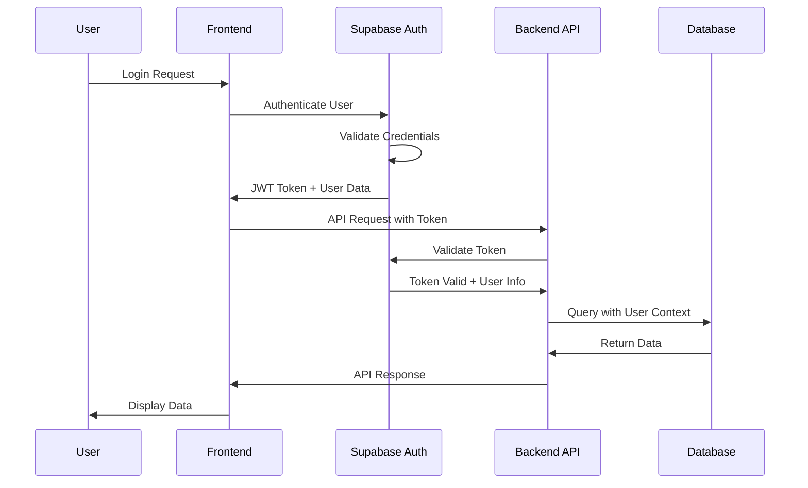

# Authentication & Authorization

### Authentication Architecture

#### 1. **Supabase Auth Integration**

- **Primary Provider**: Supabase Auth for user management
- **JWT Tokens**: Secure token-based authentication
- **Session Management**: Automatic token refresh and validation
- **Multi-Factor Authentication**: Optional 2FA support

#### 2. **Authentication Flow**

### User Roles & Permissions

#### 1. **Role Hierarchy**

- **ADMIN**: Platform administrators with full access
- **ORGANIZER**: Event organizers who create jobs and contact vendors
- **VENDOR**: Service providers who respond to jobs and manage profiles

#### 2. **Permission Matrix**

- **Vendor Permissions**: Profile management, job applications, portfolio management
- **Organizer Permissions**: Job creation, vendor contact, booking management
- **Admin Permissions**: User management, content moderation, platform analytics

### Security Features

#### 1. **Password Security**

- Minimum 8 characters with complexity requirements
- Password strength validation
- Secure password hashing via Supabase

#### 2. **Session Management**

- Short-lived access tokens (1 hour)
- Long-lived refresh tokens (30 days)
- Automatic token refresh
- Session invalidation on logout

#### 3. **Rate Limiting**

- Login attempts: 5 per 15 minutes
- Registration: 3 per hour
- Password reset: 3 per hour
- Progressive blocking for repeated failures

### Multi-Factor Authentication (MFA)

#### 1. **TOTP Support**

- Time-based One-Time Password (TOTP)
- QR code generation for authenticator apps
- Backup codes for account recovery

#### 2. **MFA Enforcement**

- Optional for organizers and vendors
- Required for admin accounts
- Grace period for MFA setup

### Social Authentication

#### 1. **OAuth Providers**

- Google OAuth integration
- Facebook OAuth integration
- Seamless account linking

#### 2. **Account Linking**

- Link social accounts to existing profiles
- Merge account data when linking
- Prevent duplicate account creation

### Security Monitoring

#### 1. **Login Attempt Tracking**

- Monitor failed login attempts
- IP address tracking
- User agent analysis
- Geographic location monitoring

#### 2. **Suspicious Activity Detection**

- Unusual login patterns
- Multiple failed attempts
- Account takeover prevention
- Automated security alerts

_[Detailed implementation code and advanced security features will be added in subsequent iterations]_

---

