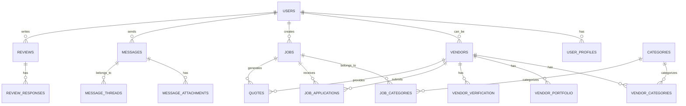

# Database Schema & Data Models

### Database Technology

- **Primary Database**: PostgreSQL via Supabase
- **Features**: Full-text search, JSON support, real-time subscriptions
- **Security**: Row Level Security (RLS) policies
- **Performance**: Optimized indexing for search operations

### Core Entity Relationships

### Core Tables Overview

#### 1. Users & Authentication

- **auth.users**: Managed by Supabase Auth (id, email, password, etc.)
- **user_profiles**: Extended user information with roles and preferences
- **Roles**: organizer, vendor, admin

#### 2. Vendors & Business Information

- **vendors**: Business profiles with subscription tiers
- **vendor_categories**: Many-to-many relationship with service categories
- **vendor_portfolio**: Image galleries and work samples
- **vendor_verification**: Trust and safety verification documents

#### 3. Jobs & Applications

- **jobs**: Event organizer job postings
- **job_applications**: Vendor responses to job postings
- **quotes**: Detailed pricing and service proposals

#### 4. Communication

- **message_threads**: Conversation threads between users
- **messages**: Individual messages with attachments
- **file_attachments**: Shared files and documents

#### 5. Reviews & Trust

- **reviews**: Multi-dimensional rating system
- **review_responses**: Vendor responses to reviews

#### 6. Subscriptions & Payments

- **subscriptions**: Stripe subscription management
- **payment_transactions**: Payment history and tracking

### Key Database Features

#### Full-Text Search

- PostgreSQL full-text search for vendor and job discovery
- Optimized indexes for search performance
- Location-based search with PostGIS extensions

#### Real-Time Capabilities

- Supabase real-time subscriptions for messaging
- Live updates for notifications and status changes
- WebSocket connections for instant communication

#### Security & Access Control

- Row Level Security (RLS) policies for data protection
- Role-based access control (RBAC)
- Encrypted sensitive data storage

#### Performance Optimization

- Strategic indexing for search operations
- Query optimization for large datasets
- Caching strategies for frequently accessed data

_[Detailed table schemas and implementation details will be added in subsequent iterations]_

---

