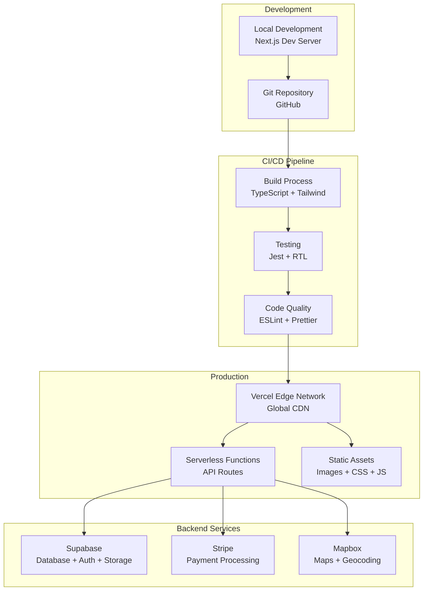

# Deployment & Infrastructure

### Infrastructure Overview

The Event Pros NZ platform is built on a modern, cloud-native infrastructure designed for scalability, reliability, and performance. The architecture leverages Vercel for hosting and Supabase for backend services, providing a robust foundation for the marketplace platform.

### Hosting & Deployment

#### 1. **Vercel Platform**

- **Primary Hosting**: Vercel for Next.js application deployment
- **Global CDN**: Edge network for optimal performance worldwide
- **Automatic Scaling**: Serverless functions scale based on demand
- **Zero-Config Deployment**: Seamless CI/CD integration

#### 2. **Deployment Architecture**



### Environment Configuration

#### 1. **Environment Variables**

```typescript
// Environment configuration
const envConfig = {
  development: {
    NEXT_PUBLIC_SITE_URL: "http://localhost:3000",
    NEXT_PUBLIC_SUPABASE_URL: "https://xxx.supabase.co",
    NEXT_PUBLIC_SUPABASE_ANON_KEY: "xxx",
    STRIPE_SECRET_KEY: "sk_test_xxx",
    NEXT_PUBLIC_STRIPE_PUBLISHABLE_KEY: "pk_test_xxx",
    NEXT_PUBLIC_MAPBOX_ACCESS_TOKEN: "pk.xxx",
  },
  production: {
    NEXT_PUBLIC_SITE_URL: "https://eventprosnz.com",
    NEXT_PUBLIC_SUPABASE_URL: "https://xxx.supabase.co",
    NEXT_PUBLIC_SUPABASE_ANON_KEY: "xxx",
    STRIPE_SECRET_KEY: "sk_live_xxx",
    NEXT_PUBLIC_STRIPE_PUBLISHABLE_KEY: "pk_live_xxx",
    NEXT_PUBLIC_MAPBOX_ACCESS_TOKEN: "pk.xxx",
  },
};
```

#### 2. **Secrets Management**

- **Vercel Environment Variables**: Secure storage for API keys
- **Supabase Secrets**: Database credentials and service keys
- **Stripe Keys**: Payment processing credentials
- **Third-party APIs**: Mapbox, SendGrid, analytics keys

### Database Infrastructure

#### 1. **Supabase Backend**

- **PostgreSQL Database**: Managed PostgreSQL with automatic backups
- **Real-time Subscriptions**: WebSocket connections for live updates
- **Authentication**: Built-in user management and JWT tokens
- **Storage**: File storage with CDN integration
- **Edge Functions**: Serverless functions for custom logic

#### 2. **Database Configuration**

```sql
-- Database settings
CREATE DATABASE eventprosnz;
-- Connection pooling
SET max_connections = 100;
-- Performance tuning
SET shared_buffers = '256MB';
SET effective_cache_size = '1GB';
-- Backup configuration
SET archive_mode = on;
SET archive_command = 'test ! -f /backup/%f && cp %p /backup/%f';
```

### CDN & Performance

#### 1. **Vercel Edge Network**

- **Global Distribution**: 100+ edge locations worldwide
- **Automatic Optimization**: Image optimization and compression
- **Caching Strategy**: Intelligent caching for static and dynamic content
- **HTTP/2 Support**: Modern protocol for improved performance

#### 2. **Performance Optimization**

```typescript
// Next.js configuration for performance
const nextConfig = {
  images: {
    domains: ["supabase.co", "eventprosnz.com"],
    formats: ["image/webp", "image/avif"],
    deviceSizes: [640, 750, 828, 1080, 1200, 1920, 2048, 3840],
    imageSizes: [16, 32, 48, 64, 96, 128, 256, 384],
  },
  compress: true,
  poweredByHeader: false,
  generateEtags: true,
  httpAgentOptions: {
    keepAlive: true,
  },
};
```

### CI/CD Pipeline

#### 1. **Automated Deployment**

```yaml
# GitHub Actions workflow
name: Deploy to Vercel
on:
  push:
    branches: [main, staging, develop]
  pull_request:
    branches: [main]

jobs:
  test:
    runs-on: ubuntu-latest
    steps:
      - uses: actions/checkout@v3
      - uses: actions/setup-node@v3
        with:
          node-version: "18"
      - run: npm ci
      - run: npm run test
      - run: npm run lint
      - run: npm run build

  deploy-staging:
    needs: test
    runs-on: ubuntu-latest
    if: github.ref == 'refs/heads/staging'
    steps:
      - uses: actions/checkout@v3
      - uses: amondnet/vercel-action@v20
        with:
          vercel-token: ${{ secrets.VERCEL_TOKEN }}
          vercel-org-id: ${{ secrets.ORG_ID }}
          vercel-project-id: ${{ secrets.PROJECT_ID }}
          vercel-args: "--target staging"

  deploy-production:
    needs: test
    runs-on: ubuntu-latest
    if: github.ref == 'refs/heads/main'
    steps:
      - uses: actions/checkout@v3
      - uses: amondnet/vercel-action@v20
        with:
          vercel-token: ${{ secrets.VERCEL_TOKEN }}
          vercel-org-id: ${{ secrets.ORG_ID }}
          vercel-project-id: ${{ secrets.PROJECT_ID }}
          vercel-args: "--prod"
```

#### 2. **Quality Gates**

- **Code Quality**: ESLint and Prettier checks
- **Testing**: Unit and integration test coverage
- **Security**: Dependency vulnerability scanning
- **Performance**: Lighthouse CI performance audits

### Deployment Procedures

#### 1. **Manual Deployment Procedures**

**Staging Deployment:**

```bash
# Deploy to staging
vercel --target staging

# Verify deployment
curl -I https://staging.eventprosnz.com/health
```

**Production Deployment:**

```bash
# Deploy to production
vercel --prod

# Verify deployment
curl -I https://eventprosnz.com/health
```

#### 2. **Database Migration Deployment**

**Supabase Migration:**

```bash
# Run migrations
supabase db push

# Verify migration
supabase db diff

# Rollback if needed
supabase db reset
```

### Rollback Procedures

#### 1. **Vercel Rollback**

**Automatic Rollback:**

- Vercel automatically rolls back on deployment failure
- Previous deployment remains available

**Manual Rollback:**

```bash
# List deployments
vercel ls

# Rollback to specific deployment
vercel rollback [deployment-url]

# Verify rollback
curl -I https://eventprosnz.com/health
```

#### 2. **Database Rollback**

**Supabase Rollback:**

```bash
# Reset to previous migration
supabase db reset

# Or restore from backup
supabase db restore [backup-id]
```

#### 3. **Emergency Rollback Checklist**

- [ ] Identify last known good deployment
- [ ] Execute Vercel rollback command
- [ ] Verify application functionality
- [ ] Check database integrity
- [ ] Notify stakeholders
- [ ] Document incident

### Staging Environment Strategy

#### 1. **Staging Environment Setup**

**Domain:** `staging.eventprosnz.com`
**Purpose:** Pre-production testing and validation
**Data:** Anonymized production data or test data

#### 2. **Staging Deployment Process**

1. **Code Promotion:**

   - Feature branches → `staging` branch
   - Automatic deployment on push
   - No manual approval required

2. **Testing Protocol:**

   - Automated test suite execution
   - Manual smoke testing
   - Performance validation
   - Security scanning

3. **Production Promotion:**
   - `staging` → `main` branch
   - Manual approval required
   - Production deployment

#### 3. **Staging Environment Configuration**

```typescript
// Staging-specific configuration
const stagingConfig = {
  environment: "staging",
  apiUrl: "https://staging.eventprosnz.com/api",
  supabaseUrl: process.env.NEXT_PUBLIC_SUPABASE_URL,
  stripeKey: process.env.STRIPE_SECRET_KEY, // Test key
  mapboxToken: process.env.NEXT_PUBLIC_MAPBOX_ACCESS_TOKEN,
  analytics: {
    enabled: true,
    debug: true,
  },
  features: {
    newFeatureFlag: true,
    experimentalFeatures: true,
  },
};
```

### Database Migration Deployment Procedures

#### 1. **Migration Strategy**

**Development → Staging:**

```bash
# Create migration
supabase migration new [migration-name]

# Apply to staging
supabase db push --target staging

# Verify migration
supabase db diff
```

**Staging → Production:**

```bash
# Apply to production
supabase db push --target production

# Verify migration
supabase db diff
```

#### 2. **Migration Safety Checks**

- [ ] Migration tested in development
- [ ] Migration tested in staging
- [ ] Backup created before production migration
- [ ] Rollback plan prepared
- [ ] Team notified of migration

#### 3. **Migration Rollback Plan**

```bash
# If migration fails
supabase db reset

# Restore from backup
supabase db restore [backup-id]

# Verify data integrity
supabase db diff
```

### Monitoring & Observability

#### 1. **Application Monitoring**

- **Vercel Analytics**: Core Web Vitals and performance metrics
- **Sentry**: Error tracking and performance monitoring
- **Uptime Monitoring**: Service availability tracking
- **Custom Metrics**: Business-specific KPIs

#### 2. **Infrastructure Monitoring**

```typescript
// Custom monitoring setup
const monitoringConfig = {
  sentry: {
    dsn: process.env.NEXT_PUBLIC_SENTRY_DSN,
    environment: process.env.NODE_ENV,
    tracesSampleRate: 1.0,
    replaysSessionSampleRate: 0.1,
    replaysOnErrorSampleRate: 1.0,
  },
  analytics: {
    googleAnalytics: process.env.NEXT_PUBLIC_GA_MEASUREMENT_ID,
    vercelAnalytics: true,
  },
};
```

### Security Infrastructure

#### 1. **SSL/TLS Configuration**

- **Automatic SSL**: Vercel provides free SSL certificates
- **HTTP/2 Support**: Modern protocol for security and performance
- **Security Headers**: HSTS, CSP, and other security headers
- **Certificate Management**: Automatic renewal and updates

#### 2. **Security Headers**

```typescript
// Security headers configuration
const securityHeaders = [
  {
    key: "X-DNS-Prefetch-Control",
    value: "on",
  },
  {
    key: "Strict-Transport-Security",
    value: "max-age=63072000; includeSubDomains; preload",
  },
  {
    key: "X-XSS-Protection",
    value: "1; mode=block",
  },
  {
    key: "X-Frame-Options",
    value: "SAMEORIGIN",
  },
  {
    key: "X-Content-Type-Options",
    value: "nosniff",
  },
  {
    key: "Referrer-Policy",
    value: "origin-when-cross-origin",
  },
];
```

### Backup & Disaster Recovery

#### 1. **Database Backups**

- **Automatic Backups**: Daily automated backups via Supabase
- **Point-in-Time Recovery**: Restore to any point in the last 7 days
- **Cross-Region Replication**: Data replicated across multiple regions
- **Backup Testing**: Regular restore testing to ensure data integrity

#### 2. **Disaster Recovery Plan**

- **RTO (Recovery Time Objective)**: 4 hours maximum
- **RPO (Recovery Point Objective)**: 1 hour maximum data loss
- **Failover Procedures**: Automated failover to backup systems
- **Communication Plan**: Stakeholder notification procedures

### Scalability & Performance

#### 1. **Auto-Scaling Configuration**

- **Serverless Functions**: Automatic scaling based on demand
- **Database Scaling**: Supabase handles database scaling automatically
- **CDN Scaling**: Global edge network scales with traffic
- **Cost Optimization**: Pay-per-use model for optimal cost efficiency

#### 2. **Performance Targets**

- **Page Load Time**: < 3 seconds on 3G connection
- **API Response Time**: < 2 seconds for all user interactions
- **Uptime**: 99.9% availability during business hours
- **Concurrent Users**: Support up to 10,000 concurrent users

### Cost Management

#### 1. **Infrastructure Costs**

- **Vercel Hosting**: $20/month for Pro plan
- **Supabase Database**: $25/month for Pro plan
- **Stripe Processing**: 2.9% + 30¢ per transaction
- **Mapbox Usage**: $0.50 per 1,000 requests
- **Total Estimated**: ~$100-200/month for MVP

#### 2. **Cost Optimization**

- **Image Optimization**: Automatic WebP conversion and resizing
- **Code Splitting**: Lazy loading for optimal bundle sizes
- **Caching**: Aggressive caching to reduce API calls
- **Monitoring**: Cost tracking and optimization alerts

This infrastructure architecture provides a robust, scalable, and cost-effective foundation for the Event Pros NZ platform, ensuring high availability and optimal performance for users across New Zealand.

---

