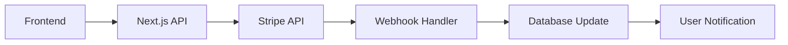

# External Service Integrations

### Integration Overview

The Event Pros NZ platform integrates with several external services to provide comprehensive functionality. Each integration is designed to be modular, secure, and maintainable.

### 1. Stripe Payment Processing

#### **Purpose**

- Subscription management for vendor tiers
- Payment processing for premium features
- Revenue tracking and analytics
- Webhook handling for payment events

#### **Integration Architecture**



#### **Key Features**

- **Subscription Tiers**: Essential (Free), Showcase ($29/month), Spotlight ($99/month)
- **Payment Methods**: Credit cards, bank transfers, digital wallets
- **Webhook Processing**: Real-time payment status updates
- **Tax Handling**: NZ GST compliance
- **Refund Management**: Automated and manual refund processing

#### **Implementation**

```typescript
// Stripe configuration
const stripeConfig = {
  publishableKey: process.env.NEXT_PUBLIC_STRIPE_PUBLISHABLE_KEY,
  secretKey: process.env.STRIPE_SECRET_KEY,
  webhookSecret: process.env.STRIPE_WEBHOOK_SECRET,
  currency: "nzd",
  taxRate: 0.15, // NZ GST
};

// Create subscription
export async function createSubscription(customerId: string, priceId: string) {
  const subscription = await stripe.subscriptions.create({
    customer: customerId,
    items: [{ price: priceId }],
    payment_behavior: "default_incomplete",
    payment_settings: { save_default_payment_method: "on_subscription" },
    expand: ["latest_invoice.payment_intent"],
  });

  return subscription;
}
```

### 2. Mapbox GL JS Integration

#### **Purpose**

- Interactive vendor location mapping
- Geocoding and address validation
- Location-based search and filtering
- Route planning and distance calculations

#### **Integration Features**

- **Interactive Maps**: Custom map styling with vendor pins
- **Geocoding API**: Address to coordinates conversion
- **Search API**: Location-based vendor discovery
- **Directions API**: Route planning for vendors
- **Clustering**: Pin clustering for dense areas

#### **Implementation**

```typescript
// Mapbox configuration
const mapboxConfig = {
  accessToken: process.env.NEXT_PUBLIC_MAPBOX_ACCESS_TOKEN,
  style: "mapbox://styles/mapbox/streets-v11",
  center: [174.7762, -41.2865], // Wellington, NZ
  zoom: 6,
};

// Geocoding service
export async function geocodeAddress(address: string) {
  const response = await fetch(
    `https://api.mapbox.com/geocoding/v5/mapbox.places/${encodeURIComponent(
      address
    )}.json?access_token=${mapboxConfig.accessToken}&country=nz`
  );

  const data = await response.json();
  return data.features[0]?.geometry.coordinates;
}
```

### 3. Email Service Integration

#### **Purpose**

- Transactional email delivery
- User notifications and alerts
- Marketing communications
- System-generated emails

#### **Service Options**

- **Primary**: SendGrid for transactional emails
- **Backup**: Supabase Edge Functions for simple emails
- **Marketing**: Mailchimp for newsletter campaigns

#### **Email Types**

- **Authentication**: Welcome emails, password reset, email verification
- **Notifications**: New messages, job applications, review notifications
- **Marketing**: Newsletter, feature updates, promotional content
- **System**: Error alerts, admin notifications, maintenance notices

#### **Implementation**

```typescript
// Email service configuration
const emailConfig = {
  sendgrid: {
    apiKey: process.env.SENDGRID_API_KEY,
    fromEmail: "noreply@eventprosnz.com",
    fromName: "Event Pros NZ",
  },
  templates: {
    welcome: "d-1234567890",
    passwordReset: "d-1234567891",
    newMessage: "d-1234567892",
  },
};

// Send transactional email
export async function sendEmail(to: string, templateId: string, data: any) {
  const response = await fetch("https://api.sendgrid.com/v3/mail/send", {
    method: "POST",
    headers: {
      Authorization: `Bearer ${emailConfig.sendgrid.apiKey}`,
      "Content-Type": "application/json",
    },
    body: JSON.stringify({
      personalizations: [
        {
          to: [{ email: to }],
          dynamic_template_data: data,
        },
      ],
      from: {
        email: emailConfig.sendgrid.fromEmail,
        name: emailConfig.sendgrid.fromName,
      },
      template_id: templateId,
    }),
  });

  return response.ok;
}
```

### 4. File Storage Integration

#### **Purpose**

- Vendor portfolio image storage
- Document uploads (insurance certificates, business licenses)
- File sharing between users
- Image optimization and resizing

#### **Storage Solution**

- **Primary**: Supabase Storage for all file types
- **CDN**: Vercel Edge Network for global delivery
- **Image Processing**: On-the-fly resizing and optimization

#### **File Categories**

- **Portfolio Images**: Vendor work samples and galleries
- **Profile Photos**: User avatars and business logos
- **Documents**: Verification documents and contracts
- **Attachments**: Message attachments and shared files

#### **Implementation**

```typescript
// File upload service
export async function uploadFile(file: File, bucket: string, path: string) {
  const { data, error } = await supabase.storage
    .from(bucket)
    .upload(path, file, {
      cacheControl: "3600",
      upsert: false,
    });

  if (error) throw error;

  // Get public URL
  const { data: urlData } = supabase.storage.from(bucket).getPublicUrl(path);

  return {
    path: data.path,
    url: urlData.publicUrl,
  };
}
```

### 5. Analytics & Monitoring Integration

#### **Purpose**

- User behavior tracking
- Performance monitoring
- Error tracking and debugging
- Business intelligence and reporting

#### **Services**

- **Google Analytics 4**: User behavior and conversion tracking
- **Sentry**: Error tracking and performance monitoring
- **Hotjar**: User session recordings and heatmaps
- **Vercel Analytics**: Core Web Vitals and performance metrics

#### **Implementation**

```typescript
// Analytics configuration
const analyticsConfig = {
  googleAnalytics: {
    measurementId: process.env.NEXT_PUBLIC_GA_MEASUREMENT_ID,
  },
  sentry: {
    dsn: process.env.NEXT_PUBLIC_SENTRY_DSN,
    environment: process.env.NODE_ENV,
  },
};

// Track custom events
export function trackEvent(eventName: string, parameters: any) {
  if (typeof window !== "undefined" && window.gtag) {
    window.gtag("event", eventName, parameters);
  }
}
```

### 6. SMS Service Integration

#### **Purpose**

- Two-factor authentication codes
- Critical notifications
- Emergency communications
- Marketing messages (opt-in)

#### **Service Provider**

- **Primary**: Twilio for SMS delivery
- **Backup**: Supabase Edge Functions with alternative provider

#### **SMS Types**

- **Authentication**: 2FA codes and verification
- **Notifications**: Urgent alerts and reminders
- **Marketing**: Promotional messages (with consent)
- **System**: Admin alerts and monitoring

### 7. Business Verification Services

#### **Purpose**

- NZ business registration verification
- Identity document validation
- Insurance certificate verification
- Professional license validation

#### **Integration Points**

- **NZ Companies Office API**: Business registration lookup
- **Document Verification**: OCR and validation services
- **Insurance Verification**: Certificate authenticity checks

### Integration Security

#### **API Key Management**

- Environment variable storage
- Key rotation policies
- Access logging and monitoring
- Secure key distribution

#### **Webhook Security**

- Signature verification
- IP whitelisting
- Rate limiting
- Error handling and retry logic

#### **Data Privacy**

- GDPR compliance
- Data encryption in transit
- Secure data storage
- User consent management

### Error Handling & Resilience

#### **Circuit Breaker Pattern**

- Automatic service degradation
- Fallback mechanisms
- Service health monitoring
- Graceful error handling

#### **Retry Logic**

- Exponential backoff
- Maximum retry attempts
- Dead letter queues
- Error notification systems

#### **Monitoring & Alerting**

- Service health checks
- Performance monitoring
- Error rate tracking
- Automated alerting

This comprehensive integration architecture ensures the Event Pros NZ platform can leverage external services effectively while maintaining security, reliability, and performance.

---

