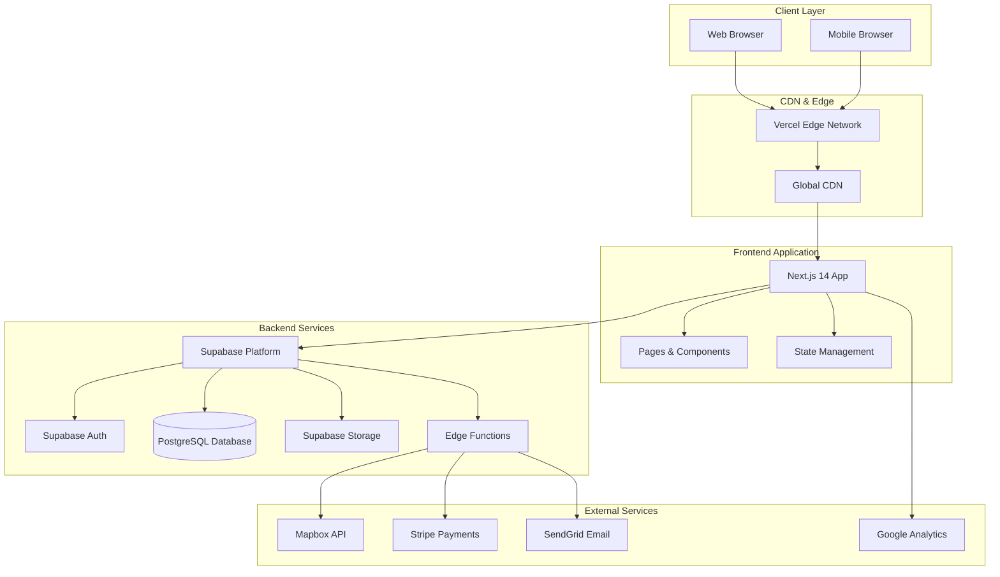

# High Level Architecture

### Technical Summary

Event Pros NZ is built as a modern Jamstack application using Next.js 14 with App Router for the frontend, integrated with Supabase as the backend-as-a-service platform. The architecture leverages serverless functions for complex business logic while maintaining real-time capabilities through Supabase's built-in real-time subscriptions. The platform is deployed on Vercel with global CDN distribution, ensuring sub-1 second page load times and 99.5% uptime. This architecture achieves the PRD's goals of creating a scalable two-sided marketplace that efficiently connects event managers with contractors while providing intelligent planning assistance and comprehensive business management tools.

### Platform and Infrastructure Choice

**Platform:** Vercel + Supabase  
**Key Services:** Next.js 14, Supabase (PostgreSQL, Auth, Storage, Edge Functions), Vercel (Deployment, CDN), Mapbox, Stripe, SendGrid  
**Deployment Host and Regions:** Vercel global edge network with primary focus on Asia-Pacific region

### Repository Structure

**Structure:** Monorepo with Turborepo  
**Monorepo Tool:** Turborepo for build optimization and task orchestration  
**Package Organization:**

- `apps/web` - Next.js frontend application
- `apps/api` - Supabase Edge Functions (serverless backend)
- `packages/shared` - Shared TypeScript types and utilities
- `packages/ui` - Shared UI components (shadcn/ui based)

### High Level Architecture Diagram

### Architectural Patterns

- **Jamstack Architecture:** Static site generation with serverless APIs - _Rationale:_ Optimal performance and scalability for content-heavy applications with real-time features
- **Component-Based UI:** Reusable React components with TypeScript - _Rationale:_ Maintainability and type safety across large codebases
- **Repository Pattern:** Abstract data access logic through Supabase client - _Rationale:_ Enables testing and future database migration flexibility
- **API Gateway Pattern:** Supabase as single entry point for all API calls - _Rationale:_ Centralized auth, rate limiting, and monitoring
- **Serverless Functions:** Edge Functions for complex business logic - _Rationale:_ Scalable, cost-effective processing without server management
- **Real-time Subscriptions:** Supabase real-time for live updates - _Rationale:_ Enables live contractor availability, inquiry notifications, and job board updates

