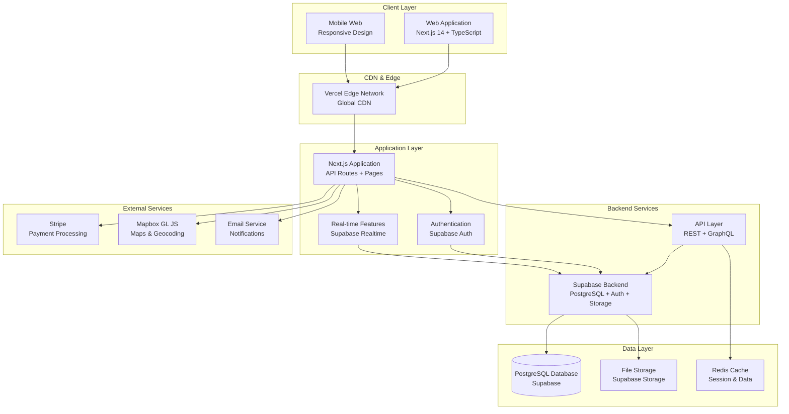

# High-Level Architecture

### System Architecture Diagram



### Architecture Principles

#### 1. **Mobile-First Design**

- Responsive design optimized for mobile devices
- Touch-friendly interfaces and interactions
- Progressive Web App (PWA) capabilities
- Offline functionality for core features

#### 2. **Microservices-Ready Monolith**

- Next.js full-stack application as starting point
- Modular architecture enabling future microservices extraction
- Clear separation of concerns between layers
- API-first design for external integrations

#### 3. **Real-Time Capabilities**

- Supabase real-time subscriptions for messaging
- Live updates for notifications and status changes
- WebSocket connections for instant communication
- Event-driven architecture for system updates

#### 4. **Security by Design**

- End-to-end encryption for sensitive data
- Role-based access control (RBAC)
- Input validation and sanitization
- PCI DSS compliance for payment processing

#### 5. **Performance Optimization**

- Edge computing with Vercel
- Image optimization and lazy loading
- Code splitting and bundle optimization
- Caching strategies at multiple layers

#### 6. **Scalability Considerations**

- Horizontal scaling capabilities
- Database indexing for search performance
- CDN distribution for global reach
- Load balancing for high availability

### System Components

#### Frontend Layer

- **Next.js 14 Application**: Full-stack React application with TypeScript
- **Tailwind CSS**: Utility-first CSS framework for responsive design
- **Component Library**: Reusable UI components with design system
- **State Management**: React Context and hooks for state management
- **Routing**: Next.js App Router for client-side navigation

#### Backend Layer

- **Supabase Backend**: PostgreSQL database with built-in authentication
- **API Routes**: Next.js API routes for server-side logic
- **Real-time Subscriptions**: WebSocket connections for live updates
- **File Storage**: Supabase Storage for images and documents
- **Database Functions**: PostgreSQL functions for complex queries

#### External Services

- **Stripe**: Payment processing and subscription management
- **Mapbox GL JS**: Interactive mapping and geocoding services
- **Email Service**: Transactional and marketing email delivery
- **Analytics**: User behavior and performance tracking

#### Infrastructure

- **Vercel**: Hosting, deployment, and edge computing
- **Supabase**: Database, authentication, and real-time features
- **CDN**: Global content delivery for optimal performance
- **Monitoring**: Application performance and error tracking

### Data Flow

#### 1. **User Authentication Flow**

```
User Login → Supabase Auth → JWT Token → Client Storage → API Authorization
```

#### 2. **Vendor Discovery Flow**

```
Search Query → API Route → Database Query → Filtered Results → Client Display
```

#### 3. **Real-Time Messaging Flow**

```
Message Send → API Route → Database Insert → Real-time Subscription → Recipient Update
```

#### 4. **Payment Processing Flow**

```
Payment Request → Stripe API → Webhook → Database Update → User Notification
```

### System Boundaries

#### Internal Components

- Next.js application and API routes
- Supabase database and authentication
- File storage and real-time features
- Internal caching and session management

#### External Dependencies

- Stripe payment processing
- Mapbox mapping services
- Email delivery services
- Third-party analytics tools

#### Integration Points

- RESTful APIs for external services
- Webhook endpoints for service callbacks
- OAuth flows for third-party authentication
- Real-time WebSocket connections

---

