# Event Pros NZ UI/UX Specification

## Introduction

This document defines the user experience goals, information architecture, user flows, and visual design specifications for Event Pros NZ's user interface. It serves as the foundation for visual design and frontend development, ensuring a cohesive and user-centered experience.

### Overall UX Goals & Principles

#### Target User Personas

**Event Organizers (Primary Users):**

- Wedding planners, corporate event managers, party organizers
- Need to quickly find reliable, vetted event professionals
- Value trust, quality, and ease of comparison
- Often working under time pressure with specific budgets

**Event Professionals (Secondary Users):**

- Caterers, photographers, DJs, florists, venues, etc.
- Want to showcase services and connect with potential clients
- Need tools to manage inquiries and build reputation
- Range from solo operators to established businesses

#### Usability Goals

- **Discovery Efficiency:** Find 3+ relevant vendors within 60 seconds
- **Trust Building:** 80%+ users feel confident in vendor selection
- **Mobile Performance:** 95%+ mobile usability score
- **Conversion Focus:** 60%+ contact form completion rate
- **Vendor Success:** 3+ quality leads per vendor per week
- **Accessibility:** WCAG 2.1 AA compliance
- **Performance:** 2-second response times for all user interactions
- **Reliability:** 99.9% uptime during business hours
- **Scalability:** Support up to 10,000 concurrent users

#### Design Principles

1. **Trust Through Transparency** - Clear verification, reviews, and business information
2. **Mobile-First Discovery** - Optimized for on-the-go event planning
3. **Progressive Disclosure** - Show essential info first, details on demand
4. **Visual Storytelling** - Let vendor portfolios speak for themselves
5. **Frictionless Contact** - Minimize steps between discovery and connection
6. **Inclusive by Design** - Accessible to all users from day one
7. **Emotionally Engaging** - Make event planning feel exciting and inspiring

### Change Log

| Date       | Version | Description                                                          | Author    |
| ---------- | ------- | -------------------------------------------------------------------- | --------- |
| 2024-12-19 | 1.0     | Initial UX foundation and principles                                 | UX Expert |
| 2024-12-19 | 1.1     | Updated to incorporate PRD requirements and technical specifications | UX Expert |

## Information Architecture (IA)

### Site Map / Screen Inventory

```mermaid
graph TD
    A[Homepage] --> B[Browse All Event Pros]
    A --> C[About]
    A --> D[Login/Sign-up Modal]
    A --> E[Vendor Profile Pages]

    B --> B1[Search Results]
    B --> B2[Category Filters]
    B --> B3[Location Filters]
    B --> B4[Interactive Map View]

    C --> C1[Benefits]
    C --> C2[Pricing]
    C --> C3[Who are we]
    C --> C4[FAQs]
    C --> C5[Contact]

    E --> E1[Vendor Details]
    E --> E2[Portfolio Gallery]
    E --> E3[Contact Form]
    E --> E4[Reviews & Ratings]

    D --> D1[Vendor Dashboard]
    D --> D2[Organizer Dashboard]
    D --> D3[Platform Admin Dashboard]

    D1 --> D1A[Analytics]
    D1 --> D1B[Enquiry Management]
    D1 --> D1C[Personal Details]
    D1 --> D1D[Business Profile]
    D1 --> D1E[Available Jobs]
    D1 --> D1F[Feature Requests]
    D1 --> D1G[Account Details]

    D2 --> D2A[Analytics]
    D2 --> D2B[Enquiry Management]
    D2 --> D2C[Personal Details]
    D2 --> D2D[Event Details]
    D2 --> D2E[My Jobs]
    D2 --> D2F[Feature Requests]
    D2 --> D2G[Account Details]

    D3 --> D3A[Platform Analytics]
    D3 --> D3B[User Management]
    D3 --> D3C[Feature Requests Management]
    D3 --> D3D[Message Management]
    D3 --> D3E[Content Management]
    D3 --> D3F[System Settings]
    D3 --> D3G[Revenue Management]
    D3 --> D3H[Security & Moderation]
```

### Navigation Structure

**Primary Navigation:**

- **Home** - Hero section with 3D animated directory preview, testimonials, interactive map, sign-up CTAs
- **Browse All Event Pros** - Main search/browse page with filters and map view
- **About** - Benefits, pricing, company info, FAQs, contact
- **Profile Dropdown** - Dashboard access (logged-in users) / Login/Sign-up buttons (guests)

**Secondary Navigation (About Section):**

- **Benefits** - Value propositions for vendors and organizers
- **Pricing** - Subscription tiers and features
- **Who are we** - Company story, team, mission
- **FAQs** - Common questions and answers
- **Contact** - Support and contact information

**Breadcrumb Strategy:**

- Browse All Event Pros > Category > Location > Vendor Profile
- Dashboard > Section > Specific Item
- About > Subsection (Benefits, Pricing, etc.)

### Key Navigation Features

**Interactive Map Integration:**

- Real-time vendor locations with individual pins
- Pin consolidation when zoomed out (showing vendor count)
- Location filtering includes all areas vendors serve
- Integrated with search results

**User Authentication States:**

- **Guest Users:** See Login/Sign-up buttons in primary nav
- **Logged-in Users:** See Profile dropdown with Dashboard access
- **Contact Forms:** Require login for vendor contact

**Dashboard Access:**

- **Vendor Dashboard:** Analytics, enquiries, profile management, available jobs, feature requests
- **Organizer Dashboard:** Analytics, enquiries, event management, job posting, feature requests
- **Platform Admin Dashboard:** Platform analytics, user management, feature requests management, messaging, content management, system settings, revenue management, security & moderation
- **Feature Requests:** Public system with voting capabilities

### Platform Admin Dashboard Features

**Core Admin Functions:**

- **Platform Analytics:** User numbers (vendors vs organizers), enquiries made, revenue tracking, conversion rates
- **User Management:** View all users, manage accounts, handle disputes, user verification
- **Feature Requests Management:** View all requests, respond to users, update status, prioritize development
- **Message Management:** Email drip campaigns, individual user messaging, contact form responses

**Additional Recommended Admin Features:**

**Content Management:**

- **Testimonials Management:** Read all testimonials, respond to reviews, notification system for new testimonials requiring response
- **Category Management:** Add/edit service categories and subcategories
- **Help Documentation:** Manage FAQs, help articles, tutorials
- **Announcements:** Platform-wide notifications and updates

**System Settings:**

- **Subscription Tiers:** Configure pricing, features, limits
- **Email Templates:** Customize automated emails and notifications
- **Platform Configuration:** Site settings, integrations, API keys

**Revenue Management:**

- **Subscription Analytics:** Revenue by tier, churn rates, upgrade patterns
- **Payment Processing:** Transaction monitoring, refunds, disputes
- **Billing Management:** Invoice generation, payment reminders
- **Financial Reports:** Revenue forecasting, growth metrics

**Security & Moderation:**

- **User Verification:** Review and approve vendor verification requests
- **Content Moderation:** Review reported profiles, inappropriate content
- **Security Monitoring:** Login attempts, suspicious activity, fraud detection
- **Compliance:** Data protection, privacy settings, audit logs

### Admin Access Control & Priority

**Access Control:**

- **Admin Dashboard Access:** Through same profile dropdown (role-based visibility)
- **User Roles:** Super Admin only (structure supports future role expansion)
- **Authentication:** Same login system with admin role verification

**MVP Priority Features:**

1. **Messaging Management** - Email campaigns, individual messaging, contact form responses
2. **User Management** - Account management, vendor profile approval, user verification
3. **Testimonials Management** - Review and respond to testimonials with notification system

**Future Phase Features:**

- Revenue management and analytics
- Advanced content management
- Security monitoring and compliance
- Integration with external tools

### Admin System Specifications

**Testimonial Management:**

- **Admin Responses:** Visible only to testimonial author (private communication)
- **Response Templates:** Pre-written responses for common testimonial types
- **Notification System:** Red dot indicator for new testimonials requiring response

**Vendor Verification Process:**

- **Verification Method:** Profile review by admin
- **Verification Steps:** Business details, portfolio quality, contact information accuracy
- **Verification Badge:** Displayed on verified vendor profiles

**Email Automation Sequences:**

- **Welcome Series:** New user onboarding (3-5 emails over first week)
- **Abandoned Profile:** Reminder emails for incomplete vendor profiles
- **Enquiries Received:** Notifications when vendors receive new enquiries

**Notification System (Red Dot Indicators):**

- **Admin Dashboard:** New testimonials, new users, reported content, pending verifications
- **Vendor Dashboard:** New enquiries, profile views, job applications, messages
- **Organizer Dashboard:** New vendor responses, job applications, messages, event reminders

### User Testimonial Submission

**Testimonial Submission Feature:**

- **Access:** Button in both vendor and organizer dashboards
- **Modal Pop-up:** User-friendly testimonial submission form
- **Rating System:** 1-5 star rating with optional written review
- **Submission Process:** Submit → Admin Review → Auto-approval (5-star) or Manual Review
- **User Feedback:** Confirmation message and status tracking

### Recommended External Integrations

**Analytics & Marketing:**

- **Google Analytics 4** - Website traffic and user behavior
- **Google Tag Manager** - Event tracking and conversion monitoring
- **Mailchimp/SendGrid** - Email marketing and transactional emails
- **Hotjar/Microsoft Clarity** - User session recordings and heatmaps

**Business Intelligence:**

- **Stripe Dashboard** - Payment analytics and financial reporting
- **Google Data Studio** - Custom reporting and dashboards
- **Zapier** - Workflow automation between tools

**Customer Support:**

- **Intercom/Zendesk** - Customer support ticketing system
- **Slack/Discord** - Internal team communication
- **Notion/Airtable** - Documentation and project management

## User Flows

### Event Organizer - Finding and Contacting Vendors

**User Goal:** Find and contact relevant event vendors for their event

**Entry Points:** Homepage, Browse All Event Pros page, direct search

**Success Criteria:** Successfully contact 3+ relevant vendors within 5 minutes

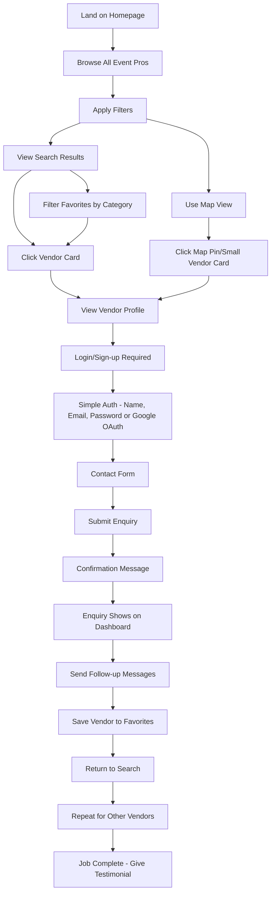

**Edge Cases & Error Handling:**

- No vendors found for selected criteria
- Login/signup process fails
- Contact form validation errors
- Network connectivity issues
- Vendor profile incomplete or unavailable
- Favorites not saving properly

**Notes:** This flow prioritizes discovery and contact efficiency. The login requirement builds trust and enables follow-up communication. Favorites can be organized by category filters. Enquiry tracking includes status indicators (sent, read, responded). Quote comparison allows side-by-side evaluation.

### Vendor - Profile Setup and Management

**User Goal:** Create and maintain an attractive vendor profile to attract clients

**Entry Points:** Homepage signup, direct registration link

**Success Criteria:** Complete profile setup and receive first enquiry within 1 week

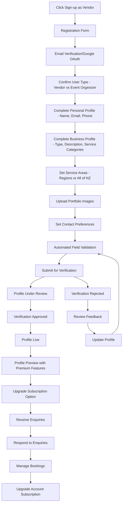

**Edge Cases & Error Handling:**

- Registration form validation errors
- Email verification not received
- Profile submission fails
- Verification rejection with unclear feedback
- Image upload failures
- Service area selection issues
- Automated validation failures
- Profile preview errors

**Notes:** This flow emphasizes profile completeness and verification with logical progression steps. Automated field validation ensures completeness before admin review. Profile preview shows premium features to encourage upgrades. Service areas allow multiple regions or "All of NZ" selection.

### Event Organizer - Job Posting and Management

**User Goal:** Post event requirements and manage vendor applications

**Entry Points:** Organizer dashboard, direct job posting link

**Success Criteria:** Post job and receive 5+ vendor applications within 48 hours

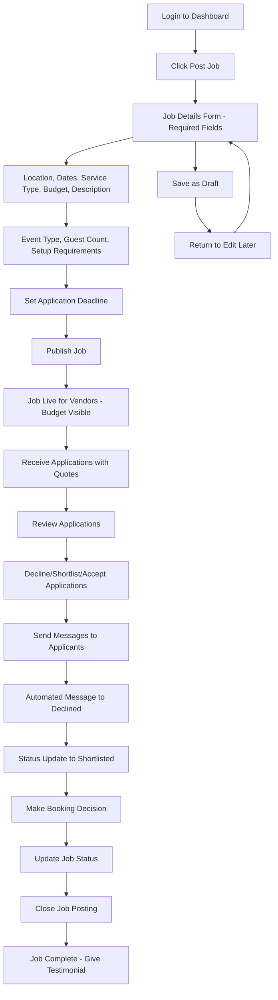

**Edge Cases & Error Handling:**

- Job posting form validation errors
- Draft saving failures
- No applications received
- Application review process confusion
- Booking decision delays
- Job status update errors
- Application deadline management
- Automated messaging failures

**Notes:** This flow enables organizers to broadcast their needs and manage responses efficiently. Required fields include location, dates, service type, budget, description, event type, guest count, and setup requirements. Budget is visible to all vendors. Application deadlines prevent applications past job date. No limit on shortlisted vendors. Quote comparison allows side-by-side evaluation.

### Vendor - Job Application and Response Management

**User Goal:** Find relevant jobs and manage client enquiries

**Entry Points:** Vendor dashboard, job notifications

**Success Criteria:** Apply to 3+ relevant jobs and respond to all enquiries within 24 hours

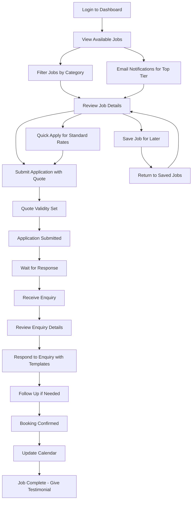

**Edge Cases & Error Handling:**

- Job application submission failures
- Enquiry notification delays
- Response form errors
- Calendar integration issues
- Follow-up communication problems
- Booking confirmation delays
- Quote expiration handling
- Application limit enforcement
- Quick apply errors

**Notes:** This flow balances proactive job seeking with reactive enquiry management. Email notifications for top-tier subscribers. Application limits: Free (1/month), Mid-tier (5/month), Top-tier (unlimited). Quote validity includes expiration dates. Quick Apply available for standard rates. Response templates available for common enquiries.

### Admin - User Management and Platform Oversight

**User Goal:** Manage platform users and maintain quality standards

**Entry Points:** Admin dashboard, notification alerts

**Success Criteria:** Process all pending actions within 24 hours

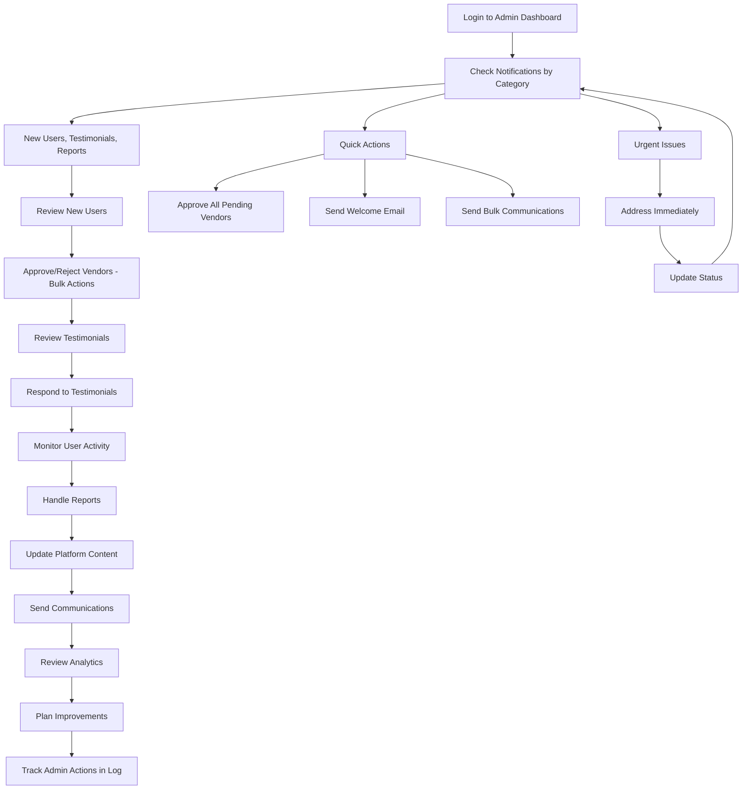

**Edge Cases & Error Handling:**

- High volume of pending actions
- User disputes or complaints
- System errors during processing
- Communication delivery failures
- Analytics data inconsistencies
- Platform performance issues
- Bulk action failures
- Quick action errors

**Notes:** This flow prioritizes responsiveness and quality control. Notifications grouped by type (new users, testimonials, reports). Bulk actions available for efficiency. Quick actions for common tasks. Activity log tracks admin actions for accountability. Profile verification criteria: appropriateness of content, relevancy to events industry, completed all fields.

### Testimonial Submission and Management

**User Goal:** Submit feedback about Event Pros NZ platform experience

**Entry Points:** User dashboards, post-booking completion

**Success Criteria:** Submit testimonial and receive vendor response within 48 hours

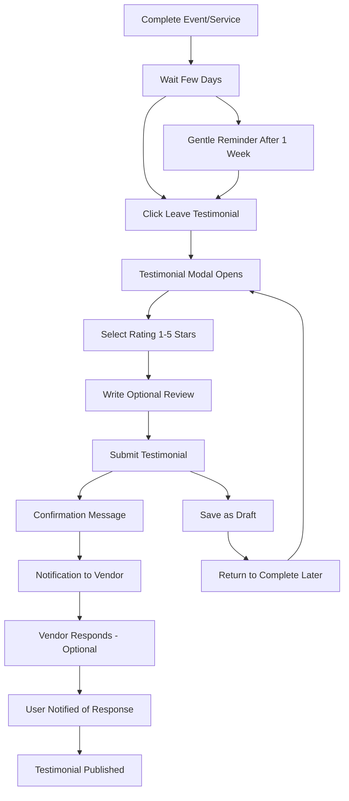

**Edge Cases & Error Handling:**

- Testimonial submission failures
- Rating system errors
- Vendor response delays
- Response delivery issues
- Draft saving problems
- Notification failures
- Reminder system errors

**Notes:** This flow encourages authentic user feedback. Delayed trigger (few days after completion) with gentle reminder after 1 week. No testimonial templates to maintain authenticity. No photo testimonials initially. Vendor receives notification and can respond optionally.

### Password Reset Flow

**User Goal:** Regain access to account when password is forgotten

**Entry Points:** Login page, forgot password link

**Success Criteria:** Successfully reset password and log in

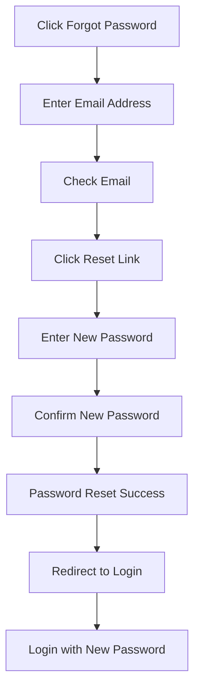

**Edge Cases & Error Handling:**

- Email not received
- Reset link expired
- Password validation errors
- Network connectivity issues

### Account Deletion Flow

**User Goal:** Permanently delete account and associated data

**Entry Points:** Account settings, dashboard

**Success Criteria:** Account permanently deleted

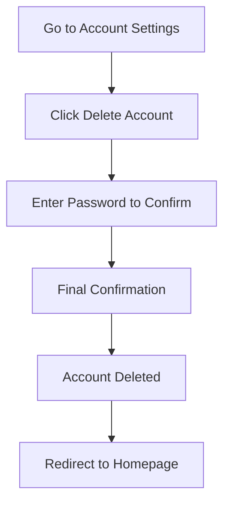

**Edge Cases & Error Handling:**

- Password confirmation errors
- Account deletion failures
- Data cleanup issues

### Subscription Upgrade/Downgrade Flow

**User Goal:** Change subscription tier to access different features

**Entry Points:** Dashboard, profile settings

**Success Criteria:** Successfully change subscription and access new features

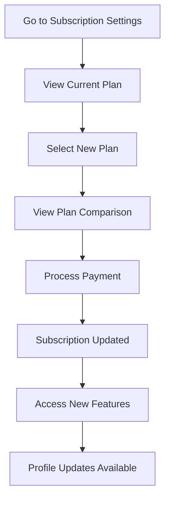

**Edge Cases & Error Handling:**

- Payment processing failures
- Subscription update errors
- Feature access issues

### Profile Verification Appeal Flow

**User Goal:** Appeal rejected profile verification and resubmit

**Entry Points:** Dashboard notification, profile settings

**Success Criteria:** Profile successfully verified after appeal

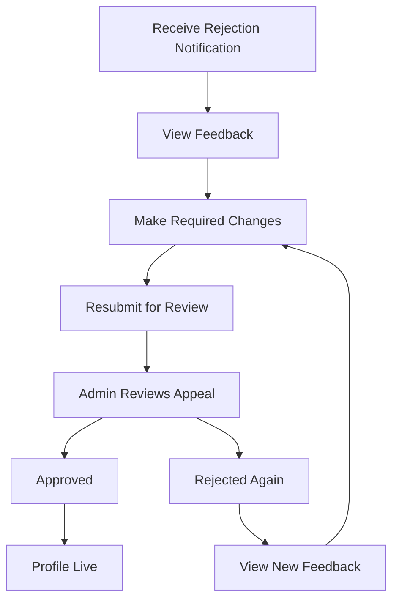

**Edge Cases & Error Handling:**

- Appeal submission failures
- Admin review delays
- Multiple rejection cycles

## Wireframes & Mockups

### Design Files

**Primary Design Files:** To be created in Figma/Sketch

### Key Screen Layouts

#### Homepage

**Purpose:** First impression and conversion to sign-up

**Key Elements:**

- **Hero Section:** Rotating directory preview animation with 3D elements
- **Testimonials:** 4 testimonial cards (desktop) with infinite horizontal scroll, soft shadows, transparent-to-white fade on edges, pause on hover/press
- **Interactive Map:** Real-time vendor locations with pins colored by category type (paid subscriptions only - admin adjustable)
- **Call-to-Action:** "Join free today" buttons for vendors and organizers
- **Service Category Highlights:** Featured service categories with visual icons

**Interaction Notes:** Smooth animations, mobile-first responsive design, map pins color-coded by service category

#### Browse All Event Pros

**Purpose:** Main search and discovery interface

**Key Elements:**

- **Search Bar:** Autocomplete suggestions with placeholder "Search by location, category etc..."
- **Filter Sidebar:** Prominent filters for ratings, location, and service types
- **Vendor Cards:** Name, rating, location (no price range) with consistent card design
- **Map Integration:** Toggle-able map that expands from the right side
- **Sort Options:** Rating, distance, relevance

**Interaction Notes:** Real-time search results, smooth map interactions, expandable map panel

#### Vendor Profile Page

**Purpose:** Detailed vendor information and contact

**Key Elements:**

- **Profile Layout:** Multi-column (desktop) - profile picture and main details (1/4 width) on left, scrollable info and contact form on right
- **Portfolio Gallery:** Carousel format for image display
- **Contact Form:** Inline form (requires login)
- **Subscription Tiers:** Features visible/hidden based on subscription level
- **Business Details:** Verification badge, service areas, reviews and ratings
- **Social Media Links:** Direct links to vendor's external presence

**Interaction Notes:** Image carousel with navigation, contact form validation, subscription-based feature visibility

#### User Dashboards

**Purpose:** Personalized management interface

**Key Elements:**

- **Vendor Dashboard:** Analytics and enquiries as main focus areas
- **Organizer Dashboard:** Enquiries as priority, followed by job management
- **Admin Dashboard:** Analytics overview, notification categories with counts
- **Navigation Sidebar:** Section-based navigation for different functions
- **Notification Indicators:** Red dot indicators for pending actions
- **Quick Actions:** Common tasks easily accessible

**Interaction Notes:** Responsive sidebar, real-time updates, mobile-compressed layout

### Authentication Screens

#### Login/Signup Modal

**Purpose:** User authentication and account creation

**Key Elements:**

- **Modal Design:** Light grey background with white input boxes
- **Close Button:** Small grey cross in top right corner
- **Background Filter:** Dark grey overlay when modal is active
- **Click Outside:** Modal closes when clicking outside
- **User Type Selection:** Side-by-side buttons for vendor vs organizer choice

**Interaction Notes:** Smooth modal transitions, form validation, responsive design

### Job Management Screens

#### Job Posting Form

**Purpose:** Multi-step job creation process

**Key Elements:**

- **Step-by-Step Guide:** Progressive form sections
- **Required Fields:** Location, dates, service type, budget, description, event type, guest count, setup requirements
- **Application Deadline:** Date picker for application cutoff
- **Draft Saving:** Save progress and return later
- **Form Validation:** Real-time validation feedback

**Interaction Notes:** Smooth step transitions, clear progress indicators, validation feedback

#### Job Applications View

**Purpose:** Manage job applications and vendor responses

**Key Elements:**

- **Jobs Page:** Side navigation item for job management
- **Job Status Overview:** Visual status indicators for each job
- **Application Management:** Decline, shortlist, accept actions
- **Vendor Communication:** Direct messaging to applicants
- **Status Updates:** Automated notifications to vendors

**Interaction Notes:** Bulk actions, status filtering, real-time updates

### Subscription Management

#### Plan Comparison

**Purpose:** Display subscription tiers and features

**Key Elements:**

- **Three-Tier Cards:** Essential (Free), Showcase (Paid), Spotlight (Premium)
- **Price Display:** Clear pricing for each tier
- **Feature Comparison Table:** Detailed feature breakdown below cards
- **Upgrade CTAs:** Clear upgrade buttons for each tier
- **Stripe Integration:** Secure payment processing
- **Feature Access Control:** Dynamic UI based on subscription status

**Subscription Tiers (per PRD FR15):**

**Essential (Free):**

- Basic vendor profile
- Limited portfolio photos (1-2 images)
- Basic contact forms
- Standard search visibility
- 1 job application per month

**Showcase (Paid):**

- Enhanced vendor profile
- Up to 10 portfolio photos
- Advanced contact forms
- Priority search visibility
- 5 job applications per month
- Basic analytics

**Spotlight (Premium):**

- Premium vendor profile
- Unlimited portfolio photos
- Advanced contact forms with custom fields
- Top search visibility
- Unlimited job applications
- Advanced analytics and reporting
- Email notifications for new jobs
- Featured placement in search results

**Interaction Notes:** Hover effects, clear feature differentiation, mobile-responsive cards, secure payment processing

#### Upgrade Flow

**Purpose:** Process subscription upgrades and payments

**Key Elements:**

- **Plan Selection:** Clear tier selection interface
- **Payment Integration:** Stripe payment form for new customers
- **Payment Details:** Guided collection of credit card information
- **Confirmation:** Success message and immediate feature access
- **Account Update:** Automatic subscription tier application

**Interaction Notes:** Secure payment processing, clear success feedback, immediate feature unlock

### Trust & Safety Features

#### Enhanced Review System

**Purpose:** Comprehensive review and rating system for trust building

**Key Elements:**

- **Multi-Dimensional Ratings:** Quality, value, communication, timeliness
- **Verified Booking Reviews:** Evidence-based review system
- **Review Photo/Video Attachments:** Visual evidence for reviews
- **Review Moderation:** Content filtering and quality control
- **Vendor Response System:** Dispute resolution and vendor responses
- **Review Helpfulness Voting:** Community-driven review quality
- **Review Analytics:** Insights and performance metrics for vendors

**Interaction Notes:** Intuitive rating interface, clear review guidelines, moderation tools

### Mobile Considerations

#### Navigation

**Purpose:** Mobile-friendly navigation system

**Key Elements:**

- **Hamburger Menu:** Collapsible navigation for mobile
- **Bottom Navigation:** Quick access to main functions
- **Touch-Friendly:** Large touch targets for mobile interaction

#### Map View

**Purpose:** Mobile map interaction

**Key Elements:**

- **Toggle-able Map:** Expandable map view on mobile
- **Touch Gestures:** Pinch to zoom, tap to select
- **Responsive Pins:** Appropriately sized for mobile viewing

#### Dashboard Layout

**Purpose:** Mobile-optimized dashboard experience

**Key Elements:**

- **Compressed Layout:** Most relevant information prioritized
- **Swipe Navigation:** Touch-friendly navigation between sections
- **Notification Center:** Consolidated notification management

**Interaction Notes:** Touch-optimized interactions, responsive design, mobile-first approach

### Advanced Communication Features

#### Real-Time Messaging System

**Purpose:** Enable instant communication between users

**Key Elements:**

- **Real-Time Delivery:** Instant message delivery and synchronization
- **Message Status Indicators:** Typing, delivered, read status
- **Online/Offline Status:** User availability indicators
- **Message History:** Persistent conversation storage
- **Message Search:** Search and filtering capabilities
- **Emoji & Reactions:** Enhanced communication features
- **Message Threading:** Organized conversation structure
- **Cross-Device Sync:** Seamless experience across devices

**Interaction Notes:** Intuitive chat interface, clear message status, mobile-optimized messaging

#### Quote Management System

**Purpose:** Handle quote requests, submissions, and comparisons

**Key Elements:**

- **Quote Request System:** Structured quote request forms
- **Side-by-Side Comparison:** Visual quote comparison interface
- **Quote Approval Workflows:** Approval and rejection processes
- **Quote Modification Tracking:** Revision and change management
- **Quote Expiration Management:** Automatic expiration and renewal
- **Quote Analytics:** Performance metrics and insights
- **Quote Templates:** Standardized quote formats

**Interaction Notes:** Clear pricing display, efficient comparison tools, approval workflows

#### File Sharing System

**Purpose:** Enable document and image sharing between users

**Key Elements:**

- **Drag-and-Drop Upload:** Intuitive file upload interface
- **Multiple File Types:** Support for images, PDFs, documents
- **File Organization:** Folder structure and categorization
- **Sharing Permissions:** Access control and privacy settings
- **File Versioning:** History tracking and version management
- **File Preview:** In-browser file viewing capabilities
- **File Search:** Search and filtering for shared files

**Interaction Notes:** Secure file handling, clear upload progress, organized file management

#### Group Messaging System

**Purpose:** Enable team communication for event planning

**Key Elements:**

- **Group Creation:** Easy group setup and management
- **Team Member Invitations:** Role-based access control
- **Group Broadcasting:** Announcements and updates
- **Event-Specific Channels:** Dedicated communication spaces
- **Group File Sharing:** Collaborative document management
- **Notification Management:** Group-specific notification settings
- **Activity Tracking:** Team member engagement monitoring

**Interaction Notes:** Intuitive group management, clear role assignments, collaborative features

## Component Library / Design System

### Design System Approach

**Design System Approach:** Custom design system built on Tailwind CSS foundation with Event Pros NZ branding

### Core Components

#### Search Bar

**Purpose:** Primary discovery interface

**Variants:** Homepage hero, browse page, mobile compact

**States:** Default, focused, loading, error, no results

**Features:**

- **Autocomplete:** Recent searches and popular searches
- **Filter Bubbles:** Visible filter terms with 'x' to remove
- **Mobile Behavior:** Expands on focus (max 4 lines height)

**Usage Guidelines:** Always include location and category filters, clear visual feedback

#### Vendor Card

**Purpose:** Display vendor information in search results

**Variants:** Grid view, list view, map popup

**States:** Default, hover, selected, verified badge

**Information Display:**

- Vendor name
- Profile pic/logo
- Testimonial star average (with count in brackets)
- Category of service
- Business address city

**Action Buttons:**

- **Favourite:** Transparent star (top right) - fills orange when clicked
- **View Profile:** Clicking card takes user to profile page
- **Hover Effect:** Card raises with soft shadow

**Subscription Indicators:**

- **Premium:** Larger cards, more information, description preview, appears first
- **Mid-tier:** Standard size, appears second
- **Free:** Basic information, appears last

**Usage Guidelines:** Consistent information hierarchy, clear CTAs, subscription-based prioritization

#### Contact Form

**Purpose:** Enable communication between users

**Variants:** Modal popup, inline form, quick contact

**States:** Default, validating, submitting, success, error

**Field Requirements:**

- **Required:** Must be logged in, event date, message
- **Optional:** End date (multi-day events), budget

**Validation Rules:**

- Must include event date and message
- Date validation (not in past)
- Message length minimum

**Success States:**

- Form disappears, replaced with thank you message
- Email sent to vendor automatically
- Vendor receives notification to login and view enquiry

**Usage Guidelines:** Clear validation messages, required field indicators

#### Notification System

**Purpose:** Alert users to new activity

**Variants:** Red dot indicator, toast notification, email digest

**States:** Unread, read, dismissed, urgent

**Red Dot Indicators:**

- **Location:** Right corner of relevant buttons
- **Triggers:** Actions needed on specific pages (review profile, check enquiry)
- **Styling:** Small red circle with white dot

**Toast Notifications:**

- **Triggers:** Form submission errors
- **Content:** Specific error messages when possible
- **Duration:** Auto-dismiss after 5 seconds

**Notification Center:**

- **Location:** Centralized on dashboards
- **Features:** Manage all notifications, mark as read, filter by type

**Usage Guidelines:** Consistent placement, clear visual hierarchy

### Additional Components

#### Map Component

**Purpose:** Interactive map with vendor locations

**Variants:** Full screen, sidebar, mobile overlay

**Features:**

- Pin clustering by category
- Category filtering
- Search integration
- Color-coded pins by service type
- Toggle-able visibility

**Usage Guidelines:** Responsive design, touch-friendly on mobile

#### Testimonial Component

**Purpose:** Display user testimonials

**Variants:** Card format, carousel, featured testimonial

**Features:**

- Star ratings (1-5 stars)
- User photos (optional)
- Response system (vendor can respond)
- Infinite scroll on homepage
- Pause on hover

**Usage Guidelines:** Authentic content, no templates

#### Subscription Tier Component

**Purpose:** Display subscription plans and features

**Variants:** Comparison cards, feature table, upgrade flow

**Features:**

- Pricing display
- Feature highlights
- Upgrade CTAs
- Three-tier comparison (Essential/Showcase/Spotlight)
- Detailed feature table
- Stripe payment integration
- Feature access control based on subscription status

**Usage Guidelines:** Clear differentiation between tiers, secure payment processing

#### Quote Management Component

**Purpose:** Handle quote requests, submissions, and comparisons

**Variants:** Quote request form, quote comparison table, quote approval workflow

**Features:**

- Quote request and submission system
- Side-by-side quote comparison
- Quote approval and rejection workflows
- Quote modification and revision tracking
- Quote expiration and renewal management
- Quote analytics and performance metrics

**Usage Guidelines:** Clear pricing information, efficient comparison tools

#### Real-Time Messaging Component

**Purpose:** Enable instant communication between users

**Variants:** Chat interface, message thread, group messaging

**Features:**

- Real-time message delivery
- Message status indicators (typing, delivered, read)
- Online/offline user status
- Message history and persistence
- Emoji and reaction support
- File sharing capabilities
- Group messaging for event teams

**Usage Guidelines:** Intuitive chat interface, clear message status indicators

#### File Sharing Component

**Purpose:** Enable document and image sharing between users

**Variants:** File upload, file preview, file management

**Features:**

- Drag-and-drop file upload
- Multiple file type support (images, PDFs, documents)
- File organization and folder structure
- File sharing permissions and access control
- File versioning and history tracking
- File preview and download capabilities

**Usage Guidelines:** Secure file handling, clear upload progress indicators

#### Enhanced Review Component

**Purpose:** Display comprehensive reviews and ratings

**Variants:** Review card, review form, review analytics

**Features:**

- Multi-dimensional rating system (quality, value, communication, timeliness)
- Verified booking reviews with evidence
- Review photo and video attachments
- Review moderation and content filtering
- Vendor response and dispute resolution
- Review helpfulness and voting system

**Usage Guidelines:** Authentic content, clear rating categories

#### Job Application Component

**Purpose:** Display and manage job applications

**Variants:** Application list, detailed view, status management

**Features:**

- Status indicators (decline, shortlist, accept)
- Action buttons
- Communication tools
- Quote comparison
- Application timeline

**Usage Guidelines:** Clear status communication, efficient management

#### Dashboard Widget Component

**Purpose:** Reusable dashboard elements

**Variants:** Analytics charts, quick stats, activity feeds

**Features:**

- Real-time updates
- Interactive elements
- Responsive design
- Notification indicators
- Quick actions

**Usage Guidelines:** Consistent sizing, clear data visualization

### Design System Specifications

#### Color Tokens

**Primary Colors:**

- `primary-50` to `primary-900`: Orange scale for main brand color (#F18D30)
- `secondary-50` to `secondary-900`: Green scale for success states
- `accent-50` to `accent-900`: Red scale for alerts and warnings

**Semantic Colors:**

- `success-500`: #10B981 (confirmations, positive feedback)
- `warning-500`: #F59E0B (cautions, important notices)
- `error-500`: #EF4444 (errors, destructive actions)
- `info-500`: #3B82F6 (informational messages)

**Neutral Colors:**

- `gray-50` to `gray-900`: Text, borders, backgrounds
- `white`: #FFFFFF (backgrounds, cards)
- `black`: #000000 (text, icons)

#### Typography Scale

**Font Families:**

- `font-primary`: Inter (body text, UI elements)
- `font-secondary`: Poppins (headings, CTAs)
- `font-mono`: JetBrains Mono (code, technical content)

**Font Sizes:**

- `text-xs`: 0.75rem (12px) - Small labels
- `text-sm`: 0.875rem (14px) - Body text
- `text-base`: 1rem (16px) - Default body
- `text-lg`: 1.125rem (18px) - Large body
- `text-xl`: 1.25rem (20px) - Small headings
- `text-2xl`: 1.5rem (24px) - Medium headings
- `text-3xl`: 1.875rem (30px) - Large headings
- `text-4xl`: 2.25rem (36px) - Extra large headings

**Font Weights:**

- `font-normal`: 400 (body text)
- `font-medium`: 500 (emphasis)
- `font-semibold`: 600 (headings)
- `font-bold`: 700 (strong emphasis)

#### Spacing System

**Base Unit:** 4px (0.25rem)

**Spacing Scale:**

- `space-1`: 0.25rem (4px) - Tight spacing
- `space-2`: 0.5rem (8px) - Small spacing
- `space-3`: 0.75rem (12px) - Medium spacing
- `space-4`: 1rem (16px) - Default spacing
- `space-6`: 1.5rem (24px) - Large spacing
- `space-8`: 2rem (32px) - Extra large spacing
- `space-12`: 3rem (48px) - Section spacing
- `space-16`: 4rem (64px) - Page spacing

#### Component States

**Interactive States:**

- `default`: Base state
- `hover`: Mouse over state
- `focus`: Keyboard focus state
- `active`: Click/press state
- `disabled`: Non-interactive state

**Data States:**

- `loading`: Data fetching
- `error`: Error condition
- `empty`: No data available
- `success`: Successful operation

**Visual States:**

- `selected`: Currently selected
- `highlighted`: Emphasized
- `muted`: De-emphasized
- `hidden`: Not visible

#### Border Radius

- `rounded-sm`: 0.125rem (2px) - Small elements
- `rounded`: 0.25rem (4px) - Default
- `rounded-md`: 0.375rem (6px) - Medium elements
- `rounded-lg`: 0.5rem (8px) - Large elements
- `rounded-xl`: 0.75rem (12px) - Cards
- `rounded-full`: 9999px - Pills, avatars

#### Shadows

- `shadow-sm`: Subtle shadow
- `shadow`: Default shadow
- `shadow-md`: Medium shadow
- `shadow-lg`: Large shadow
- `shadow-xl`: Extra large shadow
- `shadow-2xl`: Maximum shadow

#### Breakpoints

- `sm`: 640px - Small screens
- `md`: 768px - Medium screens
- `lg`: 1024px - Large screens
- `xl`: 1280px - Extra large screens
- `2xl`: 1536px - Maximum screens

## Branding & Style Guide

### Visual Identity

**Brand Guidelines:** Professional, energetic, and friendly brand personality with enthusiastic communication style

**Core Values:** Innovation, Quality, and Community

**Logo Design:**

- **Style:** Combination of "EP" wordmark with stylized ticket/ribbon symbol
- **Color:** Primary orange (#F18D30)
- **Usage:** Left side of navigation bar, footer, email headers, business materials
- **Variations:** Full color, single color, white on dark backgrounds

**Brand Mark:** Stylized ticket/ribbon element that can be used independently as a symbol

### Color Palette

#### Primary Orange Scale

| Shade      | Hex Code | Usage                          |
| ---------- | -------- | ------------------------------ |
| Orange 50  | #FEF3E7  | Light backgrounds, highlights  |
| Orange 100 | #FDE4C4  | Subtle accents, hover states   |
| Orange 200 | #FBCA9A  | Light borders, dividers        |
| Orange 300 | #F9A96B  | Secondary buttons, icons       |
| Orange 400 | #F78B47  | Tertiary elements              |
| Orange 500 | #F18D30  | **Primary brand color**        |
| Orange 600 | #E67E22  | Hover states, active elements  |
| Orange 700 | #D35400  | Darker accents, pressed states |
| Orange 800 | #BA4A00  | Text on light backgrounds      |
| Orange 900 | #A04000  | Darkest orange, high contrast  |

#### Complementary Colors

| Color Type | Hex Code | Usage                            |
| ---------- | -------- | -------------------------------- |
| Secondary  | #059669  | Success states, confirmations    |
| Accent     | #DC2626  | Alerts, warnings, urgent actions |
| Success    | #10B981  | Positive feedback, confirmations |
| Warning    | #F59E0B  | Cautions, important notices      |
| Error      | #EF4444  | Errors, destructive actions      |
| Info       | #3B82F6  | Informational messages           |
| Neutral    | #6B7280  | Text, borders, backgrounds       |

#### Recommended Complementary Colors

- **Deep Blue:** #1E3A8A (Professional contrast, trust)
- **Warm Gray:** #6B7280 (Balanced neutral)
- **Cream:** #FEF7ED (Warm background alternative)
- **Charcoal:** #374151 (Strong text contrast)

### Typography

#### Font Families

- **Primary:** Inter (clean, modern, highly readable)
- **Secondary:** Montserrat (used in logo, titles and headings)
- **Tertiary:** Poppins (friendly, approachable for CTAs)
- **Monospace:** JetBrains Mono (code, technical content)

#### Type Scale

| Element     | Size     | Weight | Line Height | Style   |
| ----------- | -------- | ------ | ----------- | ------- |
| H1          | 2.5rem   | 700    | 1.2         | Bold    |
| H2          | 2rem     | 600    | 1.3         | Bold    |
| H3          | 1.5rem   | 600    | 1.4         | Bold    |
| H4          | 1.25rem  | 600    | 1.4         | Bold    |
| H5          | 1.125rem | 600    | 1.5         | Bold    |
| H6          | 1rem     | 600    | 1.5         | Bold    |
| Body        | 1rem     | 400    | 1.6         | Regular |
| Small       | 0.875rem | 400    | 1.5         | Regular |
| Quote       | 1.125rem | 400    | 1.6         | Italic  |
| Testimonial | 1rem     | 400    | 1.6         | Italic  |

#### Typography Guidelines

**Heading Hierarchy:**

- **H1:** Bold, largest size for main page titles
- **H2:** Bold, section headers
- **H3:** Bold, subsection headers
- **H4-H6:** Bold, smaller headings

**Body Text:**

- **Default:** Regular weight, 1rem size, 1.6 line height
- **Color:** Charcoal (#374151) for primary text
- **Secondary Text:** Warm Gray (#6B7280) for supporting text

**Special Text:**

- **Quotes:** Italic styling for emphasis
- **Testimonials:** Italic styling for authenticity
- **Call-to-Actions:** Bold weight for emphasis

### Iconography

**Icon Library:** Heroicons (consistent, modern icon set)

**Icon Style:** Minimalist, clean, and modern

**Usage Guidelines:**

- Consistent sizing (16px, 20px, 24px, 32px)
- Clear meaning and purpose
- Accessible contrast ratios
- Orange (#F18D30) for primary actions
- Warm Gray (#6B7280) for secondary actions

### Imagery & Photography

**Photo Style:** Professional, high-quality event photography

**Image Treatment:**

- No filters or overlays
- Clean, natural presentation
- Focus on exciting event moments
- Consistent aspect ratios

**Event Imagery:**

- Wedding celebrations
- Corporate events
- Birthday parties
- Conferences and meetings
- Outdoor events
- Venue showcases

### Brand Applications

#### Business Materials

**Style:** Minimalist design approach

- Clean, uncluttered layouts
- Orange accent color (#F18D30)
- Professional typography
- Logo placement: Top left or center

#### Email Templates

**Structure:**

- **Header:** Event Pros NZ logo and branding
- **Content:** Main email body with clear hierarchy
- **Footer:** Email signature with contact information
- **Colors:** Orange primary, professional secondary colors

#### Social Media

**Style:** Bright, energetic, and professional

- Vibrant orange branding
- High-quality event imagery
- Consistent logo usage
- Professional yet approachable tone

### Spacing & Layout

**Grid System:** 12-column responsive grid with Tailwind CSS

**Spacing Scale:** 4px base unit (0.25rem increments)

**Layout Principles:**

- Clean, uncluttered design
- Generous white space
- Clear visual hierarchy
- Consistent spacing throughout

## Accessibility Requirements

### Compliance Target

**Standard:** WCAG 2.1 AA compliance (minimum), strive for AAA where possible

### Visual Accessibility

#### Color Contrast & Visual Design

- **Contrast Ratios:**
  - Normal text: 4.5:1 minimum (WCAG AA), 7:1 preferred (WCAG AAA)
  - Large text (18px+): 3:1 minimum (WCAG AA), 4.5:1 preferred (WCAG AAA)
  - UI components: 3:1 minimum for interactive elements
- **Orange Brand Color (#F18D30) Contrast:**
  - Use on white backgrounds: Meets AA standards
  - Use on dark backgrounds: Use white text for sufficient contrast
  - Avoid using orange text on light backgrounds
- **Focus Indicators:**
  - 2px solid outline with 2px offset
  - High contrast color (blue #3B82F6 or orange #F18D30)
  - Visible on all interactive elements
  - Consistent styling across all components

#### Text and Typography

- **Scalable Text:** Support up to 200% zoom without horizontal scrolling
- **Font Sizes:** Minimum 16px for body text, 14px for secondary text
- **Line Height:** Minimum 1.5 for body text, 1.2 for headings
- **Font Weight:** Minimum 400 for body text, avoid very thin fonts
- **Text Spacing:** Support for user-defined text spacing preferences

### Interaction Accessibility

#### Keyboard Navigation

- **Tab Order:** Logical, predictable tab sequence through all interactive elements
- **Skip Links:** "Skip to main content" and "Skip to navigation" links
- **Keyboard Shortcuts:**
  - Tab: Move forward through elements
  - Shift+Tab: Move backward through elements
  - Enter/Space: Activate buttons and links
  - Escape: Close modals and dropdowns
  - Arrow keys: Navigate within menus and lists
- **Focus Management:** Focus returns to appropriate element after modal closes
- **No Keyboard Traps:** Users can navigate away from any element

#### Touch and Mobile Accessibility

- **Touch Targets:** Minimum 44px x 44px for all interactive elements
- **Touch Spacing:** Minimum 8px spacing between touch targets
- **Gesture Alternatives:** Provide button alternatives for swipe gestures
- **Orientation Support:** App works in both portrait and landscape
- **Zoom Support:** Content remains usable at 200% zoom

### Screen Reader Support

#### Semantic HTML and ARIA

- **Landmark Roles:** Use main, navigation, banner, contentinfo, complementary
- **Heading Structure:** Logical H1-H6 hierarchy, no skipped levels
- **List Structure:** Use proper ul/ol for all lists
- **Table Structure:** Use th, caption, and scope attributes
- **Form Structure:** Use fieldset and legend for grouped form controls

#### ARIA Labels and Descriptions

- **aria-label:** For elements without visible text
- **aria-labelledby:** Reference existing text labels
- **aria-describedby:** Additional context for complex elements
- **aria-expanded:** For collapsible content
- **aria-selected:** For selected items in lists
- **aria-live:** For dynamic content updates (polite for non-urgent, assertive for urgent)

#### Live Regions for Dynamic Content

- **Search Results:** Announce number of results found
- **Form Validation:** Announce errors immediately
- **Status Updates:** Announce booking confirmations, message notifications
- **Map Updates:** Announce when map pins are filtered or updated

### Content Accessibility

#### Images and Media

- **Alt Text Guidelines:**
  - Descriptive: "Wedding photographer capturing couple's first dance"
  - Concise: Maximum 125 characters
  - Contextual: Include relevant details for the page
  - Decorative images: Use empty alt="" attribute
- **Complex Images:** Provide detailed descriptions for charts, graphs, infographics
- **Video Content:** Captions for all video content, transcripts available
- **Audio Content:** Transcripts for audio-only content

#### Forms and Input

- **Form Labels:**
  - Explicit labels for all form controls
  - Use label element with for attribute
  - Group related fields with fieldset and legend
- **Error Handling:**
  - Clear, specific error messages
  - Associate errors with form fields using aria-describedby
  - Announce errors to screen readers immediately
- **Required Fields:**
  - Use aria-required="true" attribute
  - Visual indicator (asterisk) with screen reader text
  - Clear indication of which fields are required

#### Navigation and Structure

- **Breadcrumbs:** Use nav element with aria-label="Breadcrumb"
- **Pagination:** Use nav element with aria-label="Pagination"
- **Search:** Use search landmark role
- **Skip Links:** Visible on focus, positioned at top of page

### Event Industry Specific Accessibility

#### Vendor Profiles

- **Profile Structure:** Use semantic headings for different sections
- **Portfolio Images:** Descriptive alt text for each image
- **Contact Information:** Clear labeling for phone, email, address
- **Service Areas:** Use list structure for multiple locations
- **Reviews and Ratings:** Announce star ratings numerically

#### Search and Filtering

- **Search Results:** Announce number of results and current page
- **Filter Controls:** Clear labels and current selection state
- **Map Integration:** Provide text alternative for map information
- **Sort Options:** Announce current sort method and available options

#### Job Management

- **Application Status:** Clear status indicators with text descriptions
- **Timeline Information:** Use time elements with proper formatting
- **Quote Information:** Structure pricing information clearly
- **Communication:** Clear sender and timestamp information

### Testing and Validation

#### Automated Testing

- **Tools:** axe-core, WAVE, Lighthouse accessibility audit
- **Frequency:** Run on every build and deployment
- **Coverage:** Test all pages and major user flows
- **Integration:** Include in CI/CD pipeline

#### Manual Testing

- **Screen Readers:** Test with NVDA (Windows), JAWS (Windows), VoiceOver (Mac/iOS)
- **Keyboard Only:** Complete all major user flows using only keyboard
- **Zoom Testing:** Test at 200% zoom on different screen sizes
- **Color Testing:** Test with color blindness simulators

#### User Testing

- **Disability Community:** Test with users who have various disabilities
- **Assistive Technology:** Test with actual assistive technology users
- **Feedback Collection:** Regular feedback from accessibility community

### Implementation Guidelines

#### Development Standards

- **HTML Validation:** All HTML must be valid and semantic
- **CSS Standards:** Use relative units (rem, em) for scalable design
- **JavaScript Standards:** Ensure all functionality works without JavaScript
- **Progressive Enhancement:** Core functionality must work with basic HTML

#### Content Guidelines

- **Plain Language:** Use clear, simple language throughout
- **Consistent Terminology:** Use consistent terms for similar concepts
- **Error Prevention:** Provide clear instructions and helpful hints
- **Recovery:** Provide clear paths to recover from errors

#### Performance Considerations

- **Loading Times:** Ensure fast loading for users with slower connections
- **Animation:** Respect prefers-reduced-motion user preference
- **Focus Management:** Efficient focus management for dynamic content
- **Memory Usage:** Optimize for users with limited memory devices

## Responsiveness Strategy

### Breakpoints

| Breakpoint | Min Width | Max Width | Target Devices         | Container Width |
| ---------- | --------- | --------- | ---------------------- | --------------- |
| Mobile     | 320px     | 767px     | Smartphones            | 100% (fluid)    |
| Tablet     | 768px     | 1023px    | Tablets, small laptops | 100% (fluid)    |
| Desktop    | 1024px    | 1439px    | Laptops, desktops      | 1200px max      |
| Wide       | 1440px    | -         | Large monitors         | 1400px max      |

### Mobile-First Approach

#### Design Philosophy

- **Start with Mobile:** Design for smallest screen first, then enhance for larger screens
- **Progressive Enhancement:** Add features and complexity as screen size increases
- **Touch-First:** Optimize for touch interactions, then add hover states for desktop
- **Performance Priority:** Fast loading on mobile networks is critical

#### Mobile Considerations (320px - 767px)

**Layout:**

- Single column layout for all content
- Full-width components with minimal margins
- Stacked navigation elements
- Thumb-friendly touch targets (minimum 44px)

**Navigation:**

- Hamburger menu with slide-out navigation
- Bottom navigation for primary actions
- Sticky header with essential elements only
- Breadcrumb navigation for deep pages

**Content:**

- Prioritize most important information
- Collapsible sections for secondary content
- Swipe gestures for image galleries
- Simplified forms with single-column layout

**Typography:**

- Minimum 16px font size for body text
- Larger touch targets for interactive elements
- Shorter line lengths for better readability
- Increased line spacing for touch interaction

#### Tablet Considerations (768px - 1023px)

**Layout:**

- Two-column layout for main content areas
- Sidebar navigation for secondary content
- Grid layouts for vendor cards and listings
- Flexible image galleries

**Navigation:**

- Horizontal navigation bar
- Dropdown menus for sub-navigation
- Tab-based navigation for complex sections
- Search bar prominently displayed

**Content:**

- More detailed information displayed
- Side-by-side comparisons possible
- Enhanced filtering options
- Map integration with sidebar

**Typography:**

- Standard font sizes (16px+)
- Multi-column text layouts
- Enhanced readability with proper spacing
- Hover states for interactive elements

#### Desktop Considerations (1024px+)

**Layout:**

- Multi-column layouts with sidebars
- Grid systems for complex content
- Fixed-width containers for optimal reading
- Advanced filtering and sorting options

**Navigation:**

- Full horizontal navigation
- Mega menus for complex categories
- Breadcrumb navigation
- Quick action buttons

**Content:**

- Complete information hierarchy
- Advanced search and filtering
- Side-by-side vendor comparisons
- Full map integration

**Typography:**

- Optimal font sizes and spacing
- Multi-column layouts
- Enhanced visual hierarchy
- Hover effects and animations

### Component Responsiveness

#### Search Bar Component

**Mobile:**

- Full-width with expandable height (max 4 lines)
- Filter bubbles below search input
- Collapsible advanced filters
- Touch-optimized autocomplete

**Tablet:**

- Fixed width with filter sidebar
- Inline filter options
- Enhanced autocomplete suggestions
- Quick filter buttons

**Desktop:**

- Full-featured search with all options
- Advanced filtering sidebar
- Real-time search suggestions
- Keyboard shortcuts

#### Vendor Card Component

**Mobile:**

- Single column, full-width cards
- Essential information only
- Large touch targets
- Swipe actions for favorites

**Tablet:**

- Two-column grid layout
- More detailed information
- Hover effects for interaction
- Quick action buttons

**Desktop:**

- Three-column grid layout
- Complete information display
- Advanced hover effects
- Multiple action options

#### Map Component

**Mobile:**

- Full-screen overlay mode
- Touch-optimized controls
- Simplified pin display
- Swipe gestures for navigation

**Tablet:**

- Sidebar integration
- Enhanced pin clustering
- Touch and mouse interaction
- Collapsible sidebar

**Desktop:**

- Integrated sidebar layout
- Full feature set
- Advanced filtering
- Keyboard navigation support

#### Dashboard Components

**Mobile:**

- Single column stacked layout
- Collapsible sections
- Essential metrics only
- Touch-optimized controls

**Tablet:**

- Two-column layout
- More detailed analytics
- Sidebar navigation
- Enhanced data visualization

**Desktop:**

- Multi-column dashboard
- Complete analytics suite
- Advanced data visualization
- Full feature set

### Performance Considerations

#### Image Optimization

- **Responsive Images:** Use srcset and sizes attributes
- **Format Selection:** WebP for modern browsers, fallback to JPEG/PNG
- **Lazy Loading:** Load images as they enter viewport
- **Compression:** Optimize images for different screen densities

#### Loading Strategies

- **Critical CSS:** Inline critical styles for above-the-fold content
- **Progressive Loading:** Load essential content first
- **Code Splitting:** Load JavaScript only when needed
- **Caching:** Implement proper caching strategies

#### Network Considerations

- **Mobile Networks:** Optimize for 3G/4G connections
- **Bandwidth Detection:** Adjust content based on connection speed
- **Offline Support:** Basic functionality when offline
- **Progressive Web App:** PWA features for mobile users

### Testing Strategy

#### Device Testing

- **Physical Devices:** Test on actual smartphones, tablets, and desktops
- **Browser Testing:** Chrome, Firefox, Safari, Edge on different devices
- **Operating Systems:** iOS, Android, Windows, macOS
- **Screen Sizes:** Test edge cases and common breakpoints

#### Automated Testing

- **Responsive Testing Tools:** BrowserStack, CrossBrowserTesting
- **Visual Regression Testing:** Compare screenshots across devices
- **Performance Testing:** Lighthouse audits on different screen sizes
- **Accessibility Testing:** Ensure accessibility across all breakpoints

#### User Testing

- **Mobile Users:** Test with actual mobile users
- **Cross-Device Usage:** Users switching between devices
- **Performance Testing:** Real-world network conditions
- **Usability Testing:** Task completion across different screen sizes

### Implementation Guidelines

#### CSS Framework

- **Tailwind CSS:** Mobile-first utility classes
- **Custom Breakpoints:** Extend default breakpoints as needed
- **Container Queries:** Use container queries for component-level responsiveness
- **CSS Grid and Flexbox:** Modern layout techniques

#### JavaScript Considerations

- **Touch Events:** Handle touch interactions appropriately
- **Resize Handling:** Efficient resize event handling
- **Feature Detection:** Detect capabilities rather than screen size
- **Progressive Enhancement:** Core functionality works without JavaScript

#### Content Strategy

- **Content Priority:** Most important content first
- **Progressive Disclosure:** Show more details on larger screens
- **Context Awareness:** Adapt content based on device capabilities
- **Performance Budget:** Maintain performance across all devices

### Event Industry Specific Considerations

#### Vendor Discovery

- **Mobile:** Simplified search with essential filters
- **Tablet:** Enhanced filtering with map integration
- **Desktop:** Full-featured search with advanced options

#### Event Planning

- **Mobile:** Quick vendor contact and basic job posting
- **Tablet:** Enhanced job management with detailed forms
- **Desktop:** Complete event planning suite with all features

#### Communication

- **Mobile:** Essential messaging and notifications
- **Tablet:** Enhanced communication with file sharing
- **Desktop:** Full communication suite with advanced features

### Future Considerations

#### Emerging Technologies

- **Foldable Devices:** Consider foldable phone layouts
- **Voice Interfaces:** Voice search and navigation
- **AR/VR Integration:** Augmented reality for venue previews
- **5G Optimization:** Enhanced features for 5G networks

#### Scalability

- **Component Library:** Reusable responsive components
- **Design System:** Consistent responsive patterns
- **Performance Monitoring:** Continuous performance optimization
- **User Feedback:** Regular feedback collection and iteration

## Animation & Micro-interactions

### Motion Principles

Smooth, purposeful animations that enhance usability without distracting from content

### Key Animations

- **Page Transitions:** Fade in/out (Duration: 300ms, Easing: ease-in-out)
- **Button Hover:** Scale up 5% (Duration: 150ms, Easing: ease-out)
- **Loading States:** Skeleton screens with subtle pulse (Duration: 1.5s, Easing: ease-in-out)
- **Form Validation:** Shake animation for errors (Duration: 500ms, Easing: ease-in-out)
- **Notification Toast:** Slide in from top (Duration: 300ms, Easing: ease-out)

## Technical Specifications

### Technology Stack

**Frontend Framework:**

- **Next.js 14** with TypeScript for full-stack React application
- **Tailwind CSS** for styling and responsive design
- **Supabase** for backend services (database, authentication, real-time subscriptions)

**External Services:**

- **Stripe** for payment processing and subscription management
- **Mapbox GL JS** for interactive mapping and location services
- **Vercel** for deployment and hosting

**Development Tools:**

- **Jest & React Testing Library** for unit and integration testing
- **ESLint & Prettier** for code quality and formatting
- **TypeScript** for type safety and development experience

### Performance Requirements

**Performance Goals:**

- **Page Load:** < 3 seconds on 3G connection
- **Interaction Response:** < 100ms for user interactions
- **Animation FPS:** 60fps for smooth animations
- **System Response:** < 2 seconds for all user interactions (per PRD NFR2)
- **Uptime:** 99.9% during business hours (per PRD NFR1)
- **Concurrent Users:** Support up to 10,000 concurrent users (per PRD NFR3)

**Design Strategies:**

- Optimize images with WebP format and lazy loading
- Implement progressive enhancement and minimal JavaScript
- Use code splitting and critical CSS inlining
- Implement proper caching strategies for static assets
- Optimize for mobile networks and slower connections

### Security Requirements

**Data Protection:**

- Encrypt all sensitive data in transit and at rest (per PRD NFR7)
- Implement PCI DSS compliance for payment processing
- Secure API endpoints with proper authentication
- Input validation and sanitization for all user inputs

**Authentication & Authorization:**

- Supabase Auth with role-based access control
- Multi-factor authentication support
- Secure session management
- Password reset and account recovery flows

### Accessibility Standards

**Compliance:**

- **WCAG 2.1 AA** compliance minimum (per PRD NFR6)
- Support for all major browsers (Chrome, Firefox, Safari, Edge)
- Screen reader compatibility
- Keyboard navigation support
- High contrast mode support

**Implementation:**

- Semantic HTML structure
- ARIA labels and descriptions
- Focus management for dynamic content
- Alternative text for all images
- Color contrast ratios meeting WCAG standards

### Browser Support

**Supported Browsers:**

- Chrome (latest 2 versions)
- Firefox (latest 2 versions)
- Safari (latest 2 versions)
- Edge (latest 2 versions)

**Mobile Support:**

- iOS Safari (latest 2 versions)
- Chrome Mobile (latest 2 versions)
- Samsung Internet (latest 2 versions)

### Performance Considerations

**Performance Goals:**

- **Page Load:** < 3 seconds on 3G connection
- **Interaction Response:** < 100ms for user interactions
- **Animation FPS:** 60fps for smooth animations

**Design Strategies:**

- Optimize images, lazy loading, progressive enhancement, minimal JavaScript

## Next Steps

### Immediate Actions

1. Create detailed wireframes in Figma incorporating PRD requirements
2. Develop component library and design system with new components
3. Create high-fidelity mockups for key screens including subscription tiers
4. Establish brand guidelines and visual identity
5. Plan accessibility testing strategy
6. Design trust and safety feature interfaces
7. Create advanced communication feature mockups

### Design Handoff Checklist

- [ ] All user flows documented
- [ ] Component inventory complete (including new PRD components)
- [ ] Accessibility requirements defined
- [ ] Responsive strategy clear
- [ ] Brand guidelines incorporated
- [ ] Performance goals established
- [ ] Subscription tier designs complete
- [ ] Trust and safety features designed
- [ ] Advanced communication features designed
- [ ] Technical specifications aligned with PRD
- [ ] Payment integration designs complete

### PRD Integration Checklist

- [ ] Subscription tiers (Essential/Showcase/Spotlight) designed
- [ ] Stripe payment integration interfaces complete
- [ ] Enhanced review system with multi-dimensional ratings
- [ ] Real-time messaging interfaces designed
- [ ] Quote management system designed
- [ ] File sharing system designed
- [ ] Group messaging interfaces designed
- [ ] Trust and safety dashboard designed
- [ ] Performance requirements (2-second response, 99.9% uptime) addressed
- [ ] Security requirements (encryption, PCI compliance) considered
- [ ] Accessibility standards (WCAG 2.1 AA) implemented
