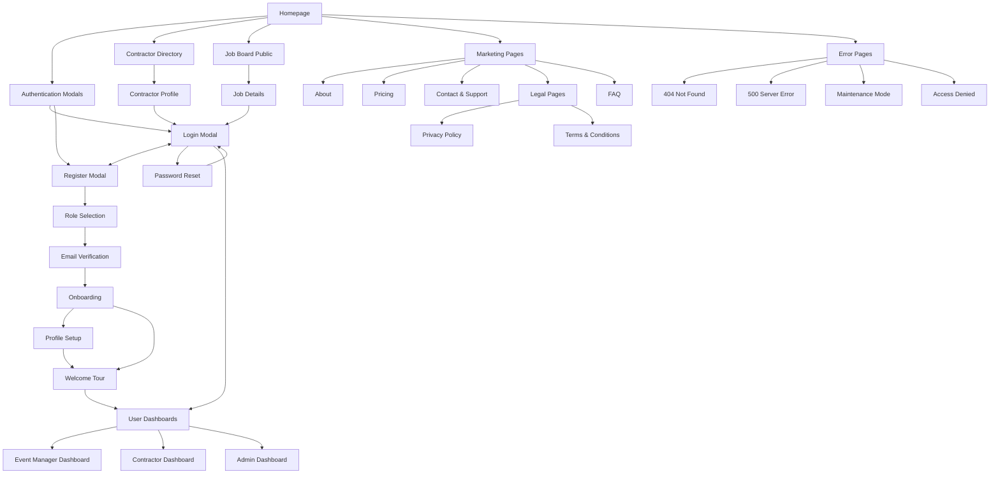
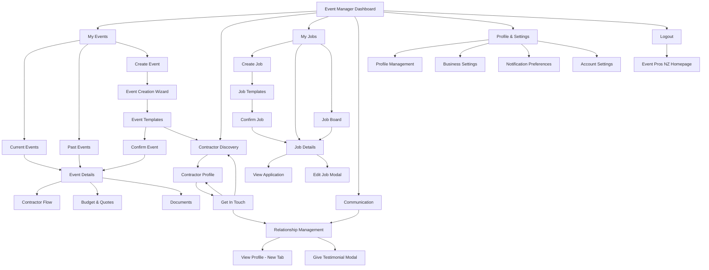
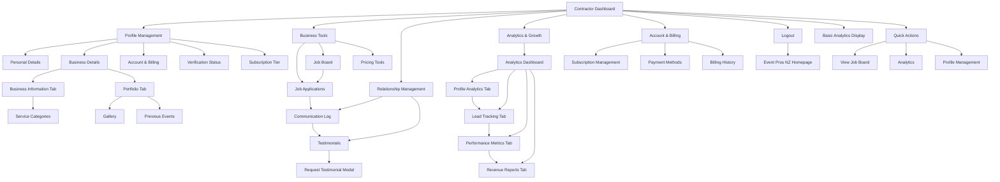
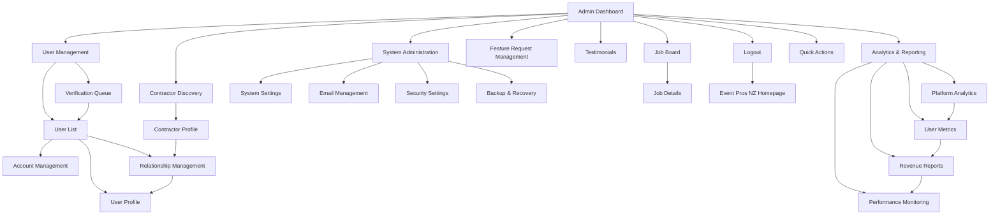
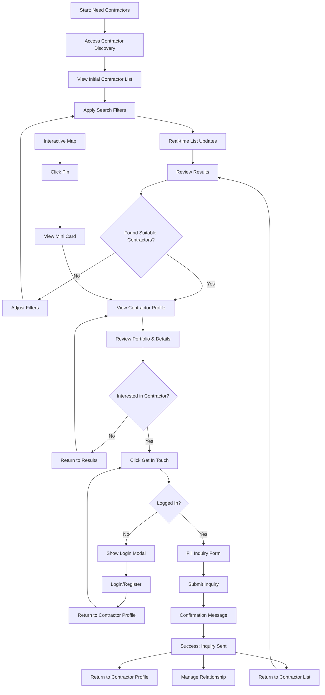
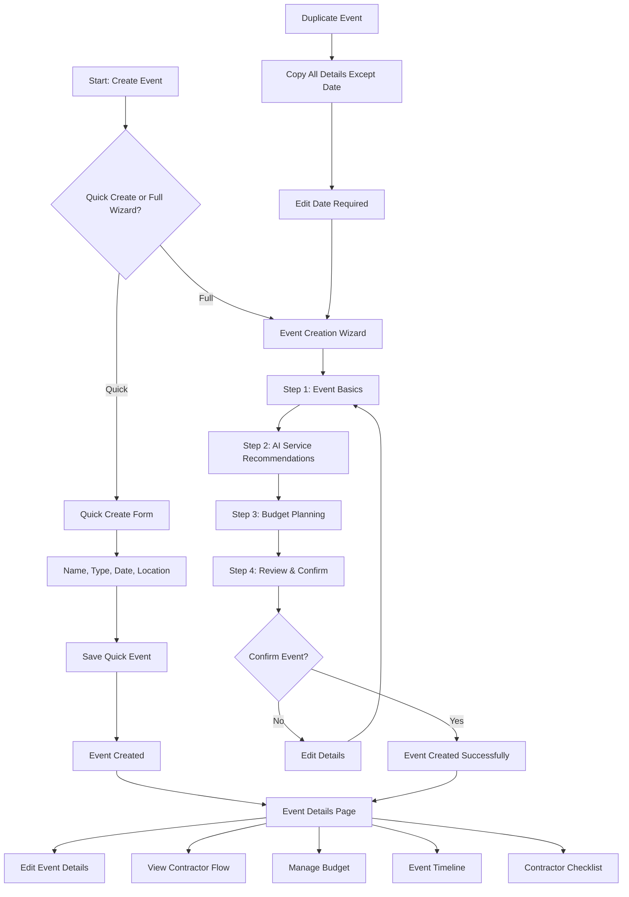
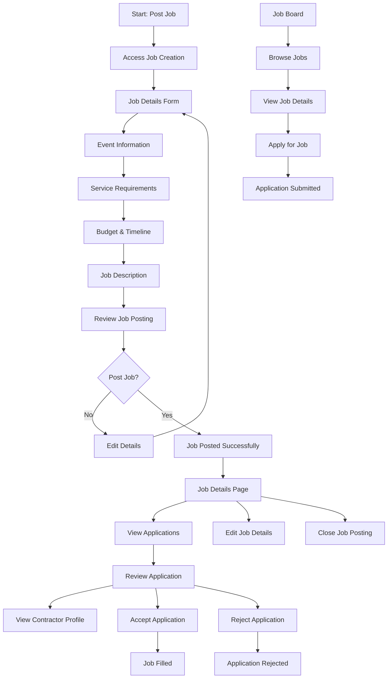
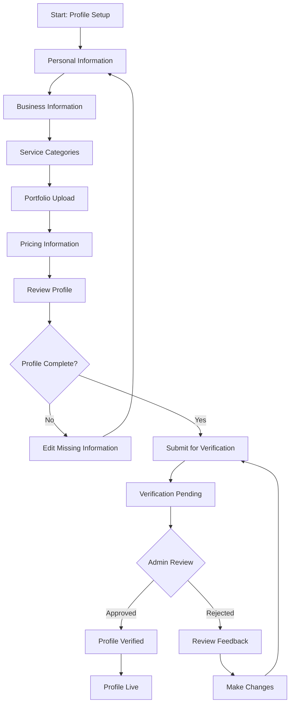
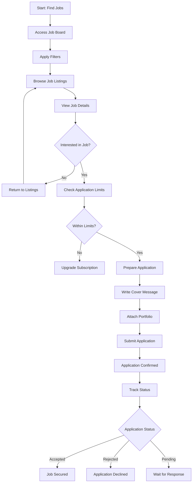
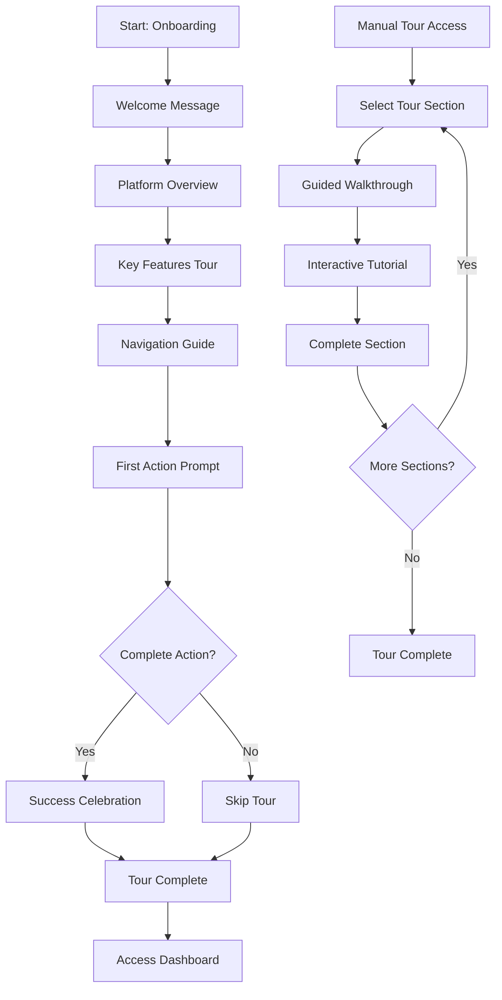

# Event Pros NZ UI/UX Specification

**Document Version:** 1.0  
**Date:** December 2024  
**Author:** UX Expert (Sally)  
**Project:** Event Pros NZ - New Zealand's Event Ecosystem

## Introduction

This document defines the user experience goals, information architecture, user flows, and visual design specifications for Event Pros NZ's user interface. It serves as the foundation for visual design and frontend development, ensuring a cohesive and user-centered experience.

### Overall UX Goals & Principles

#### Target User Personas

**Event Managers:**

- **Personal Event Planners:** Individuals planning weddings, parties, and personal celebrations who need efficient contractor discovery and planning assistance
- **Business Event Managers:** Professionals managing corporate events, conferences, and business functions who require comprehensive planning tools and reliable contractor networks

**Contractors:**

- **Solo Operators:** Independent service providers (DJs, photographers, caterers) seeking increased visibility and qualified leads
- **Established Businesses:** Companies with multiple staff looking to expand their client base and manage business opportunities efficiently

**Admins:**

- **Platform Administrators:** System managers who need control and oversight capabilities for platform quality and user management

#### Usability Goals

- **Efficiency:** Reduce contractor research time from 8 hours to 2 hours for event managers
- **Discovery:** Increase contractor profile views by 300% compared to previous marketing methods
- **Conversion:** Achieve 25%+ enquiry-to-booking conversion rate
- **Accessibility:** Maintain 4.5+ star average rating across all user testimonials
- **Performance:** Sub-1 second page load times with 99.5% platform uptime

#### Design Principles

1. **User-Centric Above All** - Every design decision must serve user needs and reduce friction
2. **Clean & Modern Aesthetic** - Embrace minimalism, clean lines, and contemporary design patterns that feel fresh and professional
3. **Intuitive Navigation** - Create logical, predictable interfaces that users can navigate without learning
4. **Simplicity Through Iteration** - Start simple, refine based on feedback and usage patterns
5. **Delight in the Details** - Thoughtful micro-interactions create memorable experiences
6. **Design for Real Scenarios** - Consider edge cases, errors, and loading states
7. **Collaborate, Don't Dictate** - Best solutions emerge from cross-functional work

### Change Log

| Date     | Version | Description                             | Author            |
| -------- | ------- | --------------------------------------- | ----------------- |
| Dec 2024 | 1.0     | Initial front-end specification created | UX Expert (Sally) |

## Information Architecture (IA)

### Main Site Map (Public/Unauthenticated)

### Event Manager Site Map

### Contractor Site Map

### Admin Site Map

### Navigation Structure

**Primary Navigation:**

- **Home** - Landing page with hero, testimonials, and contractor map
- **Find Contractors** - Directory with search, filters, and map view
- **How It Works** - Process explanation for both user types
- **Pricing** - Subscription tiers and features
- **About** - Company information and team

**Secondary Navigation:**

- **Dashboard** (authenticated users) - Role-specific dashboard
- **Profile** (authenticated users) - User profile management
- **Support** - Help center and contact
- **Login/Register** (unauthenticated users)

**Breadcrumb Strategy:**

- Show current location within the platform hierarchy
- Include clickable parent levels for easy navigation
- Display user role context (Event Manager/Contractor/Admin)
- Highlight current section for complex multi-step processes

## User Flows

### Event Manager - Finding and Contacting Contractors

**User Goal:** Find suitable contractors for their event and initiate contact

**Entry Points:**

- Homepage "Find Contractors" button
- Event Manager Dashboard "Find Contractors" quick action
- Event Details page "Find Contractors" button
- Direct navigation to Contractor Discovery
- Interactive Map Pin Click

**Success Criteria:**

- Successfully find contractors matching event requirements
- Send inquiry to at least one contractor
- Receive confirmation of inquiry sent

**Flow Diagram:**

**Edge Cases & Error Handling:**

- No contractors found matching criteria
- Contractor profile fails to load
- Inquiry form validation errors
- Network connectivity issues
- Session timeout during inquiry process

**Notes:**

- **Initial List**: Shows up to 20 contractors with pagination, prioritized by subscription tier (Premium contractors first) and AI recommendations based on upcoming events and suggested service types
- **Real-time Updates**: List updates automatically as user types in search or adjusts filters
- **Search Filters**: Location, service type, budget range, and availability
- **Contractor Profiles**: Show key information without requiring login
- **Inquiry Form**: Pre-populate with event details if available
- **Post-Success**: Can return to contractor profile or manage relationship
- **Clear Feedback**: For all user actions
- **Loading States**: Skeleton loading for real-time updates
- **Filter Persistence**: Remember user's filter preferences
- **Inquiry Tracking**: Show inquiry status in relationship management
- **Map Integration**: Click pin → mini card → contractor profile

### Event Manager - Creating and Managing Events

**User Goal:** Create a new event with AI-powered recommendations and manage it throughout its lifecycle

**Entry Points:**

- Event Manager Dashboard "Create Event" button
- Event Manager Dashboard "Create Event" quick action
- My Events page "Create New Event" button
- Event Details page "Duplicate Event" option
- Quick Create option (name, type, date, location)

**Success Criteria:**

- Successfully create event with all required details
- Receive AI-powered service recommendations
- Event saved and accessible in My Events
- Can edit and manage event details

**Flow Diagram:**

**Edge Cases & Error Handling:**

- Invalid date selection (past dates, conflicting times)
- Location not found or invalid
- AI recommendations fail to load
- Budget validation errors
- Network connectivity issues during save
- Event creation timeout
- Collaboration permissions - Handle access control for shared events

**Notes:**

- **Event Status**: Draft → Confirmed (confirmed events can engage contractors)
- **AI Budget**: Uses platform data and industry standards for realistic recommendations
- **Templates**: Users can create custom templates from successful events
- **Collaboration**: Premium feature for subscription users
- **Timeline**: Visual milestones and deadlines
- **Checklist**: Basic contractor confirmation tracking

### Event Manager - Posting and Managing Jobs

**User Goal:** Post job opportunities when suitable contractors aren't found and manage applications

**Entry Points:**

- Event Manager Dashboard "My Jobs" section
- My Events page "Post Job" button
- Event Details page "Post Job" button
- Contractor Discovery "No suitable contractors found" option

**Success Criteria:**

- Successfully post job with all required details
- Receive applications from qualified contractors
- Review and manage applications effectively
- Fill job position or close posting

**Flow Diagram:**

**Edge Cases & Error Handling:**

- Invalid job posting details
- No applications received
- Application submission errors
- Contractor profile not found
- Job posting expiration
- Duplicate job postings

**Notes:**

- **Job Templates**: Pre-built templates for common job types
- **Event Linking**: Optional linking to existing events for data import
- **Application Limits**: Based on contractor subscription tier
- **Job Status**: Active, Filled, Closed, Expired
- **Application Management**: Track status and communicate with applicants
- **Job Board**: Public view of all active job postings

### Contractor - Profile Setup and Verification

**User Goal:** Create a comprehensive business profile and get verified to increase visibility

**Entry Points:**

- Registration process
- Contractor Dashboard "Complete Profile" prompt
- Profile Management section

**Success Criteria:**

- Complete all required profile information
- Upload portfolio and business documents
- Submit for verification
- Receive verification approval

**Flow Diagram:**

**Edge Cases & Error Handling:**

- Incomplete required fields
- File upload failures
- Verification rejection
- Profile information conflicts

**Notes:**

- **Verification Process**: Manual admin review for contractors
- **Profile Completion**: Track completion percentage
- **Document Requirements**: Business registration, insurance, etc.
- **Portfolio**: Multiple image uploads, video links

### Contractor - Finding and Applying for Jobs

**User Goal:** Find relevant job opportunities and submit applications

**Entry Points:**

- Contractor Dashboard "Job Board" button
- Job notifications
- Search for specific job types

**Success Criteria:**

- Find jobs matching service categories
- Submit compelling applications
- Track application status
- Secure job opportunities

**Flow Diagram:**

**Edge Cases & Error Handling:**

- Application limit exceeded
- Job posting expired
- Application submission errors
- Portfolio upload failures

**Notes:**

- **Application Limits**: Based on subscription tier (Essential: 2/month, Showcase: 5/month, Spotlight: unlimited)
- **Service Categories**: Can only apply to jobs matching their categories
- **Application Tracking**: Status updates and notifications
- **Portfolio Requirements**: Relevant work samples

### Cross-Platform - Onboarding and Welcome Tour

**User Goal:** Get familiar with the platform and understand key features

**Entry Points:**

- After successful registration
- First login after email verification
- Manual access from user menu

**Success Criteria:**

- Complete welcome tour
- Understand platform navigation
- Know how to access key features
- Feel confident using the platform

**Flow Diagram:**

**Edge Cases & Error Handling:**

- Tour interruption
- Feature not available
- User skips tour
- Technical issues during tour

**Notes:**

- **Skippable**: Users can skip tour at any time
- **Progressive**: Show only relevant features for user role
- **Interactive**: Hands-on experience with key features
- **Replayable**: Can access tour again later
