# Event Pros NZ UI/UX Specification

**Document Version:** 1.0  
**Date:** December 2024  
**Author:** UX Expert (Sally)  
**Project:** Event Pros NZ - New Zealand's Event Ecosystem

## Introduction

This document defines the user experience goals, information architecture, user flows, and visual design specifications for Event Pros NZ's user interface. It serves as the foundation for visual design and frontend development, ensuring a cohesive and user-centered experience.

### Overall UX Goals & Principles

#### Target User Personas

**Event Managers:**

- **Personal Event Planners:** Individuals planning weddings, parties, and personal celebrations who need efficient contractor discovery and planning assistance
- **Business Event Managers:** Professionals managing corporate events, conferences, and business functions who require comprehensive planning tools and reliable contractor networks

**Contractors:**

- **Solo Operators:** Independent service providers (DJs, photographers, caterers) seeking increased visibility and qualified leads
- **Established Businesses:** Companies with multiple staff looking to expand their client base and manage business opportunities efficiently

**Admins:**

- **Platform Administrators:** System managers who need control and oversight capabilities for platform quality and user management

#### Usability Goals

- **Efficiency:** Reduce contractor research time from 8 hours to 2 hours for event managers
- **Discovery:** Increase contractor profile views by 300% compared to previous marketing methods
- **Conversion:** Achieve 25%+ enquiry-to-booking conversion rate
- **Accessibility:** Maintain 4.5+ star average rating across all user testimonials
- **Performance:** Sub-1 second page load times with 99.5% platform uptime

#### Design Principles

1. **User-Centric Above All** - Every design decision must serve user needs and reduce friction
2. **Clean & Modern Aesthetic** - Embrace minimalism, clean lines, and contemporary design patterns that feel fresh and professional
3. **Intuitive Navigation** - Create logical, predictable interfaces that users can navigate without learning
4. **Simplicity Through Iteration** - Start simple, refine based on feedback and usage patterns
5. **Delight in the Details** - Thoughtful micro-interactions create memorable experiences
6. **Design for Real Scenarios** - Consider edge cases, errors, and loading states
7. **Collaborate, Don't Dictate** - Best solutions emerge from cross-functional work

### Change Log

| Date     | Version | Description                             | Author            |
| -------- | ------- | --------------------------------------- | ----------------- |
| Dec 2024 | 1.0     | Initial front-end specification created | UX Expert (Sally) |

## Information Architecture (IA)

### Main Site Map (Public/Unauthenticated)

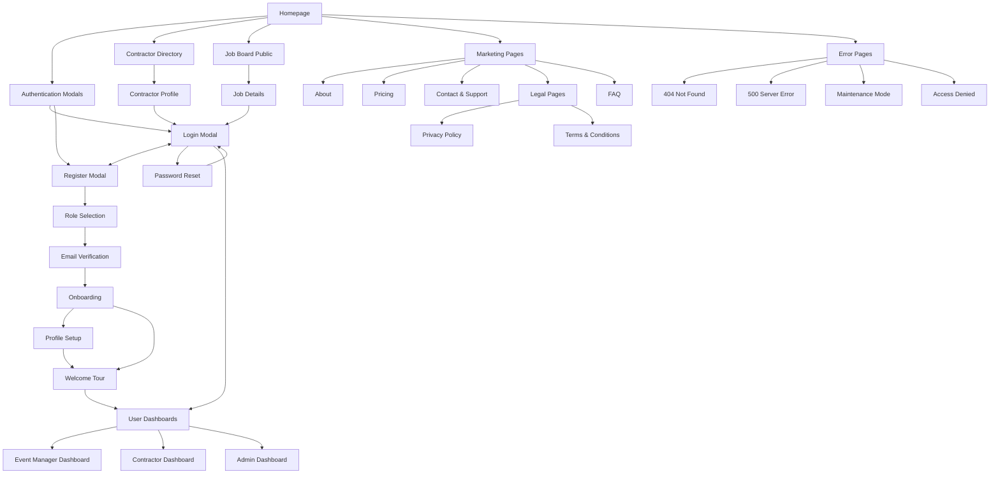

### Event Manager Site Map

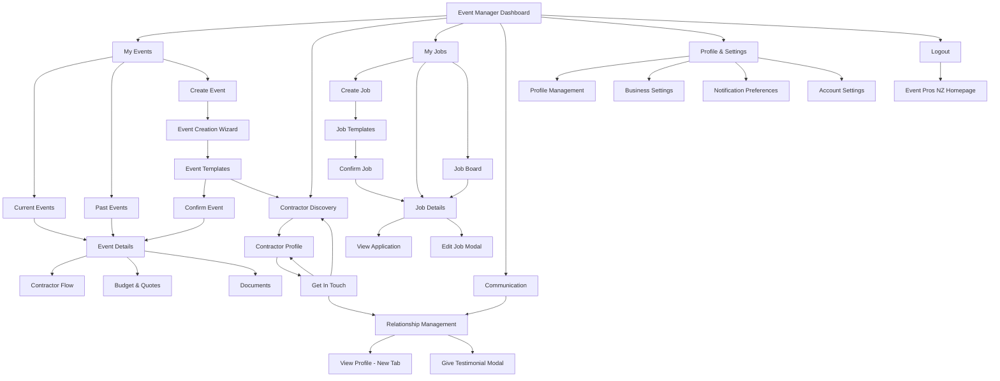

### Contractor Site Map

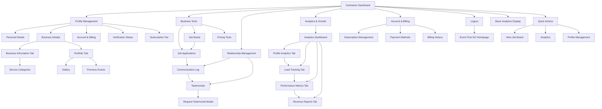

### Admin Site Map

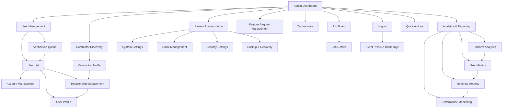

### Navigation Structure

**Primary Navigation:**

- **Home** - Landing page with hero, testimonials, and contractor map
- **Find Contractors** - Directory with search, filters, and map view
- **How It Works** - Process explanation for both user types
- **Pricing** - Subscription tiers and features
- **About** - Company information and team

**Secondary Navigation:**

- **Dashboard** (authenticated users) - Role-specific dashboard
- **Profile** (authenticated users) - User profile management
- **Support** - Help center and contact
- **Login/Register** (unauthenticated users)

**Breadcrumb Strategy:**

- Show current location within the platform hierarchy
- Include clickable parent levels for easy navigation
- Display user role context (Event Manager/Contractor/Admin)
- Highlight current section for complex multi-step processes

## User Flows

### Event Manager - Finding and Contacting Contractors

**User Goal:** Find suitable contractors for their event and initiate contact

**Entry Points:**

- Homepage "Find Contractors" button
- Event Manager Dashboard "Find Contractors" quick action
- Event Details page "Find Contractors" button
- Direct navigation to Contractor Discovery
- Interactive Map Pin Click

**Success Criteria:**

- Successfully find contractors matching event requirements
- Send inquiry to at least one contractor
- Receive confirmation of inquiry sent

**Flow Diagram:**

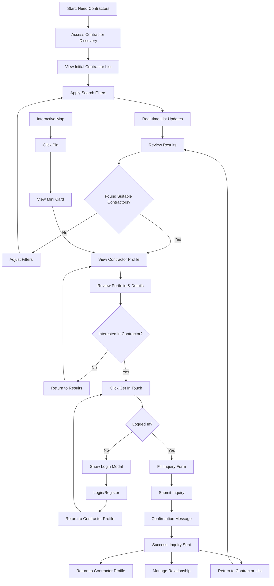

**Edge Cases & Error Handling:**

- No contractors found matching criteria
- Contractor profile fails to load
- Inquiry form validation errors
- Network connectivity issues
- Session timeout during inquiry process

**Notes:**

- **Initial List**: Shows up to 20 contractors with pagination, prioritized by subscription tier (Premium contractors first) and AI recommendations based on upcoming events and suggested service types
- **Real-time Updates**: List updates automatically as user types in search or adjusts filters
- **Search Filters**: Location, service type, budget range, and availability
- **Contractor Profiles**: Show key information without requiring login
- **Inquiry Form**: Pre-populate with event details if available
- **Post-Success**: Can return to contractor profile or manage relationship
- **Clear Feedback**: For all user actions
- **Loading States**: Skeleton loading for real-time updates
- **Filter Persistence**: Remember user's filter preferences
- **Inquiry Tracking**: Show inquiry status in relationship management
- **Map Integration**: Click pin → mini card → contractor profile

### Event Manager - Creating and Managing Events

**User Goal:** Create a new event with AI-powered recommendations and manage it throughout its lifecycle

**Entry Points:**

- Event Manager Dashboard "Create Event" button
- Event Manager Dashboard "Create Event" quick action
- My Events page "Create New Event" button
- Event Details page "Duplicate Event" option
- Quick Create option (name, type, date, location)

**Success Criteria:**

- Successfully create event with all required details
- Receive AI-powered service recommendations
- Event saved and accessible in My Events
- Can edit and manage event details

**Flow Diagram:**

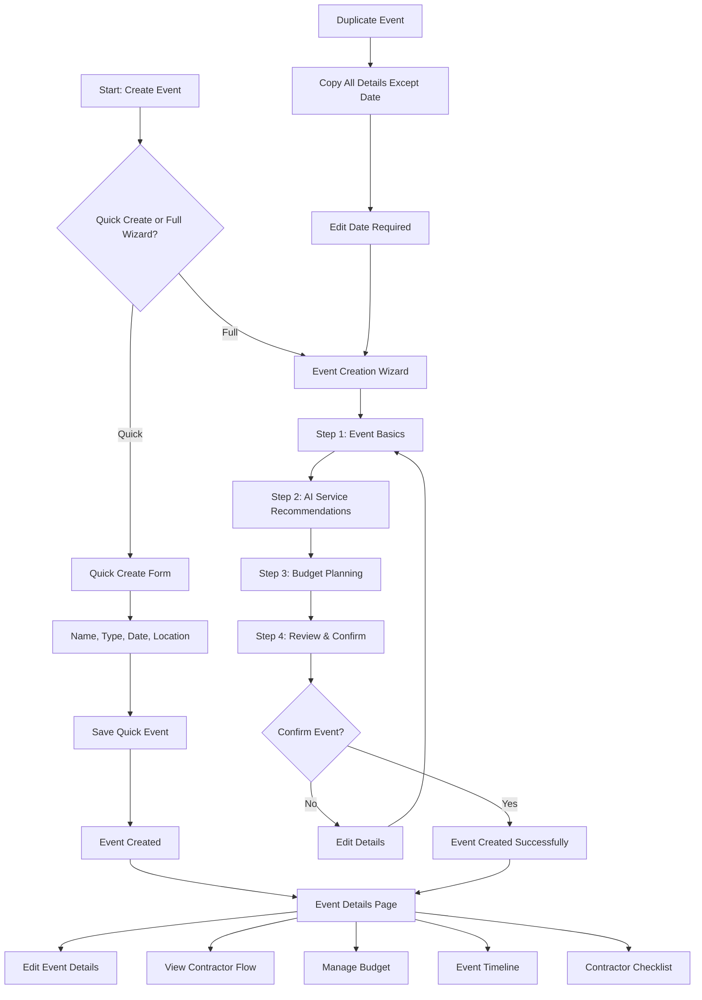

**Edge Cases & Error Handling:**

- Invalid date selection (past dates, conflicting times)
- Location not found or invalid
- AI recommendations fail to load
- Budget validation errors
- Network connectivity issues during save
- Event creation timeout
- Collaboration permissions - Handle access control for shared events

**Notes:**

- **Event Status**: Draft → Confirmed (confirmed events can engage contractors)
- **AI Budget**: Uses platform data and industry standards for realistic recommendations
- **Templates**: Users can create custom templates from successful events
- **Collaboration**: Premium feature for subscription users
- **Timeline**: Visual milestones and deadlines
- **Checklist**: Basic contractor confirmation tracking

### Event Manager - Posting and Managing Jobs

**User Goal:** Post job opportunities when suitable contractors aren't found and manage applications

**Entry Points:**

- Event Manager Dashboard "My Jobs" section
- My Events page "Post Job" button
- Event Details page "Post Job" button
- Contractor Discovery "No suitable contractors found" option

**Success Criteria:**

- Successfully post job with all required details
- Receive applications from qualified contractors
- Review and manage applications effectively
- Fill job position or close posting

**Flow Diagram:**

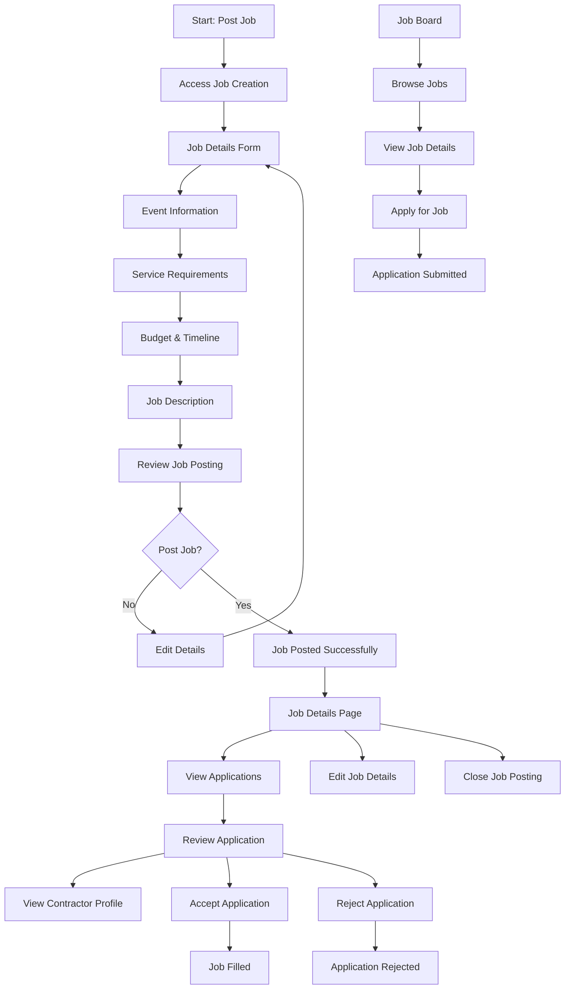

**Edge Cases & Error Handling:**

- Invalid job posting details
- No applications received
- Application submission errors
- Contractor profile not found
- Job posting expiration
- Duplicate job postings

**Notes:**

- **Job Templates**: Pre-built templates for common job types
- **Event Linking**: Optional linking to existing events for data import
- **Application Limits**: Based on contractor subscription tier
- **Job Status**: Active, Filled, Closed, Expired
- **Application Management**: Track status and communicate with applicants
- **Job Board**: Public view of all active job postings

### Contractor - Profile Setup and Verification

**User Goal:** Create a comprehensive business profile and get verified to increase visibility

**Entry Points:**

- Registration process
- Contractor Dashboard "Complete Profile" prompt
- Profile Management section

**Success Criteria:**

- Complete all required profile information
- Upload portfolio and business documents
- Submit for verification
- Receive verification approval

**Flow Diagram:**

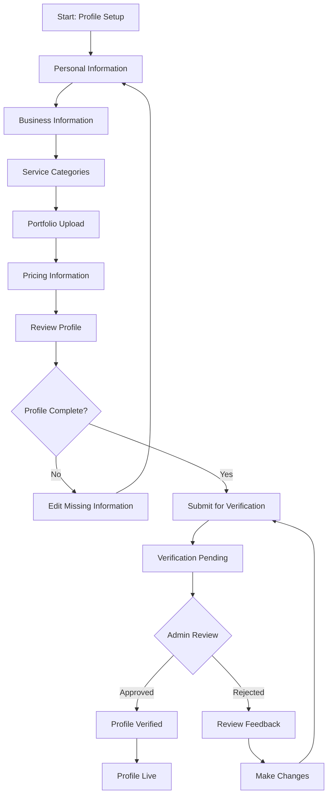

**Edge Cases & Error Handling:**

- Incomplete required fields
- File upload failures
- Verification rejection
- Profile information conflicts

**Notes:**

- **Verification Process**: Manual admin review for contractors
- **Profile Completion**: Track completion percentage
- **Document Requirements**: Business registration, insurance, etc.
- **Portfolio**: Multiple image uploads, video links

### Contractor - Finding and Applying for Jobs

**User Goal:** Find relevant job opportunities and submit applications

**Entry Points:**

- Contractor Dashboard "Job Board" button
- Job notifications
- Search for specific job types

**Success Criteria:**

- Find jobs matching service categories
- Submit compelling applications
- Track application status
- Secure job opportunities

**Flow Diagram:**

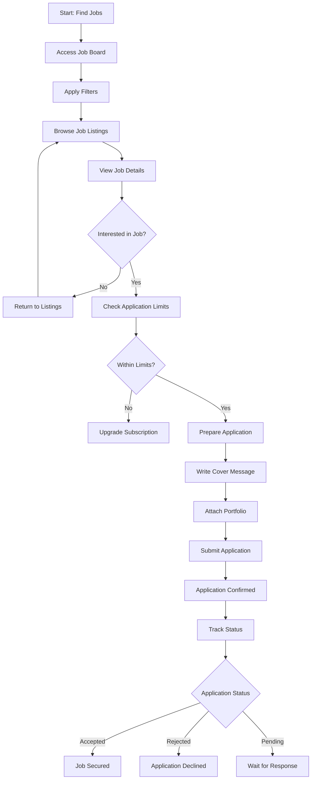

**Edge Cases & Error Handling:**

- Application limit exceeded
- Job posting expired
- Application submission errors
- Portfolio upload failures

**Notes:**

- **Application Limits**: Based on subscription tier (Essential: 2/month, Showcase: 5/month, Spotlight: unlimited)
- **Service Categories**: Can only apply to jobs matching their categories
- **Application Tracking**: Status updates and notifications
- **Portfolio Requirements**: Relevant work samples

### Cross-Platform - Onboarding and Welcome Tour

**User Goal:** Get familiar with the platform and understand key features

**Entry Points:**

- After successful registration
- First login after email verification
- Manual access from user menu

**Success Criteria:**

- Complete welcome tour
- Understand platform navigation
- Know how to access key features
- Feel confident using the platform

**Flow Diagram:**

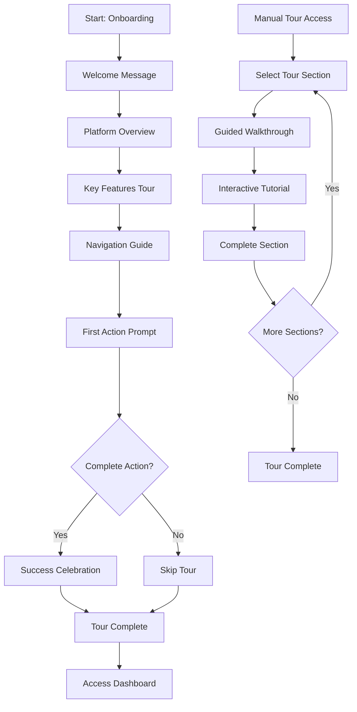

**Edge Cases & Error Handling:**

- Tour interruption
- Feature not available
- User skips tour
- Technical issues during tour

**Notes:**

- **Skippable**: Users can skip tour at any time
- **Progressive**: Show only relevant features for user role
- **Interactive**: Hands-on experience with key features
- **Replayable**: Can access tour again later

### Event Manager - Profile Setup

**User Goal:** Complete profile setup with personal and business information

**Entry Points:**

- Sign-up modal (Email, password, confirm password, Google login, Terms & Conditions, Privacy Policy)
- Login modal (for existing users)
- Event Manager Dashboard "Complete Profile" prompt
- Profile Management section

**Success Criteria:**

- Complete all required profile information
- Verify contact information
- Set up business details (if applicable)
- Profile ready for platform use

**Flow Diagram:**

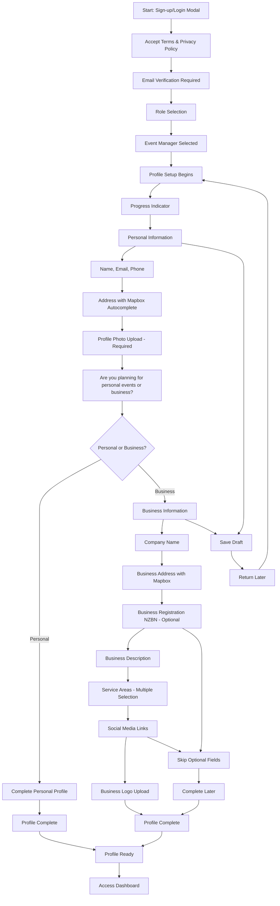

**Edge Cases & Error Handling:**

- Invalid address information
- File upload failures
- Required field validation errors
- Business registration validation
- Network connectivity issues
- Terms acceptance validation
- Email verification failures
- Draft save failures

**Notes:**

- **Mapbox Integration**: Address autocomplete for accurate location data
- **Business Registration**: NZBN validation for business profiles (optional)
- **Profile Completion**: Track completion percentage with progress indicator
- **Photo Upload**: Profile photo required, business logo optional
- **Service Areas**: Multiple geographic coverage areas selection
- **Draft Saving**: Auto-save and manual save options
- **Mobile Optimization**: Responsive design for all devices
- **Validation**: Clear error messages and success confirmations

### Event Manager - View and Create Feature Requests

**User Goal:** Submit feature requests and vote on others' suggestions to influence platform development

**Entry Points:**

- Event Manager Dashboard "Feature Requests" link
- Footer "Feature Requests" link
- Direct navigation to feature request board
- Email notification about new feature requests

**Success Criteria:**

- Successfully submit feature request with detailed description
- Vote on existing feature requests
- Track status of submitted requests
- See community feedback and engagement

**Flow Diagram:**

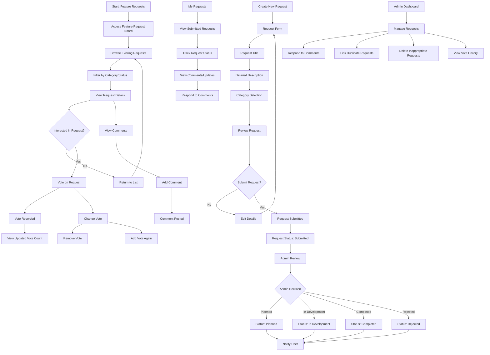

**Edge Cases & Error Handling:**

- Duplicate feature requests
- Inappropriate content in requests
- Voting system errors
- Request submission failures
- Network connectivity issues
- Admin review delays
- Comment moderation issues
- Vote change failures

**Notes:**

- **Authentication Required**: Must be logged in to submit or vote
- **Request Categories**: UI/UX, Functionality, Integration, Performance, etc.
- **Status Tracking**: Submitted, Planned, In Development, Completed, Rejected
- **Status Filter**: Users can filter requests by status
- **Voting System**: One vote per user per request, can change vote
- **Admin Communication**: Updates and responses from admin team
- **Search Functionality**: Find requests by title, description, or category
- **Sorting Options**: By votes, date, status, category
- **Comment System**: Users can comment, admins can respond
- **Request Moderation**: Admin can link duplicates and delete inappropriate content
- **Email Notifications**: Notify creators and voters of status updates
- **Analytics**: Show request popularity and engagement metrics

### Contractor - View and Create Feature Requests

**User Goal:** Submit feature requests and vote on others' suggestions to influence platform development

**Entry Points:**

- Contractor Dashboard "Feature Requests" link
- Footer "Feature Requests" link
- Direct navigation to feature request board
- Email notification about new feature requests

**Success Criteria:**

- Successfully submit feature request with detailed description
- Vote on existing feature requests
- Track status of submitted requests
- See community feedback and engagement

**Flow Diagram:**


**Edge Cases & Error Handling:**

- Duplicate feature requests
- Inappropriate content in requests
- Voting system errors
- Request submission failures
- Network connectivity issues
- Admin review delays
- Comment moderation issues
- Vote change failures

**Notes:**

- **Authentication Required**: Must be logged in to submit or vote
- **Request Categories**: UI/UX, Functionality, Integration, Performance, etc.
- **Status Tracking**: Submitted, Planned, In Development, Completed, Rejected
- **Status Filter**: Users can filter requests by status
- **Voting System**: One vote per user per request, can change vote
- **Admin Communication**: Updates and responses from admin team
- **Search Functionality**: Find requests by title, description, or category
- **Sorting Options**: By votes, date, status, category
- **Comment System**: Users can comment, admins can respond
- **Request Moderation**: Admin can link duplicates and delete inappropriate content
- **Email Notifications**: Notify creators and voters of status updates
- **Analytics**: Show request popularity and engagement metrics

### Admin - Review Feature Requests

**User Goal:** Review, manage, and respond to feature requests from the community

**Entry Points:**

- Admin Dashboard "Feature Request Management" section
- Direct navigation to admin feature request panel
- Email notification about new feature requests
- Admin notification about flagged requests

**Success Criteria:**

- Review all submitted feature requests
- Categorize and prioritize requests
- Respond to user comments and questions
- Update request status appropriately
- Manage duplicate and inappropriate content

**Flow Diagram:**

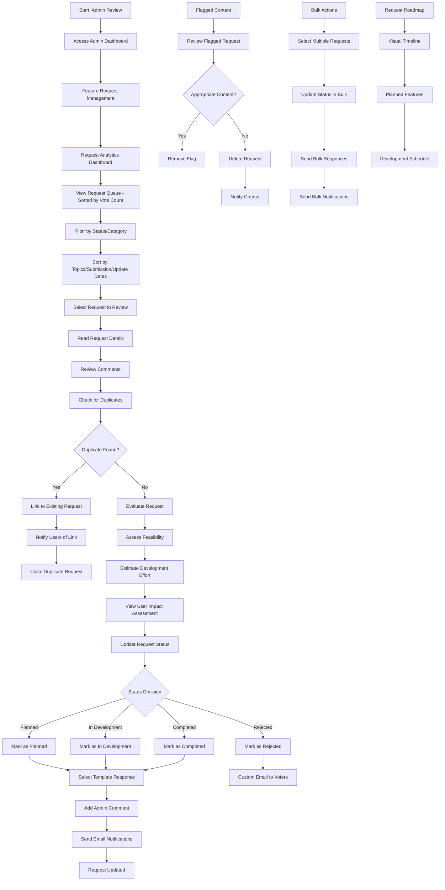

**Edge Cases & Error Handling:**

- High volume of requests
- Inappropriate content requiring immediate attention
- Duplicate request detection failures
- Notification delivery failures
- Bulk action errors
- User complaints about decisions
- Template response failures
- Roadmap update conflicts

**Notes:**

- **Request Queue**: Prioritized by vote count, then admin discretion
- **Filtering/Sorting**: By status, category, topics, submission dates, update dates
- **Response Time**: 2-week expected response time
- **Bulk Actions**: Multiple status updates and bulk responses
- **Escalation**: Custom email to voters for rejected high-vote requests
- **Analytics**: Trends, popular categories, admin workload metrics
- **Templates**: Pre-written responses for common scenarios
- **Auto-Categorization**: System suggests categories based on content
- **User Impact**: Admin-only view of user benefit metrics
- **Development Effort**: Admin estimation of implementation complexity
- **Roadmap**: Visual timeline of planned features
- **Content Moderation**: Flag and remove inappropriate content
- **Notification System**: Keep users informed of status changes
- **Audit Trail**: Log all admin actions for accountability

### Contractor - Managing Testimonials and Reviews

**User Goal:** Manage testimonials received from event managers and request new testimonials

**Entry Points:**

- Contractor Dashboard "Testimonials" section
- Relationship Management "Testimonials" tab
- Email notification about new testimonials
- Profile Management "Testimonials" section

**Success Criteria:**

- View all received testimonials
- Request testimonials from past clients
- Respond to testimonials
- See testimonial impact on profile

**Flow Diagram:**

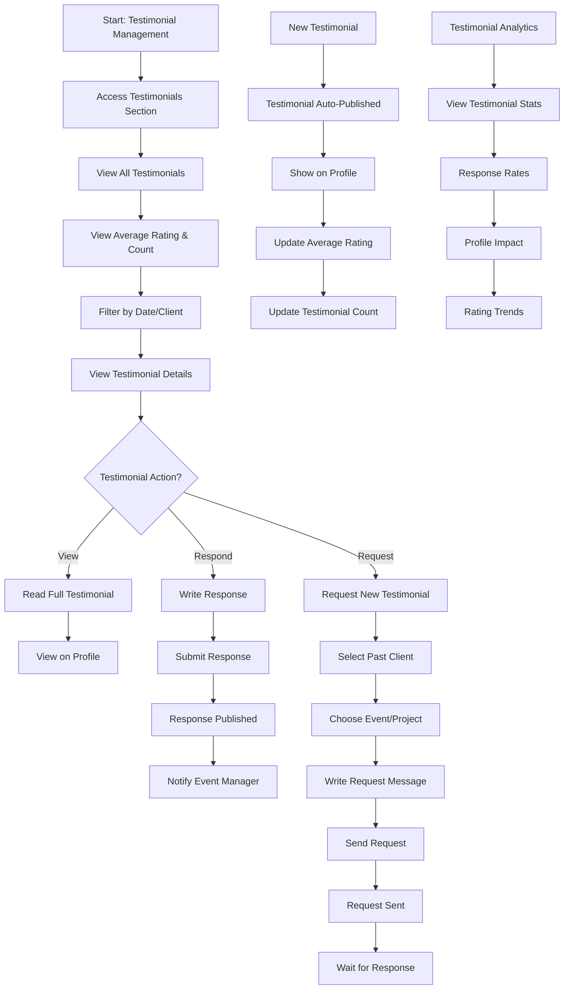

**Edge Cases & Error Handling:**

- Testimonial request failures
- Client not responding to requests
- Inappropriate testimonial content
- Testimonial display errors
- Response submission failures
- Client contact information issues

**Notes:**

- **Testimonial Status**: Requested, Published
- **Auto-Publishing**: All testimonials get published immediately
- **Profile Summary**: Shows average rating and count in brackets
- **Request System**: Send requests to past clients
- **Response Functionality**: Contractors can respond to testimonials
- **Analytics**: Track testimonial performance and response rates
- **Client Verification**: Verification tick for confirmed events
- **Template System**: Contractors can create custom request templates
- **Rating Breakdown**: Show rating distribution (5 stars, 4 stars, etc.)
- **Recent Testimonials**: Highlight most recent testimonials on profile
- **Notifications**: Notify contractors when new testimonials are received
- **Automated Reminders**: 24h → 2 days → 3 days reminder sequence

### Admin - Content Moderation and Reporting

**User Goal:** Moderate platform content and handle user reports to maintain platform quality

**Entry Points:**

- Admin Dashboard "Content Moderation" section
- Email notification about flagged content
- Direct reports from users
- System alerts about suspicious activity

**Success Criteria:**

- Review and moderate flagged content
- Handle user reports appropriately
- Maintain platform quality standards
- Take appropriate action on violations

**Flow Diagram:**

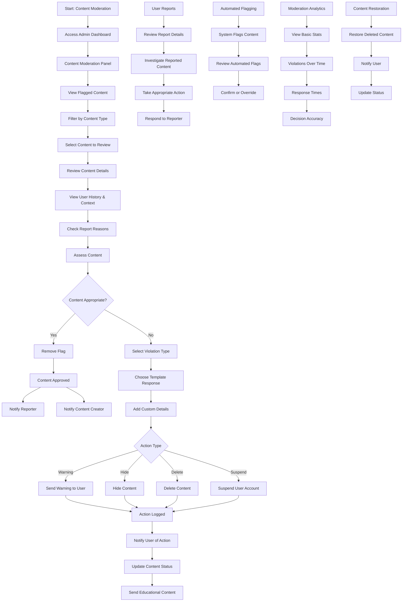

**Edge Cases & Error Handling:**

- High volume of flagged content
- Conflicting reports on same content
- System errors during content review
- False positive flagging
- User harassment through reporting
- Template response failures
- Content restoration errors

**Notes:**

- **Content Types**: Profiles, testimonials, job postings, feature requests, messages
- **Violation Types**: Inappropriate content, spam, harassment, fake information, policy violations
- **Action Types**: Warning, hide content, delete content, suspend account
- **Template Responses**: Pre-written responses for common moderation actions
- **User Context**: Show related content and user history for better decisions
- **Educational Content**: Send educational material with warnings
- **Automated Flagging**: System flags obvious violations automatically
- **Basic Analytics**: Track violations over time, response times, decision accuracy
- **Content Restoration**: Can restore deleted content if needed
- **User Notifications**: Notify users when content is flagged
- **Flag Removal**: Notify both content creator and reporter when flag is removed
- **Audit Trail**: Log all moderation actions
- **User Communication**: Clear explanations with violation type and details

### Cross-Platform - Password Reset and Account Recovery

**User Goal:** Reset forgotten password and recover account access

**Entry Points:**

- Login modal "Forgot Password" link
- Password reset email
- Account recovery page
- Support contact for account issues

**Success Criteria:**

- Successfully reset password
- Regain access to account
- Secure account recovery process
- Clear confirmation of successful reset

**Flow Diagram:**

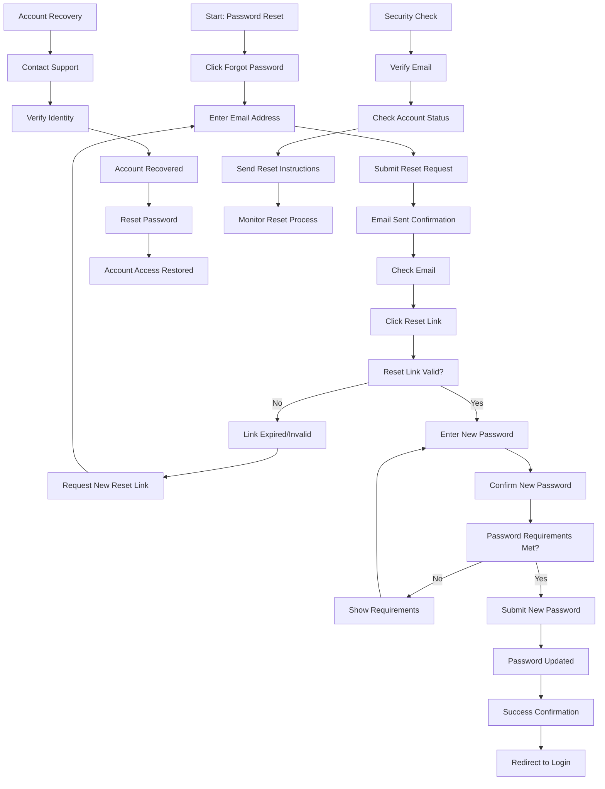

**Edge Cases & Error Handling:**

- Invalid email address
- Reset link expiration
- Password requirements not met
- Account locked or suspended
- Email delivery failures
- Multiple reset requests
- Suspicious activity detection

**Notes:**

- **Email Verification**: Verify email before sending reset link
- **Link Expiration**: Reset links expire after 24 hours
- **Password Requirements**: Strong password requirements
- **Rate Limiting**: 3 reset requests per day per user
- **Account Lockout**: 3-hour lockout after 5 failed login attempts in one hour
- **Suspicious Activity**: 5 failed login attempts in one hour triggers 3-hour lockout and admin alert
- **Security Notifications**: Users notified of suspicious activity attempts
- **Lockout Communication**: Clear message explaining lockout reason and when they can try again
- **Account Status**: Check if account is active before reset
- **Timeout Handling**: User must re-request password reset if not completed within 24 hours
- **Email Delivery**: Reattempt if email doesn't arrive; notify admin if second attempt fails
- **Recovery Question Setup**: Set up during onboarding flow in profile settings
- **Support Recovery**: Personal recovery question and pre-defined answer for identity verification
- **Admin Alert Details**: Include IP address, timestamp, user email, and attempt count
- **Audit Trail**: Log all password reset attempts for security analysis
- **Success Confirmation**: Clear confirmation of successful reset
- **Support Contact**: Alternative recovery method through support

### Contractor - Managing Inquiries and Relationships

**User Goal:** Manage incoming inquiries from event managers and maintain ongoing business relationships through integrated relationship management

**Entry Points:**

- Contractor Dashboard "Relationship Management" section
- Email notification about new inquiries
- Direct navigation from contractor profile
- Relationship Management page

**Success Criteria:**

- View and respond to all incoming inquiries within 48 hours
- Track inquiry status and follow-up actions
- Maintain communication history with event managers
- Convert inquiries into bookings
- Manage ongoing relationships effectively
- Schedule calls and meetings with event managers

**Flow Diagram:**

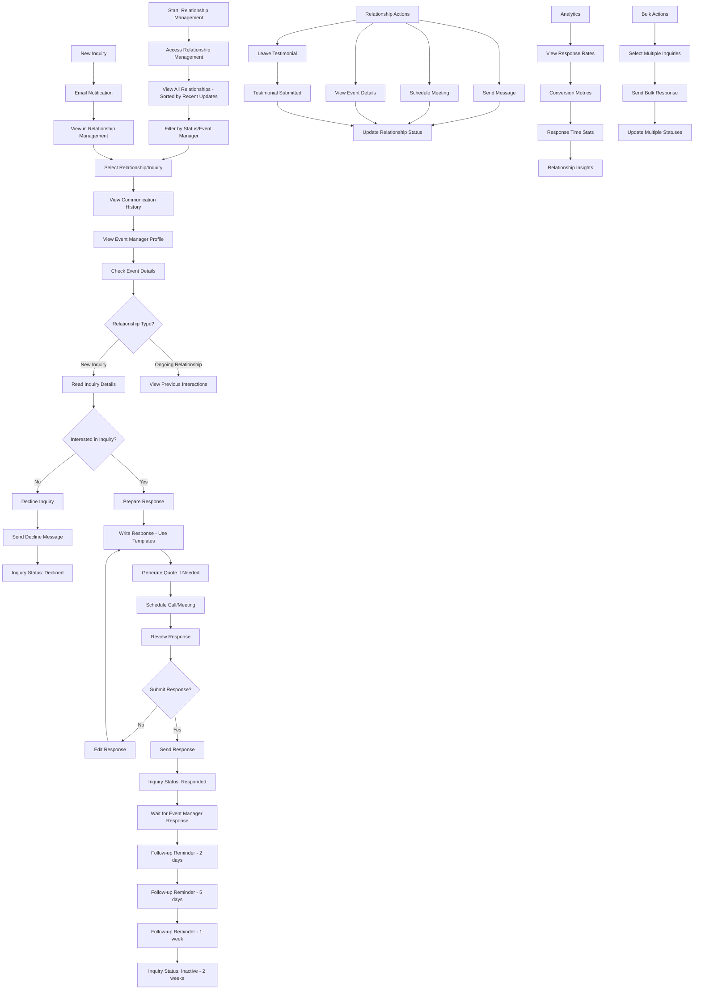

**Edge Cases & Error Handling:**

- Inquiry response failures
- Event manager not responding within 2 weeks
- Duplicate inquiries from same event manager
- Inquiry expiration (2 weeks)
- Communication system errors
- Quote generation failures
- Meeting scheduling conflicts
- Follow-up reminder failures
- Testimonial submission errors

**Notes:**

- **Inquiry Status**: New, Responded, Follow-up, Declined, Converted, Inactive (after 2 weeks)
- **Response Time**: 48-hour expected response time for contractors
- **Follow-up Schedule**: 2 days, 5 days, and 1 week reminders
- **Inquiry Expiration**: 2 weeks - status changes to inactive unless event manager updates
- **Relationship Sorting**: Most recently updated relationships appear first
- **Response Templates**: Pre-written responses for common scenarios
- **Quote Generator**: Built-in tool for creating professional quotes
- **Meeting Scheduling**: Ability to schedule calls and face-to-face meetings
- **Testimonial System**: Both parties can leave testimonials after service completion
- **Bulk Actions**: Respond to multiple inquiries simultaneously
- **Communication History**: Complete log of all interactions
- **Event Manager Profiles**: Quick access to contact details and history
- **Analytics**: Track response rates, conversion metrics, and relationship insights
- **Mobile Optimization**: Full functionality on mobile devices
- **Notification System**: Real-time alerts for new inquiries and responses

### Admin - User Verification and Management

**User Goal:** Verify contractor accounts, manage user profiles, and maintain platform quality through comprehensive user management

**Entry Points:**

- Admin Dashboard "User Management" section
- Email notification about new contractor applications
- Direct navigation from admin dashboard
- User verification queue

**Success Criteria:**

- Review and verify contractor applications efficiently
- Manage user account status and permissions
- Handle verification rejections with clear communication
- Monitor user activity and compliance
- Maintain accurate user records
- Process verification appeals

**Flow Diagram:**

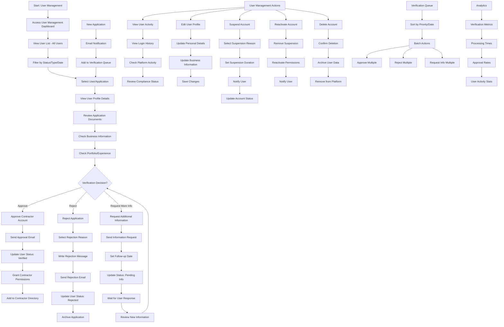

**Edge Cases & Error Handling:**

- Incomplete application documents
- Invalid business registration numbers
- Fake or fraudulent applications
- User appeals for rejected applications
- System errors during verification process
- Email delivery failures
- Document upload issues
- User account conflicts
- Verification timeout (applications expire after 30 days)
- Duplicate account detection

**Notes:**

- **Verification Status**: Pending, Under Review, Approved, Rejected, Suspended, Expired
- **Processing Time**: 48-72 hours for standard verification
- **Document Requirements**: Business registration (optional), portfolio samples (recommended), identification
- **Rejection Reasons**: Incomplete info, fake documents, policy violations, insufficient experience
- **Appeal Process**: Users can appeal rejections within 7 days through relationship manager
- **Suspension Reasons**: Policy violations, suspicious activity, payment issues (case by case)
- **Batch Processing**: Handle multiple applications simultaneously
- **Audit Trail**: Complete log of all verification actions
- **Email Templates**: Pre-written messages for approvals, rejections, and requests
- **Priority Queue**: VIP or premium applications processed first
- **Compliance Monitoring**: Regular checks for ongoing compliance
- **Data Retention**: Archived applications kept for 2 years
- **User Communication**: Clear, professional messaging for all actions
- **Mobile Access**: Full functionality on mobile devices for admins
- **Verification Criteria**: Completed profile, contact details, service categories, profile photo, response time commitment, industry experience (recommended), portfolio quality (recommended)
- **Verification Checklist**: Profile completeness, business information accuracy, contact details, service categories, no policy violations, professional presentation, industry experience (recommended), response time commitment, terms acceptance
- **User Education**: Profile setup guide, portfolio best practices, service category selection, response time expectations, platform policies, success tips, common rejection reasons, appeal process
- **Tiered Verification**: Basic verification for free accounts, enhanced verification for premium
- **Verification Badges**: Visual indicators of verification status on profiles
- **Quality Score**: Track contractor performance metrics
- **Mentorship Program**: Connect new contractors with experienced ones (future feature)

### Admin - Platform Monitoring and Analytics

**User Goal:** Monitor platform health, track key metrics, analyze user behavior, and generate reports for business insights and decision-making

**Entry Points:**

- Admin Dashboard "Analytics" section
- Direct navigation from admin dashboard
- Email notifications for critical alerts
- Manual report generation

**Success Criteria:**

- Monitor real-time platform performance
- Track user engagement and conversion metrics
- Identify trends and patterns in user behavior
- Generate comprehensive reports on-demand
- Set up automated alerts for critical issues
- Make data-driven decisions for platform improvements

**Flow Diagram:**

```mermaid
graph TD
    A[Start: Platform Analytics] --> B[Access Analytics Dashboard]
    B --> C[View Top 6 Key Metrics]
    C --> D[Daily Active Users]
    C --> E[New Registrations - 7 days]
    C --> F[Job Postings - 7 days]
    C --> G[Inquiry Response Rate]
    C --> H[Platform Uptime]
    C --> I[Revenue]

    D --> J[View User Activity Trends]
    E --> K[Analyze Registration Patterns]
    F --> L[Track Job Posting Trends]
    G --> M[Monitor Contractor Performance]
    H --> N[Check System Health]
    I --> O[Review Revenue Metrics]

    P[Detailed Analytics] --> Q[Select Analytics Category]
    Q --> R[User Analytics]
    Q --> S[Platform Performance]
    Q --> T[Business Metrics]
    Q --> U[Content Analytics]

    R --> V[User Registration Trends]
    R --> W[User Activity Patterns]
    R --> X[User Engagement Metrics]
    R --> Y[User Retention Rates]

    V --> Z[View Registration by Date/Type]
    Z --> AA[Analyze Growth Trends]
    AA --> BB[Identify Peak Periods]

    W --> CC[Login Frequency Analysis]
    CC --> DD[Feature Usage Statistics]
    DD --> EE[User Behavior Analysis]

    X --> FF[Time on Platform]
    X --> GG[Page Views per Session]
    GG --> HH[Bounce Rate Analysis]

    Y --> II[Daily Active Users]
    II --> JJ[Monthly Active Users]
    JJ --> KK[Churn Rate Analysis]

    S --> LL[System Performance]
    S --> MM[Error Monitoring]
    S --> NN[Response Times]
    S --> OO[Uptime Statistics]

    LL --> PP[Server Load Monitoring]
    PP --> QQ[Database Performance]
    QQ --> RR[API Response Times]

    MM --> SS[Error Rate Tracking]
    SS --> TT[Critical Error Alerts]
    TT --> UU[Error Resolution Status]

    T --> VV[Revenue Analytics]
    T --> WW[Subscription Metrics]
    T --> XX[Job Posting Statistics]
    T --> YY[Contractor Performance]

    VV --> ZZ[Revenue by Period]
    ZZ --> AAA[Revenue by User Type]
    AAA --> BBB[Revenue Growth Trends]

    WW --> CCC[Subscription Conversions]
    CCC --> DDD[Churn Analysis]
    DDD --> EEE[Upgrade/Downgrade Patterns]

    XX --> FFF[Jobs Posted per Day]
    FFF --> GGG[Job Completion Rates]
    GGG --> HHH[Job Category Analysis]

    YY --> III[Contractor Response Rates]
    III --> JJJ[Contractor Conversion Rates]
    JJJ --> KKK[Top Performing Contractors]

    U --> LLL[Content Performance]
    U --> MMM[Search Analytics]
    U --> NNN[Feature Request Analytics]

    LLL --> OOO[Most Viewed Profiles]
    OOO --> PPP[Popular Job Categories]
    PPP --> QQQ[Content Engagement Rates]

    MMM --> RRR[Search Query Analysis]
    RRR --> SSS[Search Result Click Rates]
    SSS --> TTT[Search Conversion Rates]

    NNN --> UUU[Feature Request Volume]
    UUU --> VVV[Request Status Distribution]
    VVV --> WWW[Popular Request Categories]

    XXX[Report Generation] --> YYY[Select Report Type]
    YYY --> ZZZ[Set Date Range]
    ZZZ --> AAAA[Choose Metrics]
    AAAA --> BBBB[Generate Report]
    BBBB --> CCCC[Export Report - CSV/PDF/Excel]

    DDDD[Alert Management] --> EEEE[Set Alert Thresholds]
    EEEE --> FFFF[Configure Notifications]
    FFFF --> GGGG[Test Alert System]
    GGGG --> HHHH[Monitor Alert Status]

    IIII[Data Export] --> JJJJ[Select Data Type]
    JJJJ --> KKKK[Choose Export Format]
    KKKK --> LLLL[Download Data]

    MMMM[User Segmentation] --> NNNN[Event Managers]
    MMMM --> OOOO[Contractors]
    MMMM --> PPPP[Site Visitors - Logged Out]

    NNNN --> QQQQ[Event Manager Analytics]
    OOOO --> RRRR[Contractor Analytics]
    PPPP --> SSSS[Visitor Analytics]
```

**Edge Cases & Error Handling:**

- Data collection failures
- Report generation timeouts
- Large dataset performance issues
- Missing or corrupted data
- Alert system failures
- Export format errors
- Real-time data delays
- Historical data gaps
- User privacy compliance
- Data retention policy conflicts

**Notes:**

- **Top 6 Key Metrics**: Daily Active Users, New Registrations (7 days), Job Postings (7 days), Inquiry Response Rate, Platform Uptime, Revenue
- **Real-time Monitoring**: Live dashboard with key metrics updated every minute
- **Historical Analysis**: Data retention for 5 years for trend analysis
- **Custom Dashboards**: Admins can create personalized dashboard views
- **Manual Reports**: Generate reports on-demand rather than automated
- **Alert Thresholds**: System uptime <99%, error rate >5%, response time >3s, registration drop >50%, job posting drop >30%, response rate <60%
- **Data Export**: CSV, PDF, Excel export options
- **User Privacy**: Anonymized data where required by privacy laws
- **Performance Optimization**: Cached data for faster loading
- **Mobile Analytics**: Full functionality on mobile devices
- **Data Visualization**: Charts, graphs, and interactive elements
- **Drill-down Capability**: Click through from high-level to detailed metrics
- **Comparative Analysis**: Period-over-period comparisons
- **Cohort Analysis**: Track user groups over time
- **Funnel Analysis**: Track user conversion through key processes
- **A/B Testing**: Support for testing different features/designs
- **User Segmentation**: Event Managers, Contractors, Site Visitors (logged out)
- **Predictive Analytics**: Use data to predict future trends and user behavior
- **Platform Benchmarking**: Compare metrics against previous platform performance
- **Trend Analysis**: Implement automated trend detection and alerts

## Wireframes & Mockups

This section provides detailed wireframes and mockups for key pages and components, following our clean, modern, and intuitive design principles.

### **Design System Overview**

**Color Palette:**

- **Primary Orange**: `#f18d30` (vibrant, professional, modern)
- **Primary Dark**: `#d17a1a` (hover states)
- **Primary Light**: `#f4a855` (backgrounds)
- **Accent Blue**: `#2563eb` (complements orange)
- **Accent Green**: `#059669` (success states)
- **Accent Red**: `#dc2626` (error states)
- **Event Manager**: `#7c3aed` (purple)
- **Contractor**: `#059669` (green)
- **Admin**: `#dc2626` (red)
- **Background**: `#fafafa` (off-white)
- **Surface**: `#ffffff` (white for cards)
- **Text Primary**: `#1f2937` (dark gray)
- **Text Secondary**: `#6b7280` (medium gray)
- **Border**: `#e5e7eb` (light gray)

**Typography:**

- **Font Family**: Inter (system font)
- **H1**: 48px (Hero headings)
- **H2**: 36px (Page titles)
- **H3**: 30px (Section headings)
- **H4**: 24px (Subsection headings)
- **H5**: 20px (Card titles)
- **H6**: 18px (Small headings)
- **Body Large**: 18px (Important text)
- **Body Medium**: 16px (Default body text)
- **Body Small**: 14px (Secondary text)
- **Caption**: 12px (Labels, captions)

**Spacing System:**

- **Base Unit**: 8px
- **Desktop Grid**: 12 columns, 24px gutters
- **Tablet Grid**: 8 columns, 16px gutters
- **Mobile Grid**: 4 columns, 16px gutters
- **Spacing Scale**: 4px, 8px, 16px, 24px, 32px, 48px, 64px, 96px

**Component Specifications:**

- **Buttons**: 10px border radius, 44px height, 16px horizontal padding
- **Cards**: 10px border radius, light shadow, 24px padding
- **Forms**: 44px height, 8px border radius, 12px horizontal padding
- **Icons**: Outlined, 1.5px stroke, 16px/20px/24px/32px sizes

### **Wireframe Annotations**

All wireframes include the following annotations:

- **User Actions**: What happens when users click/tap
- **Responsive Behavior**: How elements adapt across screen sizes
- **Loading States**: What users see while content loads
- **Error States**: How errors are displayed and handled
- **Accessibility Notes**: Screen reader considerations, keyboard navigation
- **User Testing Points**: Areas for user feedback and validation
- **A/B Testing Opportunities**: Elements that can be tested for optimization

### **Priority Pages for Wireframing**

1. **Homepage** (public entry point)
2. **Contractor Discovery** (core functionality)
3. **Event Manager Dashboard** (main user interface)
4. **Contractor Dashboard** (main user interface)
5. **Contractor Profile** (key conversion page)
6. **Job Board** (core functionality)
7. **Relationship Management** (communication hub)

### **Mobile-First Approach**

- **Touch Targets**: Minimum 44px for interactive elements
- **Thumb Navigation**: Easy access to primary actions
- **Content Priority**: Most important content above the fold
- **Gesture Support**: Swipe, pinch, tap interactions
- **Responsive Breakpoints**: 320px, 768px, 1024px, 1440px

### **Wireframe 1: Homepage (Public)**

**Desktop Layout:**

```
┌─────────────────────────────────────────────────────────────┐
│ Header: Logo | Navigation | Sign Up | Login                │
├─────────────────────────────────────────────────────────────┤
│ Hero Section                                                │
│ ┌─────────────────────────────────────────────────────────┐ │
│ │ 3D Contractor Discovery Interface (with tilt animation) │ │
│ │ "Connect with New Zealand's Best Event Professionals"   │ │
│ │ [Get Started] [Learn More]                              │ │
│ └─────────────────────────────────────────────────────────┘ │
├─────────────────────────────────────────────────────────────┤
│ 5-Star Testimonials (Infinite Horizontal Scroll)           │
│ ┌─────┐ ┌─────┐ ┌─────┐ ┌─────┐ ┌─────┐ ┌─────┐ ┌─────┐    │
│ │ ⭐⭐⭐⭐⭐ │ │ ⭐⭐⭐⭐⭐ │ │ ⭐⭐⭐⭐⭐ │ │ ⭐⭐⭐⭐⭐ │ │ ⭐⭐⭐⭐⭐ │ │ ⭐⭐⭐⭐⭐ │ │ ⭐⭐⭐⭐⭐ │    │
│ │ "Amazing..." │ │ "Perfect..." │ │ "Excellent..." │ │ "Great..." │ │ "Outstanding..." │ │ "Fantastic..." │ │ "Brilliant..." │    │
│ └─────┘ └─────┘ └─────┘ └─────┘ └─────┘ └─────┘ └─────┘    │
├─────────────────────────────────────────────────────────────┤
│ Interactive Map (Showcase Contractors)                     │
│ ┌─────────────────────────────────────────────────────────┐ │
│ │ [Map with pins] Click pins for contractor mini cards   │ │
│ │ Mini Card: [Photo] Name | Service | Rating | [View]    │ │
│ └─────────────────────────────────────────────────────────┘ │
├─────────────────────────────────────────────────────────────┤
│ Featured Contractors                                        │
│ Service Type Bubbles: [All] [Photography] [Catering] [DJ]  │
│ ┌─────┐ ┌─────┐ ┌─────┐ ┌─────┐ ┌─────┐ ┌─────┐ ┌─────┐ ┌─────┐ │
│ │ [Photo] │ │ [Photo] │ │ [Photo] │ │ [Photo] │ │ [Photo] │ │ [Photo] │ │ [Photo] │ │ [Photo] │ │
│ │ Name    │ │ Name    │ │ Name    │ │ Name    │ │ Name    │ │ Name    │ │ Name    │ │ Name    │ │
│ │ Service │ │ Service │ │ Service │ │ Service │ │ Service │ │ Service │ │ Service │ │ Service │ │
│ │ Rating  │ │ Rating  │ │ Rating  │ │ Rating  │ │ Rating  │ │ Rating  │ │ Rating  │ │ Rating  │ │
│ └─────┘ └─────┘ └─────┘ └─────┘ └─────┘ └─────┘ └─────┘ └─────┘ │
├─────────────────────────────────────────────────────────────┤
│ Recent Job Postings (Basic Details)                        │
│ ┌─────────────────────────────────────────────────────────┐ │
│ │ Job Title | Location | Date | [View Details]           │ │
│ │ Job Title | Location | Date | [View Details]           │ │
│ │ Job Title | Location | Date | [View Details]           │ │
│ └─────────────────────────────────────────────────────────┘ │
├─────────────────────────────────────────────────────────────┤
│ "Proudly Made in New Zealand"                              │
├─────────────────────────────────────────────────────────────┤
│ Footer: Logo | Links | Contact Info                        │
└─────────────────────────────────────────────────────────────┘
```

**Mobile Layout:**

```
┌─────────────────────────┐
│ [☰] Logo    [Sign Up]  │
├─────────────────────────┤
│ Hero Section            │
│ ┌─────────────────────┐ │
│ │ 3D Interface        │ │
│ │ "Connect with NZ's  │ │
│ │ Best Event Pros"    │ │
│ │ [Get Started]       │ │
│ └─────────────────────┘ │
├─────────────────────────┤
│ Testimonials Scroll     │
│ ┌─────┐ ┌─────┐ ┌─────┐ │
│ │ ⭐⭐⭐⭐⭐ │ │ ⭐⭐⭐⭐⭐ │ │ ⭐⭐⭐⭐⭐ │ │
│ │ "Amazing..." │ │ "Perfect..." │ │ "Excellent..." │ │
│ └─────┘ └─────┘ └─────┘ │
├─────────────────────────┤
│ [Map View] [List View]  │
│ ┌─────────────────────┐ │
│ │ [Map with pins]     │ │
│ │ Tap pins for cards  │ │
│ └─────────────────────┘ │
├─────────────────────────┤
│ Featured Contractors    │
│ [All] [Photo] [DJ] [Cat]│
│ ┌─────┐ ┌─────┐ ┌─────┐ │
│ │ [Photo] │ │ [Photo] │ │ [Photo] │ │
│ │ Name    │ │ Name    │ │ Name    │ │
│ │ Service │ │ Service │ │ Service │ │
│ │ Rating  │ │ Rating  │ │ Rating  │ │
│ └─────┘ └─────┘ └─────┘ │
├─────────────────────────┤
│ Recent Jobs             │
│ Job Title | Location    │
│ Job Title | Location    │
│ Job Title | Location    │
├─────────────────────────┤
│ "Proudly Made in NZ"    │
├─────────────────────────┤
│ Footer Links            │
└─────────────────────────┘
```

**Annotations:**

- **3D Interface**: Tilt animation on mouse movement, showcases contractor discovery
- **Testimonials**: Infinite horizontal scroll with smooth animation
- **Map Pins**: Click to show mini cards, click cards to go to profiles
- **Service Bubbles**: Filter featured contractors by service type
- **Job Postings**: Basic details only, requires login for full details
- **Responsive**: Stacks vertically on mobile, maintains touch-friendly targets
- **Loading States**: Skeleton loaders for testimonials and contractor cards
- **Error States**: Fallback content if map fails to load
- **Accessibility**: High contrast, keyboard navigation, screen reader support

### **Wireframe 2: Contractor Discovery (Public)**

**Desktop Layout:**

```
┌─────────────────────────────────────────────────────────────┐
│ Header: Logo | Navigation | Sign Up | Login                │
├─────────────────────────────────────────────────────────────┤
│ Search & Filters                    │ Interactive Map       │
│ ┌─────────────────────────────────┐ │ ┌─────────────────────┐ │
│ │ [Search contractors...]         │ │ │ [Map with pins]     │ │
│ │                                 │ │ │ Click pins for      │ │
│ │ Location: [Dropdown]            │ │ │ contractor cards    │ │
│ │ Service: [Dropdown]             │ │ │                     │ │
│ │ Budget: [Range Slider]          │ │ │                     │ │
│ │ Availability: [Date Picker]     │ │ │                     │ │
│ │                                 │ │ │                     │ │
│ │ [Apply Filters] [Clear]         │ │ │                     │ │
│ └─────────────────────────────────┘ │ └─────────────────────┘ │
├─────────────────────────────────────────────────────────────┤
│ Contractor Results (Grid View)                             │
│ ┌─────┐ ┌─────┐ ┌─────┐ ┌─────┐ ┌─────┐ ┌─────┐ ┌─────┐ ┌─────┐ │
│ │ [Photo] │ │ [Photo] │ │ [Photo] │ │ [Photo] │ │ [Photo] │ │ [Photo] │ │ [Photo] │ │ [Photo] │ │
│ │ Name    │ │ Name    │ │ Name    │ │ Name    │ │ Name    │ │ Name    │ │ Name    │ │ Name    │ │
│ │ Service │ │ Service │ │ Service │ │ Service │ │ Service │ │ Service │ │ Service │ │ Service │ │
│ │ Rating  │ │ Rating  │ │ Rating  │ │ Rating  │ │ Rating  │ │ Rating  │ │ Rating  │ │ Rating  │ │
│ │ Location│ │ Location│ │ Location│ │ Location│ │ Location│ │ Location│ │ Location│ │ Location│ │
│ │ [View]  │ │ [View]  │ │ [View]  │ │ [View]  │ │ [View]  │ │ [View]  │ │ [View]  │ │ [View]  │ │
│ └─────┘ └─────┘ └─────┘ └─────┘ └─────┘ └─────┘ └─────┘ └─────┘ │
├─────────────────────────────────────────────────────────────┤
│ Pagination: [< Previous] 1 2 3 4 5 [Next >]                │
└─────────────────────────────────────────────────────────────┘
```

**Mobile Layout:**

```
┌─────────────────────────┐
│ [☰] Logo    [Sign Up]  │
├─────────────────────────┤
│ [Search contractors...] │
│ [Filters] [Map] [List]  │
├─────────────────────────┤
│ Filters (Collapsible)   │
│ ┌─────────────────────┐ │
│ │ Location: [Dropdown]│ │
│ │ Service: [Dropdown] │ │
│ │ Budget: [Slider]    │ │
│ │ [Apply] [Clear]     │ │
│ └─────────────────────┘ │
├─────────────────────────┤
│ Contractor Results      │
│ ┌─────────────────────┐ │
│ │ [Photo] Name        │ │
│ │ Service | Rating    │ │
│ │ Location            │ │
│ │ [View Profile]      │ │
│ └─────────────────────┘ │
│ ┌─────────────────────┐ │
│ │ [Photo] Name        │ │
│ │ Service | Rating    │ │
│ │ Location            │ │
│ │ [View Profile]      │ │
│ └─────────────────────┘ │
├─────────────────────────┤
│ [< Previous] 1 2 3 [Next >] │
└─────────────────────────┘
```

**Annotations:**

- **Search**: Real-time filtering as user types
- **Filters**: Collapsible on mobile, always visible on desktop
- **Map**: Toggle between map and list view
- **Contractor Cards**: Hover effects, click to view profile
- **Pagination**: Load more results or traditional pagination
- **Loading States**: Skeleton cards while loading
- **Error States**: "No contractors found" message with filter suggestions
- **Accessibility**: Keyboard navigation, screen reader support

### **Wireframe 3: Contractor Profile (Public)**

**Desktop Layout:**

```
┌─────────────────────────────────────────────────────────────┐
│ Header: Logo | Navigation | Sign Up | Login                │
├─────────────────────────────────────────────────────────────┤
│ Contractor Profile                                         │
│ ┌─────────────────┐ ┌─────────────────────────────────────┐ │
│ │ [Photo]         │ │ Name                                │ │
│ │                 │ │ Service Categories                   │ │
│ │                 │ │ Location                             │ │
│ │                 │ │ Rating (4.8/5) - 24 reviews         │ │
│ │                 │ │ "Professional photographer with..."  │ │
│ │                 │ │ [Get In Touch] [View Portfolio]     │ │
│ └─────────────────┘ └─────────────────────────────────────┘ │
├─────────────────────────────────────────────────────────────┤
│ Service Categories & Pricing                               │
│ ┌─────────────────────────────────────────────────────────┐ │
│ │ Photography: $800-1200 per event                       │ │
│ │ Videography: $1000-1500 per event                      │ │
│ │ Photo Booth: $400-600 per event                        │ │
│ └─────────────────────────────────────────────────────────┘ │
├─────────────────────────────────────────────────────────────┤
│ Portfolio Gallery (Blurred - Login Required)               │
│ ┌─────────────────────────────────────────────────────────┐ │
│ │ [Blurred Image] [Blurred Image] [Blurred Image]        │ │
│ │ [Blurred Image] [Blurred Image] [Blurred Image]        │ │
│ │ "Login to view full portfolio" [Login]                 │ │
│ └─────────────────────────────────────────────────────────┘ │
├─────────────────────────────────────────────────────────────┤
│ Testimonials                                               │
│ ┌─────────────────────────────────────────────────────────┐ │
│ │ ⭐⭐⭐⭐⭐ "Amazing work! Highly recommend." - Sarah M.    │ │
│ │ ⭐⭐⭐⭐⭐ "Professional and creative." - John D.          │ │
│ │ ⭐⭐⭐⭐⭐ "Exceeded expectations." - Lisa K.              │ │
│ └─────────────────────────────────────────────────────────┘ │
└─────────────────────────────────────────────────────────────┘
```

**Mobile Layout:**

```
┌─────────────────────────┐
│ [☰] Logo    [Sign Up]  │
├─────────────────────────┤
│ Contractor Profile      │
│ ┌─────────────────────┐ │
│ │ [Photo]             │ │
│ │ Name                │ │
│ │ Service Categories  │ │
│ │ Location            │ │
│ │ Rating (4.8/5)      │ │
│ │ "Professional..."   │ │
│ │ [Get In Touch]      │ │
│ └─────────────────────┘ │
├─────────────────────────┤
│ Services & Pricing      │
│ Photography: $800-1200  │
│ Videography: $1000-1500 │
│ Photo Booth: $400-600   │
├─────────────────────────┤
│ Portfolio (Blurred)     │
│ ┌─────┐ ┌─────┐ ┌─────┐ │
│ │ [Blur] │ │ [Blur] │ │ [Blur] │ │
│ └─────┘ └─────┘ └─────┘ │
│ "Login to view" [Login] │
├─────────────────────────┤
│ Testimonials            │
│ ⭐⭐⭐⭐⭐ "Amazing work!" │
│ ⭐⭐⭐⭐⭐ "Professional"  │
│ ⭐⭐⭐⭐⭐ "Exceeded..."   │
└─────────────────────────┘
```

**Annotations:**

- **Profile Layout**: 1/4 photo, 3/4 info on desktop
- **Portfolio Blur**: Encourages login to view full content
- **Get In Touch**: Opens inquiry form (requires login)
- **Testimonials**: Show top 3-5 testimonials
- **Responsive**: Stacks vertically on mobile
- **Loading States**: Skeleton content while loading
- **Error States**: Fallback if profile fails to load
- **Accessibility**: Alt text for images, keyboard navigation

### **Wireframe 4: Event Manager Dashboard**

**Desktop Layout:**

```
┌─────────────────────────────────────────────────────────────┐
│ Header: Logo | [Profile] [Notifications] [Logout]          │
├─────────────────────────────────────────────────────────────┤
│ Sidebar Navigation          │ Main Content                  │
│ ┌─────────────────────────┐ │ ┌─────────────────────────────┐ │
│ │ [Dashboard]             │ │ │ Welcome back, Sarah!        │ │
│ │ [My Events]             │ │ │                             │ │
│ │ [Contractor Discovery]  │ │ │ Quick Stats                 │ │
│ │ [My Jobs]               │ │ │ ┌─────┐ ┌─────┐ ┌─────┐ ┌─────┐ │
│ │ [Relationship Mgmt]     │ │ │ │ 12  │ │ 5   │ │ 8   │ │ 3   │ │
│ │ [Feature Requests]      │ │ │ │Events│ │Jobs │ │Inq. │ │New  │ │
│ │ [Profile & Settings]    │ │ │ └─────┘ └─────┘ └─────┘ └─────┘ │
│ │ [Logout]                │ │ │                             │ │
│ └─────────────────────────┘ │ │ Recent Activity             │ │
│                             │ │ ┌─────────────────────────────┐ │
│                             │ │ │ New inquiry from John's DJ  │ │
│                             │ │ │ Event "Summer Wedding"      │ │
│                             │ │ │ updated 2 hours ago         │ │
│                             │ │ └─────────────────────────────┘ │
│                             │ │ ┌─────────────────────────────┐ │
│                             │ │ │ Application received for    │ │
│                             │ │ │ "Corporate Event" job       │ │
│                             │ │ │ updated 4 hours ago         │ │
│                             │ │ └─────────────────────────────┘ │
│                             │ │                             │ │
│                             │ │ Quick Actions                │ │
│                             │ │ [Create Event] [Post Job]    │ │
│                             │ │ [Find Contractors]           │ │
│                             │ │                             │ │
│                             │ │ Upcoming Events              │ │
│                             │ │ ┌─────────────────────────────┐ │
│                             │ │ │ Summer Wedding - July 15    │ │
│                             │ │ │ Corporate Event - Aug 20    │ │
│                             │ │ │ Birthday Party - Sept 5     │ │
│                             │ │ └─────────────────────────────┘ │
│                             │ └─────────────────────────────┘ │
└─────────────────────────────────────────────────────────────┘
```

**Mobile Layout:**

```
┌─────────────────────────┐
│ [☰] [Profile] [Bell] [Logout] │
├─────────────────────────┤
│ Welcome back, Sarah!    │
├─────────────────────────┤
│ Quick Stats             │
│ ┌─────┐ ┌─────┐ ┌─────┐ │
│ │ 12  │ │ 5   │ │ 8   │ │
│ │Events│ │Jobs │ │Inq. │ │
│ └─────┘ └─────┘ └─────┘ │
├─────────────────────────┤
│ Recent Activity         │
│ New inquiry from John's │
│ DJ Event "Summer..."    │
│ 2 hours ago             │
├─────────────────────────┤
│ Quick Actions           │
│ [Create Event]          │
│ [Post Job]              │
│ [Find Contractors]      │
├─────────────────────────┤
│ Upcoming Events         │
│ Summer Wedding - July 15│
│ Corporate Event - Aug 20│
│ Birthday Party - Sept 5 │
└─────────────────────────┘
```

**Annotations:**

- **Sidebar**: Collapsible on mobile, always visible on desktop
- **Quick Stats**: Key metrics at a glance
- **Recent Activity**: Real-time updates with timestamps
- **Quick Actions**: Primary tasks easily accessible
- **Upcoming Events**: Timeline view of events
- **Responsive**: Hamburger menu on mobile
- **Loading States**: Skeleton content while loading
- **Error States**: Fallback content if data fails to load
- **Accessibility**: Keyboard navigation, screen reader support

### **Wireframe 5: Contractor Dashboard**

**Desktop Layout:**

```
┌─────────────────────────────────────────────────────────────┐
│ Header: Logo | [Profile] [Notifications] [Logout]          │
├─────────────────────────────────────────────────────────────┤
│ Sidebar Navigation          │ Main Content                  │
│ ┌─────────────────────────┐ │ ┌─────────────────────────────┐ │
│ │ [Dashboard]             │ │ │ Welcome back, Mike!         │ │
│ │ [Profile Management]    │ │ │                             │ │
│ │ [Job Board]             │ │ │ Performance Metrics         │ │
│ │ [Relationship Mgmt]     │ │ │ ┌─────┐ ┌─────┐ ┌─────┐ ┌─────┐ │
│ │ [Testimonials]          │ │ │ │ 15  │ │ 4.8  │ │ 12  │ │ 8   │ │
│ │ [Feature Requests]      │ │ │ │Inq. │ │Rating│ │Jobs │ │New  │ │
│ │ [Analytics]             │ │ │ └─────┘ └─────┘ └─────┘ └─────┘ │
│ │ [Profile & Settings]    │ │ │                             │ │
│ │ [Logout]                │ │ │ Recent Inquiries            │ │
│ └─────────────────────────┘ │ │ ┌─────────────────────────────┐ │
│                             │ │ │ Sarah M. - Wedding Photo    │ │
│                             │ │ │ "Looking for photographer   │ │
│                             │ │ │ for July 15th wedding"      │ │
│                             │ │ │ [Respond] [View Details]    │ │
│                             │ │ └─────────────────────────────┘ │
│                             │ │ ┌─────────────────────────────┐ │
│                             │ │ │ John D. - Corporate Event   │ │
│                             │ │ │ "Need videographer for..."  │ │
│                             │ │ │ [Respond] [View Details]    │ │
│                             │ │ └─────────────────────────────┘ │
│                             │ │                             │ │
│                             │ │ Job Applications             │ │
│                             │ │ ┌─────────────────────────────┐ │
│                             │ │ │ Wedding DJ - Auckland      │ │
│                             │ │ │ Status: Under Review        │ │
│                             │ │ │ Applied 2 days ago          │ │
│                             │ │ └─────────────────────────────┘ │
│                             │ │ ┌─────────────────────────────┐ │
│                             │ │ │ Corporate Event - Wellington│ │
│                             │ │ │ Status: Shortlisted         │ │
│                             │ │ │ Applied 1 week ago          │ │
│                             │ │ └─────────────────────────────┘ │
│                             │ │                             │ │
│                             │ │ Profile Completion           │ │
│                             │ │ [████████░░] 80% Complete    │ │
│                             │ │ [Complete Profile]           │ │
│                             │ └─────────────────────────────┘ │
└─────────────────────────────────────────────────────────────┘
```

**Mobile Layout:**

```
┌─────────────────────────┐
│ [☰] [Profile] [Bell] [Logout] │
├─────────────────────────┤
│ Welcome back, Mike!     │
├─────────────────────────┤
│ Performance Metrics     │
│ ┌─────┐ ┌─────┐ ┌─────┐ │
│ │ 15  │ │ 4.8  │ │ 12  │ │
│ │Inq. │ │Rating│ │Jobs │ │
│ └─────┘ └─────┘ └─────┘ │
├─────────────────────────┤
│ Recent Inquiries        │
│ Sarah M. - Wedding Photo│
│ "Looking for..."        │
│ [Respond] [View]        │
├─────────────────────────┤
│ Job Applications        │
│ Wedding DJ - Auckland   │
│ Status: Under Review    │
│ [View Details]          │
├─────────────────────────┤
│ Profile Completion      │
│ [████████░░] 80%        │
│ [Complete Profile]      │
└─────────────────────────┘
```

**Annotations:**

- **Performance Metrics**: Key stats for contractor success
- **Recent Inquiries**: New inquiries requiring response
- **Job Applications**: Status of applied jobs
- **Profile Completion**: Progress bar encouraging completion
- **Quick Actions**: Respond to inquiries, view job details
- **Responsive**: Hamburger menu on mobile
- **Loading States**: Skeleton content while loading
- **Error States**: Fallback content if data fails to load
- **Accessibility**: Keyboard navigation, screen reader support

### **Wireframe 6: Job Board (Authenticated)**

**Desktop Layout:**

```
┌─────────────────────────────────────────────────────────────┐
│ Header: Logo | [Profile] [Notifications] [Logout]          │
├─────────────────────────────────────────────────────────────┤
│ Sidebar Navigation          │ Main Content                  │
│ ┌─────────────────────────┐ │ ┌─────────────────────────────┐ │
│ │ [Dashboard]             │ │ │ Job Board                   │ │
│ │ [My Events]             │ │ │                             │ │
│ │ [Contractor Discovery]  │ │ │ Search & Filters            │ │
│ │ [My Jobs]               │ │ │ ┌─────────────────────────────┐ │
│ │ [Relationship Mgmt]     │ │ │ │ [Search jobs...]            │ │
│ │ [Feature Requests]      │ │ │ │ Location: [Dropdown]        │ │
│ │ [Profile & Settings]    │ │ │ │ Service: [Dropdown]         │ │
│ │ [Logout]                │ │ │ │ Budget: [Range]             │ │
│ └─────────────────────────┘ │ │ │ [Apply Filters] [Clear]     │ │
│                             │ │ └─────────────────────────────┘ │
│                             │ │                             │ │
│                             │ │ Job Listings                 │ │
│                             │ │ ┌─────────────────────────────┐ │
│                             │ │ │ Wedding DJ Needed           │ │
│                             │ │ │ Auckland, NZ • $800-1200    │ │
│                             │ │ │ July 15, 2024 • Posted 2h ago│ │
│                             │ │ │ [View Details] [Apply]      │ │
│                             │ │ └─────────────────────────────┘ │
│                             │ │ ┌─────────────────────────────┐ │
│                             │ │ │ Corporate Event Photographer│ │
│                             │ │ │ Wellington, NZ • $1000-1500 │ │
│                             │ │ │ Aug 20, 2024 • Posted 1d ago│ │
│                             │ │ │ [View Details] [Apply]      │ │
│                             │ │ └─────────────────────────────┘ │
│                             │ │ ┌─────────────────────────────┐ │
│                             │ │ │ Birthday Party Catering     │ │
│                             │ │ │ Christchurch, NZ • $500-800 │ │
│                             │ │ │ Sept 5, 2024 • Posted 3d ago│ │
│                             │ │ │ [View Details] [Apply]      │ │
│                             │ │ └─────────────────────────────┘ │
│                             │ │                             │ │
│                             │ │ [< Previous] 1 2 3 [Next >] │ │
│                             │ └─────────────────────────────┘ │
└─────────────────────────────────────────────────────────────┘
```

**Mobile Layout:**

```
┌─────────────────────────┐
│ [☰] [Profile] [Bell] [Logout] │
├─────────────────────────┤
│ Job Board               │
├─────────────────────────┤
│ [Search jobs...]        │
│ [Filters] [Map] [List]  │
├─────────────────────────┤
│ Job Listings            │
│ ┌─────────────────────┐ │
│ │ Wedding DJ Needed   │ │
│ │ Auckland • $800-1200│ │
│ │ July 15 • 2h ago    │ │
│ │ [View] [Apply]      │ │
│ └─────────────────────┘ │
│ ┌─────────────────────┐ │
│ │ Corporate Photographer│ │
│ │ Wellington • $1000-1500│ │
│ │ Aug 20 • 1d ago     │ │
│ │ [View] [Apply]      │ │
│ └─────────────────────┘ │
├─────────────────────────┤
│ [< Previous] 1 2 3 [Next >] │
└─────────────────────────┘
```

**Annotations:**

- **Search & Filters**: Real-time filtering as user types
- **Job Listings**: Clear job details with action buttons
- **Apply Button**: Opens application form
- **View Details**: Shows full job description
- **Pagination**: Load more results or traditional pagination
- **Responsive**: Stacks vertically on mobile
- **Loading States**: Skeleton cards while loading
- **Error States**: "No jobs found" message with filter suggestions
- **Accessibility**: Keyboard navigation, screen reader support

### **Wireframe 7: Relationship Management**

**Desktop Layout:**

```
┌─────────────────────────────────────────────────────────────┐
│ Header: Logo | [Profile] [Notifications] [Logout]          │
├─────────────────────────────────────────────────────────────┤
│ Sidebar Navigation          │ Main Content                  │
│ ┌─────────────────────────┐ │ ┌─────────────────────────────┐ │
│ │ [Dashboard]             │ │ │ Relationship Management     │ │
│ │ [My Events]             │ │ │                             │ │
│ │ [Contractor Discovery]  │ │ │ Search & Filter             │ │
│ │ [My Jobs]               │ │ │ ┌─────────────────────────────┐ │
│ │ [Relationship Mgmt]     │ │ │ │ [Search contacts...]        │ │
│ │ [Feature Requests]      │ │ │ │ Status: [All] [Active] [New]│ │
│ │ [Profile & Settings]    │ │ │ │ [Apply Filters] [Clear]     │ │
│ │ [Logout]                │ │ │ └─────────────────────────────┘ │
│ └─────────────────────────┘ │ │                             │ │
│                             │ │ Contact List (Recent First)  │ │
│                             │ │ ┌─────────────────────────────┐ │
│                             │ │ │ [Photo] John's DJ Service   │ │
│                             │ │ │ Wedding DJ • Auckland      │ │
│                             │ │ │ Last: "Thanks for the..."   │ │
│                             │ │ │ 2 hours ago • [View] [Message]│ │
│                             │ │ └─────────────────────────────┘ │
│                             │ │ ┌─────────────────────────────┐ │
│                             │ │ │ [Photo] Sarah's Photography │ │
│                             │ │ │ Wedding Photographer • WGTN │ │
│                             │ │ │ Last: "Portfolio looks..."  │ │
│                             │ │ │ 1 day ago • [View] [Message]│ │
│                             │ │ └─────────────────────────────┘ │
│                             │ │ ┌─────────────────────────────┐ │
│                             │ │ │ [Photo] Mike's Catering     │ │
│                             │ │ │ Event Catering • Auckland   │ │
│                             │ │ │ Last: "Menu options..."     │ │
│                             │ │ │ 3 days ago • [View] [Message]│ │
│                             │ │ └─────────────────────────────┘ │
│                             │ │                             │ │
│                             │ │ Quick Actions                │ │
│                             │ │ [Send Message] [Schedule Call]│ │
│                             │ │ [Leave Testimonial]          │ │
│                             │ └─────────────────────────────┘ │
└─────────────────────────────────────────────────────────────┘
```

**Mobile Layout:**

```
┌─────────────────────────┐
│ [☰] [Profile] [Bell] [Logout] │
├─────────────────────────┤
│ Relationship Management │
├─────────────────────────┤
│ [Search contacts...]    │
│ [All] [Active] [New]    │
├─────────────────────────┤
│ Contact List            │
│ ┌─────────────────────┐ │
│ │ [Photo] John's DJ   │ │
│ │ Wedding DJ • Auckland│ │
│ │ "Thanks for the..."  │ │
│ │ 2h ago [View] [Msg]  │ │
│ └─────────────────────┘ │
│ ┌─────────────────────┐ │
│ │ [Photo] Sarah's Photo│ │
│ │ Wedding Photographer │ │
│ │ "Portfolio looks..." │ │
│ │ 1d ago [View] [Msg]  │ │
│ └─────────────────────┘ │
├─────────────────────────┤
│ Quick Actions           │
│ [Send Message]          │
│ [Schedule Call]         │
│ [Leave Testimonial]     │
└─────────────────────────┘
```

**Annotations:**

- **Contact List**: Sorted by most recent activity
- **Search & Filter**: Find specific contacts quickly
- **Quick Actions**: Common tasks easily accessible
- **Message History**: View conversation history
- **Status Indicators**: Show inquiry/application status
- **Responsive**: Stacks vertically on mobile
- **Loading States**: Skeleton content while loading
- **Error States**: Fallback content if data fails to load
- **Accessibility**: Keyboard navigation, screen reader support

### **Component Library Wireframes**

#### **Button Components**

```
Primary Button:    [Get Started]     (Orange background, white text)
Secondary Button:  [Learn More]      (White background, orange border)
Ghost Button:      [Cancel]          (Transparent background, orange text)
Icon Button:       [🔍]              (Circular, icon only)
Disabled Button:   [Submit]          (Gray background, disabled state)
```

#### **Card Components**

```
Contractor Card:   [Photo] Name      (Rounded corners, shadow, hover effect)
                   Service | Rating
                   Location
                   [View Profile]

Job Card:          Job Title         (Rounded corners, shadow, hover effect)
                   Location • Budget
                   Date • Posted
                   [View Details] [Apply]

Event Card:        Event Name        (Rounded corners, shadow, hover effect)
                   Date • Location
                   Status
                   [View Details] [Edit]
```

#### **Form Components**

```
Input Field:       [Text input...]   (Rounded corners, border, focus state)
Dropdown:          [Select option ▼] (Rounded corners, border, focus state)
Checkbox:          ☐ Option          (Square, checkmark, focus state)
Radio Button:      ○ Option          (Circle, dot, focus state)
Textarea:          [Multi-line text] (Rounded corners, border, focus state)
```

#### **Navigation Components**

```
Header:            Logo | Nav | [Sign Up] [Login]
Sidebar:           [Dashboard]       (Collapsible, icons + text)
                   [My Events]
                   [Contractor Discovery]
                   [My Jobs]
                   [Relationship Mgmt]
                   [Profile & Settings]

Breadcrumb:        Home > Events > Summer Wedding
Pagination:        [< Previous] 1 2 3 [Next >]
```

#### **Feedback Components**

```
Alert Success:     ✅ Success message (Green background, white text)
Alert Error:       ❌ Error message   (Red background, white text)
Alert Warning:     ⚠️ Warning message (Yellow background, black text)
Alert Info:        ℹ️ Info message    (Blue background, white text)
Loading Spinner:   ⏳ Loading...     (Animated spinner)
Progress Bar:      [████████░░] 80%  (Filled bar, percentage)
```

### **Responsive Breakpoints**

**Mobile (320px - 767px):**

- Single column layout
- Hamburger menu
- Touch-friendly targets (44px minimum)
- Stacked content
- Simplified navigation

**Tablet (768px - 1023px):**

- Two column layout
- Collapsible sidebar
- Medium touch targets
- Balanced content
- Optimized navigation

**Desktop (1024px - 1439px):**

- Multi-column layout
- Fixed sidebar
- Hover effects
- Rich content
- Full navigation

**Large Desktop (1440px+):**

- Maximum width container
- Optimal spacing
- Enhanced hover effects
- Full feature set
- Complete navigation

### **Accessibility Annotations**

**Keyboard Navigation:**

- Tab order clearly defined
- Focus indicators visible
- Skip links for main content
- Keyboard shortcuts documented

**Screen Reader Support:**

- Alt text for all images
- ARIA labels for interactive elements
- Semantic HTML structure
- Screen reader announcements

**Color Contrast:**

- AA standard compliance (4.5:1)
- AAA standard for large text (7:1)
- Color not the only indicator
- High contrast mode support

**Touch Accessibility:**

- Minimum 44px touch targets
- Adequate spacing between elements
- Gesture alternatives
- Voice control support

### **User Testing Considerations**

**Key Testing Points:**

- Navigation flow and findability
- Form completion and validation
- Search and filter functionality
- Mobile responsiveness
- Accessibility compliance

**A/B Testing Opportunities:**

- CTA button colors and text
- Hero section messaging
- Card layout and content
- Navigation structure
- Form field arrangements

**Success Metrics:**

- Task completion rates
- Time to complete tasks
- Error rates and recovery
- User satisfaction scores
- Accessibility compliance scores

## Component Library

This section provides detailed specifications for all UI components, ensuring consistency and reusability across the Event Pros NZ platform.

### **Component Architecture**

**Design System Foundation:**

- Built on our established color palette, typography, and spacing system
- Consistent with our clean, modern, and intuitive design principles
- Mobile-first responsive approach
- Accessibility-first implementation

**Component Categories:**

1. **Navigation Components** - Header, sidebar, breadcrumbs, pagination
2. **Form Components** - Inputs, buttons, selects, validation
3. **Card Components** - Contractor, job, event, testimonial cards
4. **Feedback Components** - Alerts, notifications, loading states
5. **Layout Components** - Containers, grids, spacing utilities
6. **Interactive Components** - Modals, dropdowns, tooltips
7. **Data Display Components** - Tables, lists, charts

### **Navigation Components**

#### **Header Navigation**

**Public Header:**

```typescript
interface HeaderProps {
  variant: "public" | "authenticated";
  user?: User;
  notifications?: Notification[];
  onLogin: () => void;
  onSignUp: () => void;
  onLogout: () => void;
}
```

**Specifications:**

- **Height**: 64px (desktop), 56px (mobile)
- **Background**: White with subtle shadow
- **Logo**: Left-aligned, 32px height
- **Navigation**: Center-aligned (desktop), hidden (mobile)
- **Actions**: Right-aligned (Sign Up/Login or Profile/Notifications/Logout)
- **Mobile**: Hamburger menu with slide-out navigation

**States:**

- **Default**: Clean, minimal appearance
- **Scrolled**: Slightly reduced height, enhanced shadow
- **Mobile**: Collapsed with hamburger menu

#### **Sidebar Navigation**

**Authenticated Sidebar:**

```typescript
interface SidebarProps {
  user: User;
  currentPath: string;
  collapsed: boolean;
  onToggle: () => void;
  onNavigate: (path: string) => void;
}
```

**Specifications:**

- **Width**: 256px (expanded), 64px (collapsed)
- **Background**: White with right border
- **Items**: Icon + text (expanded), icon only (collapsed)
- **Active State**: Orange background with white text
- **Hover State**: Light gray background
- **Mobile**: Full-screen overlay

**Navigation Items by User Role:**

**Event Manager:**

- Dashboard
- My Events
- Contractor Discovery
- My Jobs
- Relationship Management
- Feature Requests
- Profile & Settings
- Logout

**Contractor:**

- Dashboard
- Job Board
- Relationship Management
- Testimonials
- Feature Requests
- Profile & Settings
- Account and Billing
- Logout

**Admin:**

- Dashboard
- Users
- Relationship Management
- Feature Requests
- Analytics
- Content Moderation
- Profile & Settings
- Logout

**Sidebar Enhancements:**

- **Badge Notifications**: Show count badges for pending items (e.g., "My Jobs (3)")
- **Collapsible Sections**: Group related items under collapsible sections

#### **Breadcrumb Navigation**

**Specifications:**

- **Separator**: Slash (/)
- **Color**: Medium gray text with orange active item
- **Spacing**: 8px between items
- **Truncation**: Show first and last items with ellipsis for middle
- **Mobile**: Horizontal scroll if needed

#### **Pagination**

**Specifications:**

- **Items per page**: 12 (desktop), 8 (mobile)
- **Button size**: 40px × 40px
- **Active state**: Orange background, white text
- **Hover state**: Light gray background
- **Disabled state**: Gray text, no hover
- **Ellipsis**: For large page counts

### **Form Components**

#### **Input Fields**

**Text Input:**

```typescript
interface InputProps {
  type: "text" | "email" | "password" | "tel" | "url";
  label: string;
  placeholder?: string;
  value: string;
  onChange: (value: string) => void;
  error?: string;
  required?: boolean;
  disabled?: boolean;
  helperText?: string;
}
```

**Specifications:**

- **Height**: 44px
- **Border radius**: 8px
- **Border**: 1px solid #e5e7eb
- **Focus state**: Light orange border with subtle shadow
- **Error state**: 2px solid #dc2626
- **Padding**: 12px horizontal, 16px vertical
- **Font size**: 16px (prevents zoom on mobile)

**States:**

- **Default**: Light gray border
- **Focus**: Light orange border with subtle shadow
- **Error**: Red border with error message below
- **Disabled**: Gray background, no interaction
- **Success**: Green border (optional)

**Floating Labels:**

- **Default State**: Label inside input field as placeholder
- **Focus State**: Label animates up and becomes smaller above input
- **Filled State**: Label stays in top position when input has content
- **Animation**: Smooth 200ms transition with easing

**Auto-save Behavior:**

- **Trigger**: When user leaves input field (onBlur event)
- **Indicator**: Small "Saved" checkmark appears briefly
- **Frequency**: Only when user moves to different field
- **Scope**: Form data saved to localStorage as draft

#### **Select Dropdown**

**Specifications:**

- **Height**: 44px
- **Border radius**: 8px
- **Arrow**: Chevron down, 16px
- **Options**: Max height 200px with scroll
- **Search**: Filterable options (optional)
- **Multi-select**: Checkbox list (optional)

#### **Checkbox**

**Specifications:**

- **Size**: 20px × 20px
- **Border radius**: 4px
- **Checkmark**: White checkmark on orange background
- **Label**: 16px text, 8px spacing from checkbox
- **States**: Default, checked, disabled, indeterminate

#### **Radio Button**

**Specifications:**

- **Size**: 20px × 20px
- **Border radius**: 50% (circle)
- **Dot**: 8px white dot on orange background
- **Label**: 16px text, 8px spacing from radio
- **Group**: Vertical spacing 16px between options

#### **Textarea**

**Specifications:**

- **Min height**: 80px
- **Resize**: Vertical only
- **Border radius**: 8px
- **Padding**: 12px
- **Font**: Same as input fields
- **Character count**: Optional counter

#### **Button Components**

**Primary Button:**

```typescript
interface ButtonProps {
  variant: "primary" | "secondary" | "ghost" | "danger";
  size: "sm" | "md" | "lg";
  disabled?: boolean;
  loading?: boolean;
  icon?: React.ReactNode;
  children: React.ReactNode;
  onClick: () => void;
}
```

**Specifications:**

- **Height**: 44px (md), 36px (sm), 52px (lg)
- **Border radius**: 10px
- **Padding**: 16px horizontal (md)
- **Font weight**: 500 (medium)
- **Font size**: 16px (md)

**Variants:**

- **Primary**: Orange background (#f18d30), white text
- **Secondary**: White background, orange border (#f18d30)
- **Ghost**: Transparent background, orange text
- **Danger**: Red background (#dc2626), white text

**States:**

- **Default**: Base styling
- **Hover**: Slightly darker background, subtle shadow
- **Active**: Pressed state with reduced shadow
- **Disabled**: 50% opacity, no interaction
- **Loading**: Spinner icon, disabled state

### **Card Components**

#### **Contractor Card**

**Specifications:**

- **Dimensions**: 280px × 320px (desktop), full width (mobile)
- **Border radius**: 10px
- **Shadow**: 0 1px 3px rgba(0, 0, 0, 0.1)
- **Padding**: 24px
- **Border**: 1px around photo and basic details below
- **Hover effect**: 3px upward slide, enhanced shadow

**Content Structure:**

- **Photo**: 280px × 280px, Square with curved top corners, Center
- **Favorite Star Icon**: Top right of photo, clickable to add to favorites
  - **Default**: Outline star icon
  - **Favorited**: Filled orange star icon
  - **Animation**: Scale from 0.8 to 1.2 and back to 1.0 when clicked
  - **Color Transition**: Smooth transition from outline to filled orange
  - **Duration**: 200ms ease-out animation
  - **Feedback**: Subtle bounce effect for better user feedback
- **Name**: 18px, bold, dark gray
- **Service**: 14px, medium gray
- **Rating**: 5 stars, 16px
- **Location**: 14px, medium gray, with location icon
- **Verification Badge**: Show verification status (verified contractor badge)
- **Response Time**: Show average response time (e.g., "Responds within 2 hours")
- **Action button**: "View Profile" (primary button)

#### **Job Card**

**Specifications:**

- **Dimensions**: 320px × 200px (desktop), full width (mobile)
- **Border radius**: 10px
- **Shadow**: 0 1px 3px rgba(0, 0, 0, 0.1)
- **Padding**: 24px
- **Hover effect**: 3px upward slide, enhanced shadow

**Content Structure:**

- **Title**: 18px, bold, dark gray
- **Location**: 14px, medium gray, with location icon
- **Budget**: 16px, bold, orange text
- **Date**: 14px, medium gray
- **Posted**: 12px, light gray
- **Actions**: "View Details" and "Apply" buttons

#### **Event Card**

**Specifications:**

- **Dimensions**: 300px × 180px (desktop), full width (mobile)
- **Border radius**: 10px
- **Shadow**: 0 1px 3px rgba(0, 0, 0, 0.1)
- **Padding**: 24px
- **Hover effect**: 3px upward slide, enhanced shadow

**Content Structure:**

- **Name**: 18px, bold, dark gray
- **Date**: 16px, medium gray
- **Location**: 14px, medium gray
- **Status**: Badge with color coding
- **Actions**: "View Details" and "Edit" buttons

#### **Testimonial Card**

**Specifications:**

- **Dimensions**: 280px × 200px (desktop), full width (mobile)
- **Border radius**: 10px
- **Shadow**: 0 1px 3px rgba(0, 0, 0, 0.1)
- **Padding**: 24px
- **Background**: Light gray (#f9fafb)

**Content Structure:**

- **Rating**: 5 stars, 20px
- **Text**: 16px, italic, dark gray
- **Author**: 14px, bold, dark gray
- **Event**: 12px, medium gray

### **Feedback Components**

#### **Alert Components**

**Success Alert:**

```typescript
interface AlertProps {
  type: "success" | "error" | "warning" | "info";
  title?: string;
  message: string;
  dismissible?: boolean;
  onDismiss?: () => void;
}
```

**Specifications:**

- **Background**: Green (#f0fdf4), white text
- **Border**: 1px solid green (#22c55e)
- **Icon**: Checkmark circle, 20px
- **Padding**: 16px
- **Border radius**: 8px
- **Dismiss**: X button, top-right

**Alert Types:**

- **Success**: Green background, checkmark icon
- **Error**: Red background, X icon
- **Warning**: Yellow background, exclamation icon
- **Info**: Blue background, information icon

#### **Notification Components**

**Toast Notification:**

```typescript
interface ToastProps {
  type: "success" | "error" | "warning" | "info";
  title: string;
  message?: string;
  duration?: number;
  onClose: () => void;
}
```

**Specifications:**

- **Position**: Top-right corner
- **Width**: 320px (desktop), full width (mobile)
- **Animation**: Slide in from right, fade out
- **Duration**: 5 seconds (auto-dismiss)
- **Stack**: Multiple notifications stack vertically

#### **Loading States**

**Spinner:**

```typescript
interface SpinnerProps {
  size: "sm" | "md" | "lg";
  color?: string;
}
```

**Specifications:**

- **Size**: 16px (sm), 24px (md), 32px (lg)
- **Color**: Orange (#f18d30) by default
- **Animation**: Rotating circle
- **Usage**: Buttons, page loading, inline loading

**Skeleton Loader:**

- **Purpose**: Show content structure while loading
- **Animation**: Shimmer effect
- **Usage**: Cards, lists, forms

### **Layout Components**

#### **Container**

**Specifications:**

- **Max width**: 1200px (desktop)
- **Padding**: 24px (desktop), 16px (mobile)
- **Center**: Horizontally centered
- **Responsive**: Full width on mobile

#### **Grid System**

**Desktop Grid:**

- **Columns**: 12
- **Gutters**: 24px
- **Breakpoints**: 1024px+

**Tablet Grid:**

- **Columns**: 8
- **Gutters**: 16px
- **Breakpoints**: 768px - 1023px

**Mobile Grid:**

- **Columns**: 4
- **Gutters**: 16px
- **Breakpoints**: 320px - 767px

#### **Spacing Utilities**

**Margin Classes:**

- `m-0` to `m-8` (0px to 64px)
- `mx-auto` (horizontal center)
- `mt-4`, `mb-4`, `ml-4`, `mr-4` (directional)

**Padding Classes:**

- `p-0` to `p-8` (0px to 64px)
- `px-4`, `py-4` (directional)

### **Interactive Components**

#### **Modal Components**

**Specifications:**

- **Backdrop**: Semi-transparent black overlay
- **Position**: Centered on screen
- **Max width**: 500px (desktop), full width (mobile)
- **Border radius**: 12px
- **Shadow**: Large shadow for depth
- **Animation**: Fade in/out with scale

**Modal Types:**

- **Login Modal**: Email/password form
- **Register Modal**: Sign-up form with role selection
- **Confirmation Modal**: Yes/no actions
- **Form Modal**: Complex forms (job posting, profile setup)

#### **Dropdown Components**

**Specifications:**

- **Trigger**: Button or input field
- **Position**: Below trigger, left-aligned
- **Max height**: 200px with scroll
- **Animation**: Fade in/out
- **Keyboard**: Arrow keys, Enter, Escape

#### **Tooltip Components**

**Specifications:**

- **Background**: Dark gray (#374151)
- **Text**: White, 14px
- **Padding**: 8px horizontal, 4px vertical
- **Border radius**: 4px
- **Arrow**: Small triangle pointing to trigger
- **Delay**: 500ms show, 200ms hide

### **Data Display Components**

#### **Table Components**

**Specifications:**

- **Header**: Bold, dark gray background
- **Rows**: White
- **Hover**: Light orange background
- **Borders**: Light gray between rows
- **Responsive**: Horizontal scroll on mobile
- **Freeze Header**: Header row stays visible when scrolling through rows
- **Color-coded Labels**: Bubble labels on items in rows (e.g., contractor vs event manager in user lists)

**Table Enhancements:**

- **Sorting**: Clickable column headers with sort indicators
- **Inline Filters**:
  - **Dropdown Filters**: Small dropdown menus in column headers for filtering
  - **Search Filters**: Text input fields in headers for text-based filtering
  - **Date Range Filters**: Date picker inputs for date columns
  - **Example**: In a "Status" column, dropdown with "All", "Active", "Inactive" options
- **Bulk Actions**: Checkboxes for selecting multiple rows
- **Integrated Pagination**:
  - **Location**: Pagination controls directly below the table (not separate section)
  - **Styling**: Matches table design with same border and background
  - **Info**: Shows "Showing 1-10 of 50 results" above pagination
  - **Controls**: Previous/Next buttons + page numbers + "Go to page" input

#### **List Components**

**Specifications:**

- **Items**: 16px vertical spacing
- **Hover**: Light gray background
- **Selection**: Orange background for selected items
- **Empty state**: Centered message with icon

#### **Chart Components**

**Specifications:**

- **Colors**: Use brand color palette
- **Responsive**: Adapt to container size
- **Accessibility**: High contrast, screen reader support
- **Animation**: Smooth transitions

### **Component States**

#### **Loading States**

- **Skeleton**: Placeholder content while loading
- **Spinner**: For buttons and inline loading
- **Progress bar**: For long operations
- **Shimmer**: For content cards

#### **Empty States**

- **Illustration**: Custom icon or image
- **Message**: Clear explanation of empty state
- **Action**: Button to add content or refresh
- **Help**: Link to documentation or support

#### **Error States**

- **Message**: Clear error description
- **Icon**: Error icon for visual clarity
- **Action**: Retry or alternative action
- **Help**: Link to support or documentation

### **Accessibility Features**

#### **Keyboard Navigation**

- **Tab order**: Logical flow through components
- **Focus indicators**: Clear visual focus state
- **Keyboard shortcuts**: Common actions (Enter, Escape, Arrow keys)
- **Skip links**: Jump to main content

#### **Screen Reader Support**

- **ARIA labels**: Descriptive labels for all interactive elements
- **Semantic HTML**: Proper heading hierarchy and landmarks
- **Live regions**: Announce dynamic content changes
- **Alt text**: Descriptive text for all images

#### **Color and Contrast**

- **AA compliance**: 4.5:1 contrast ratio minimum
- **AAA compliance**: 7:1 for large text
- **Color independence**: Information not conveyed by color alone
- **High contrast mode**: Support for system preferences

### **Responsive Behavior**

#### **Mobile Adaptations**

- **Touch targets**: Minimum 44px for all interactive elements
- **Spacing**: Increased padding and margins
- **Typography**: Slightly larger text for readability
- **Navigation**: Collapsible menus and simplified layouts

#### **Tablet Adaptations**

- **Layout**: Two-column layouts where appropriate
- **Touch targets**: Maintained 44px minimum
- **Navigation**: Collapsible sidebar
- **Content**: Balanced between mobile and desktop

#### **Desktop Enhancements**

- **Hover effects**: Enhanced interactions
- **Keyboard shortcuts**: Full keyboard support
- **Multi-column layouts**: Optimal use of screen space
- **Advanced features**: Tooltips, advanced filtering

### **Performance Considerations**

#### **Lazy Loading**

- **Images**: Load as they enter viewport
- **Components**: Load when needed
- **Charts**: Render on demand
- **Modals**: Load content when opened

#### **Optimization**

- **Bundle size**: Tree-shake unused components
- **CSS**: Scoped styles to prevent conflicts
- **Icons**: SVG sprites for better performance
- **Animations**: Hardware-accelerated transforms

### **Testing Guidelines**

#### **Unit Testing**

- **Props**: Test all prop combinations
- **States**: Test all component states
- **Events**: Test all user interactions
- **Accessibility**: Test keyboard and screen reader support

#### **Visual Testing**

- **Screenshots**: Compare against design system
- **Responsive**: Test across all breakpoints
- **States**: Test all component states
- **Browsers**: Test across major browsers

#### **Integration Testing**

- **User flows**: Test complete user journeys
- **Data flow**: Test component interactions
- **Performance**: Test loading and rendering times
- **Accessibility**: Test with assistive technologies

## Branding & Style Guide

This section provides comprehensive brand guidelines and visual identity standards for Event Pros NZ, ensuring consistent and professional representation across all touchpoints.

### **Brand Overview**

**Brand Mission:**
Connecting New Zealand's best event professionals with event managers to create unforgettable experiences.

**Brand Values:**

- **Professional**: High-quality, reliable service providers
- **Vibrant**: Energetic, dynamic, and engaging
- **Modern**: Contemporary, innovative, and forward-thinking
- **Trustworthy**: Transparent, honest, and dependable
- **Friendly**: Approachable, helpful, and welcoming

**Brand Personality:**

- **Professional yet approachable**
- **Vibrant and energetic**
- **Modern and innovative**
- **Trustworthy and reliable**
- **Friendly and helpful**

### **Logo Guidelines**

#### **Primary Logo**

**Logo Design:**

- **Style**: Modern, clean, and professional with playful elements
- **Elements**: "EP" letters in bold sans-serif with overlapping ticket icon
- **Typography**: Custom bold sans-serif font with connected "E" and "P"
- **Color**: Vibrant orange (#f18d30) for both letters and ticket icon
- **Layout**: Horizontal arrangement with ticket icon positioned diagonally over the "E"

**Logo Description:**

- **Letters**: "EP" in bold, blocky, connected sans-serif typeface
- **Ticket Icon**: Stylized event ticket with perforated edge and dashed tear-off line
- **Positioning**: Ticket icon overlaps top-left corner of "E" and extends slightly above
- **Aesthetic**: Modern, clean, and playful due to the ticket icon and vibrant orange color

**Logo Variations:**

- **Full Logo**: Complete logo with "EP" letters and ticket icon
- **Icon Only**: Standalone ticket icon for small spaces
- **Text Only**: "EP" letters without ticket icon for specific applications
- **Monochrome**: Single color versions for special applications

**Logo Usage:**

- **Minimum Size**: 120px width for full logo, 32px for icon only
- **Clear Space**: Equal to the height of the "E" in "EP"
- **Background**: White or light backgrounds preferred
- **Placement**: Top-left corner of headers, centered for standalone use

#### **Logo Specifications**

**Color Variations:**

- **Primary**: Orange (#f18d30) on white
- **Dark**: White on dark gray (#1f2937)
- **Monochrome**: Dark gray (#1f2937) on white
- **Reverse**: White on orange (#f18d30)

**Size Guidelines:**

- **Large**: 200px+ width (hero sections, large displays)
- **Medium**: 120px-200px width (headers, cards)
- **Small**: 60px-120px width (mobile headers, small cards)
- **Icon Only**: 32px-64px (favicons, social media)

**Prohibited Usage:**

- **Distortion**: Never stretch or skew the logo
- **Colors**: Don't use unauthorized color combinations
- **Backgrounds**: Avoid busy or low-contrast backgrounds
- **Effects**: No drop shadows, outlines, or 3D effects
- **Modifications**: Don't alter the logo design or proportions

### **Color Palette**

#### **Primary Colors**

**Event Pros Orange (#f18d30):**

- **Usage**: Primary brand color, CTAs, highlights, logo
- **RGB**: 241, 141, 48
- **HSL**: 32, 87%, 57%
- **CMYK**: 0, 42, 80, 5
- **Accessibility**: AA compliant on white backgrounds

**Event Pros Dark (#d17a1a):**

- **Usage**: Hover states, pressed states
- **RGB**: 209, 122, 26
- **HSL**: 32, 78%, 46%
- **CMYK**: 0, 42, 88, 18
- **Accessibility**: AAA compliant on white backgrounds

**Event Pros Light (#f4a855):**

- **Usage**: Backgrounds, subtle highlights
- **RGB**: 244, 168, 85
- **HSL**: 32, 87%, 65%
- **CMYK**: 0, 31, 65, 4
- **Accessibility**: AA compliant on white backgrounds

#### **Secondary Colors**

**Accent Blue (#2563eb):**

- **Usage**: Links, information, trust elements
- **RGB**: 37, 99, 235
- **HSL**: 221, 91%, 53%
- **CMYK**: 84, 58, 0, 8
- **Accessibility**: AA compliant on white backgrounds

**Accent Green (#059669):**

- **Usage**: Success states, positive actions
- **RGB**: 5, 150, 105
- **HSL**: 160, 94%, 30%
- **CMYK**: 97, 0, 30, 41
- **Accessibility**: AAA compliant on white backgrounds

**Accent Red (#dc2626):**

- **Usage**: Error states, warnings, alerts
- **RGB**: 220, 38, 38
- **HSL**: 0, 84%, 51%
- **CMYK**: 0, 83, 83, 14
- **Accessibility**: AA compliant on white backgrounds

#### **User Type Colors**

**Event Manager Purple (#7c3aed):**

- **Usage**: Event manager specific elements, badges
- **RGB**: 124, 58, 237
- **HSL**: 262, 85%, 58%
- **CMYK**: 48, 76, 0, 7
- **Accessibility**: AA compliant on white backgrounds

**Contractor Green (#059669):**

- **Usage**: Contractor specific elements, badges
- **RGB**: 5, 150, 105
- **HSL**: 160, 94%, 30%
- **CMYK**: 97, 0, 30, 41
- **Accessibility**: AAA compliant on white backgrounds

**Admin Red (#dc2626):**

- **Usage**: Admin specific elements, badges
- **RGB**: 220, 38, 38
- **HSL**: 0, 84%, 51%
- **CMYK**: 0, 83, 83, 14
- **Accessibility**: AA compliant on white backgrounds

#### **Neutral Colors**

**Background Colors:**

- **Primary Background**: #fafafa (off-white)
- **Surface Background**: #ffffff (white)
- **Card Background**: #ffffff (white)
- **Modal Background**: #ffffff (white)

**Text Colors:**

- **Primary Text**: #1f2937 (dark gray)
- **Secondary Text**: #6b7280 (medium gray)
- **Muted Text**: #9ca3af (light gray)
- **Placeholder Text**: #d1d5db (very light gray)

**Border Colors:**

- **Light Border**: #e5e7eb (light gray)
- **Medium Border**: #d1d5db (medium gray)
- **Dark Border**: #9ca3af (dark gray)

### **Typography**

#### **Font Family**

**Primary Font: Inter**

- **Usage**: Headings, body text, UI elements
- **Fallback**: -apple-system, BlinkMacSystemFont, "Segoe UI", Roboto, sans-serif
- **Characteristics**: Modern, highly readable, professional
- **Support**: Excellent cross-platform support

**Font Weights:**

- **Light (300)**: Subtle text, captions
- **Regular (400)**: Body text, default weight
- **Medium (500)**: Emphasized text, buttons
- **Semibold (600)**: Subheadings, important text
- **Bold (700)**: Headings, strong emphasis

#### **Typography Scale**

**Headings:**

- **H1 (48px/3rem)**: Hero headings, page titles
- **H2 (36px/2.25rem)**: Section headings
- **H3 (30px/1.875rem)**: Subsection headings
- **H4 (24px/1.5rem)**: Card titles, small headings
- **H5 (20px/1.25rem)**: List headings, labels
- **H6 (18px/1.125rem)**: Small headings, captions

**Body Text:**

- **Large (18px/1.125rem)**: Important body text
- **Medium (16px/1rem)**: Default body text
- **Small (14px/0.875rem)**: Secondary text, descriptions
- **Caption (12px/0.75rem)**: Labels, metadata

**Line Heights:**

- **Headings**: 1.2 (tight, for impact)
- **Body Text**: 1.5 (comfortable reading)
- **Small Text**: 1.4 (slightly tighter)

**Letter Spacing:**

- **Headings**: 0.025em (slightly spaced)
- **Body Text**: 0 (normal)
- **Small Text**: 0.025em (slightly spaced)

### **Iconography**

#### **Icon Style**

**Design Principles:**

- **Style**: Outlined icons with consistent stroke width
- **Stroke Width**: 1.5px for consistency
- **Corner Radius**: 2px for rounded corners
- **Grid**: 24px base grid system
- **Alignment**: Centered within grid

**Icon Sizes:**

- **Small (16px)**: Inline icons, small buttons
- **Medium (20px)**: Standard UI icons
- **Large (24px)**: Primary UI icons
- **Extra Large (32px)**: Hero icons, large buttons

**Icon Library:**

- **Source**: Heroicons or Lucide (consistent, professional)
- **Categories**: Navigation, actions, status, communication
- **Custom Icons**: Event-specific icons (camera, microphone, etc.)

#### **Icon Usage Guidelines**

**Color Usage:**

- **Default**: Medium gray (#6b7280)
- **Active**: Orange (#f18d30)
- **Success**: Green (#059669)
- **Error**: Red (#dc2626)
- **Muted**: Light gray (#9ca3af)

**Placement:**

- **Left of Text**: 8px spacing
- **Right of Text**: 8px spacing
- **Above Text**: 4px spacing
- **Standalone**: Centered in container

### **Imagery**

#### **Photography Style**

**Event Photography:**

- **Style**: Professional, high-quality, vibrant
- **Composition**: Dynamic angles, candid moments
- **Lighting**: Natural, warm, inviting
- **Color**: Saturated, vibrant, true to life
- **Mood**: Celebratory, professional, engaging

**Portrait Photography:**

- **Style**: Professional headshots, business casual
- **Composition**: Head and shoulders, centered
- **Lighting**: Even, professional lighting
- **Background**: Neutral, clean backgrounds
- **Expression**: Friendly, approachable, confident

**Lifestyle Photography:**

- **Style**: Candid, authentic, natural
- **Composition**: Environmental, storytelling
- **Lighting**: Natural, warm, inviting
- **Color**: Vibrant, true to life
- **Mood**: Professional, approachable, engaging

#### **Image Guidelines**

**Aspect Ratios:**

- **Hero Images**: 16:9 (1920x1080)
- **Card Images**: 4:3 (800x600)
- **Profile Photos**: 1:1 (400x400)
- **Thumbnails**: 1:1 (200x200)

**File Formats:**

- **Photography**: JPEG (high quality)
- **Graphics**: PNG (with transparency)
- **Icons**: SVG (scalable)
- **Logos**: SVG (scalable)

**Optimization:**

- **Web**: Compressed for fast loading
- **Mobile**: Responsive images
- **Retina**: High-resolution versions
- **Lazy Loading**: Load as needed

### **Spacing System**

#### **Base Unit**

**8px Grid System:**

- **Base Unit**: 8px
- **Rationale**: Divisible by 2, 4, 8 for consistent spacing
- **Usage**: All spacing, margins, padding
- **Benefits**: Consistent, predictable, scalable

#### **Spacing Scale**

**Micro Spacing (0-8px):**

- **0px**: No spacing
- **2px**: Minimal spacing
- **4px**: Small spacing
- **8px**: Base unit spacing

**Small Spacing (8-24px):**

- **8px**: Base unit
- **12px**: Small spacing
- **16px**: Medium spacing
- **24px**: Large spacing

**Medium Spacing (24-48px):**

- **24px**: Large spacing
- **32px**: Extra large spacing
- **40px**: Section spacing
- **48px**: Major spacing

**Large Spacing (48px+):**

- **48px**: Major spacing
- **64px**: Hero spacing
- **80px**: Page spacing
- **96px**: Section spacing

#### **Spacing Usage**

**Component Spacing:**

- **Internal Padding**: 16px-24px
- **External Margins**: 16px-32px
- **Grid Gutters**: 16px-24px
- **Section Spacing**: 48px-64px

**Layout Spacing:**

- **Page Margins**: 24px (desktop), 16px (mobile)
- **Column Gutters**: 24px (desktop), 16px (mobile)
- **Section Breaks**: 64px (desktop), 48px (mobile)

### **Grid System**

#### **Breakpoints**

**Mobile (320px - 767px):**

- **Columns**: 4
- **Gutters**: 16px
- **Margins**: 16px
- **Max Width**: 100%

**Tablet (768px - 1023px):**

- **Columns**: 8
- **Gutters**: 16px
- **Margins**: 24px
- **Max Width**: 100%

**Desktop (1024px - 1439px):**

- **Columns**: 12
- **Gutters**: 24px
- **Margins**: 24px
- **Max Width**: 1200px

**Large Desktop (1440px+):**

- **Columns**: 12
- **Gutters**: 24px
- **Margins**: 24px
- **Max Width**: 1200px

#### **Grid Usage**

**Container Widths:**

- **Small**: 100% (mobile)
- **Medium**: 100% (tablet)
- **Large**: 1200px (desktop)
- **Extra Large**: 1200px (large desktop)

**Column Spans:**

- **Full Width**: 12 columns (desktop)
- **Half Width**: 6 columns (desktop)
- **Third Width**: 4 columns (desktop)
- **Quarter Width**: 3 columns (desktop)

### **Visual Elements**

#### **Shadows**

**Shadow Scale:**

- **Small**: 0 1px 3px rgba(0, 0, 0, 0.1)
- **Medium**: 0 4px 6px rgba(0, 0, 0, 0.1)
- **Large**: 0 10px 15px rgba(0, 0, 0, 0.1)
- **Extra Large**: 0 20px 25px rgba(0, 0, 0, 0.1)

**Usage:**

- **Cards**: Small shadow
- **Modals**: Large shadow
- **Dropdowns**: Medium shadow
- **Hero Elements**: Extra large shadow

#### **Border Radius**

**Radius Scale:**

- **Small**: 4px (small elements)
- **Medium**: 8px (standard elements)
- **Large**: 12px (cards, modals)
- **Extra Large**: 16px (hero sections)

**Usage:**

- **Buttons**: 10px (custom)
- **Cards**: 10px (custom)
- **Inputs**: 8px
- **Modals**: 12px

#### **Gradients**

**Gradient Usage:**

- **Subtle**: Light orange to white
- **Hero**: Orange to light orange
- **Cards**: White to light gray
- **Buttons**: Orange to dark orange

**Gradient Examples:**

- **Primary**: linear-gradient(135deg, #f18d30, #f4a855)
- **Secondary**: linear-gradient(135deg, #ffffff, #f9fafb)
- **Accent**: linear-gradient(135deg, #2563eb, #3b82f6)

### **Brand Applications**

#### **Business Cards**

**Design Elements:**

- **Logo**: "EP" logo with ticket icon, top-left corner
- **Contact Info**: Clean, readable typography
- **Colors**: Orange and dark gray
- **Layout**: Professional, minimal
- **Size**: Standard 85mm x 55mm

#### **Letterhead**

**Design Elements:**

- **Logo**: "EP" logo with ticket icon, top-left corner
- **Header**: Company name and tagline
- **Footer**: Contact information
- **Colors**: Orange and dark gray
- **Layout**: Clean, professional

#### **Email Templates**

**Design Elements:**

- **Header**: "EP" logo and navigation
- **Body**: Clean, readable content
- **Footer**: Contact information and links
- **Colors**: Brand colors throughout
- **Layout**: Responsive, mobile-friendly

#### **Social Media**

**Profile Images:**

- **Logo**: "EP" logo with ticket icon, centered
- **Background**: White or brand color
- **Consistency**: Same across all platforms
- **Quality**: High-resolution, crisp

**Post Templates:**

- **Brand Colors**: Consistent color usage
- **Typography**: Brand fonts
- **Layout**: Clean, professional
- **Content**: Engaging, relevant

### **Brand Voice and Tone**

#### **Voice Characteristics**

**Professional yet Approachable:**

- **Formal enough** for business communications
- **Friendly enough** for personal interactions
- **Confident** in our expertise
- **Helpful** in our guidance

**Vibrant and Energetic:**

- **Enthusiastic** about events and celebrations
- **Dynamic** in our approach
- **Engaging** in our communications
- **Inspiring** in our messaging

**Modern and Innovative:**

- **Forward-thinking** in our solutions
- **Contemporary** in our language
- **Tech-savvy** in our approach
- **Cutting-edge** in our features

#### **Tone Guidelines**

**Communication Tone:**

- **Welcoming**: "Welcome to Event Pros NZ"
- **Helpful**: "We're here to help you find the perfect contractor"
- **Professional**: "Our verified professionals deliver exceptional results"
- **Enthusiastic**: "Let's create unforgettable events together"

**Content Guidelines:**

- **Clear**: Use simple, direct language
- **Concise**: Get to the point quickly
- **Consistent**: Maintain brand voice across all touchpoints
- **Compelling**: Engage and motivate users

### **Accessibility Standards**

#### **Color Accessibility**

**Contrast Ratios:**

- **AA Standard**: 4.5:1 for normal text
- **AAA Standard**: 7:1 for large text
- **Color Independence**: Information not conveyed by color alone
- **High Contrast Mode**: Support for system preferences

#### **Typography Accessibility**

**Readability:**

- **Font Size**: Minimum 16px for body text
- **Line Height**: 1.5 for comfortable reading
- **Letter Spacing**: Adequate spacing for readability
- **Font Weight**: Sufficient contrast between weights

#### **Visual Accessibility**

**Focus Indicators:**

- **Clear**: Visible focus states
- **Consistent**: Same across all elements
- **High Contrast**: Sufficient contrast
- **Keyboard**: Full keyboard navigation

### **Implementation Guidelines**

#### **Design System Integration**

**Component Usage:**

- **Consistent**: Use established components
- **Flexible**: Adapt to different contexts
- **Scalable**: Work across all screen sizes
- **Accessible**: Meet accessibility standards

**Brand Application:**

- **Colors**: Use brand colors consistently
- **Typography**: Apply typography scale
- **Spacing**: Follow spacing system
- **Imagery**: Use appropriate photography

#### **Quality Assurance**

**Brand Compliance:**

- **Review**: Check against brand guidelines
- **Consistency**: Ensure consistent application
- **Accessibility**: Verify accessibility standards
- **Testing**: Test across devices and browsers

**Documentation:**

- **Guidelines**: Keep guidelines updated
- **Examples**: Provide clear examples
- **Training**: Train team on brand usage
- **Feedback**: Collect and incorporate feedback
