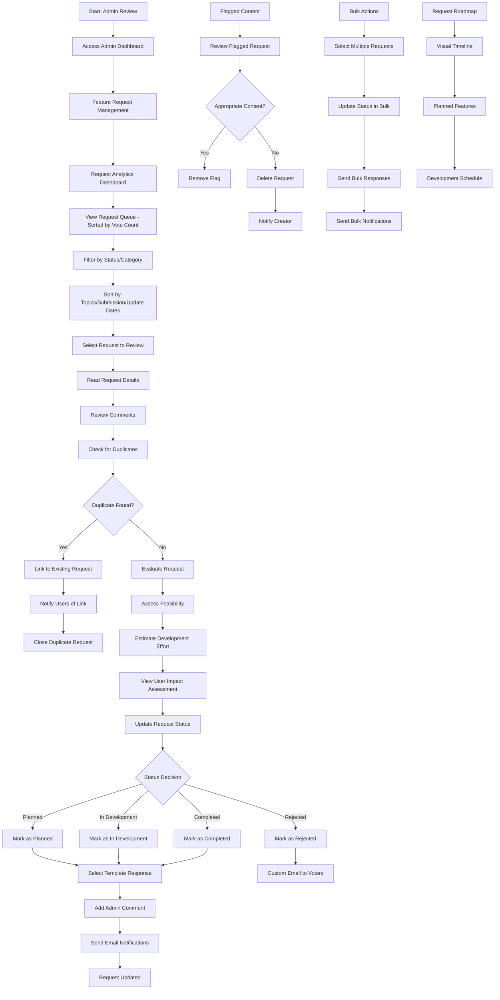
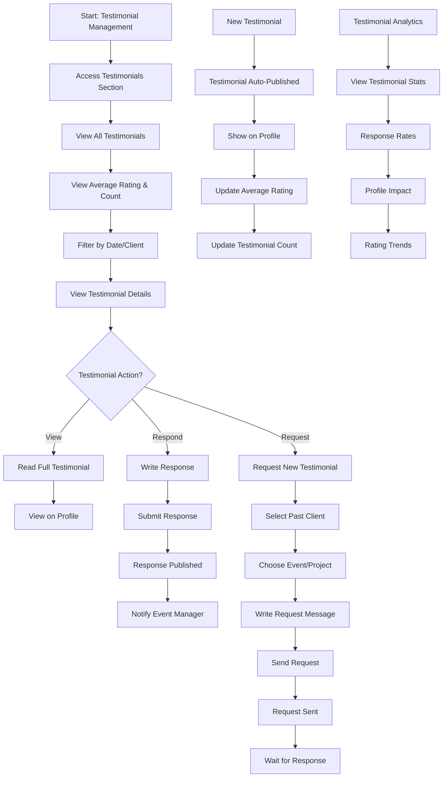
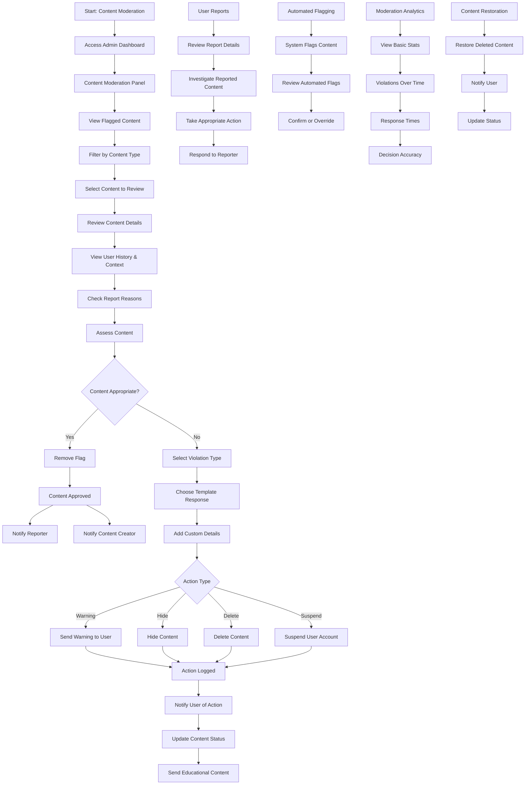
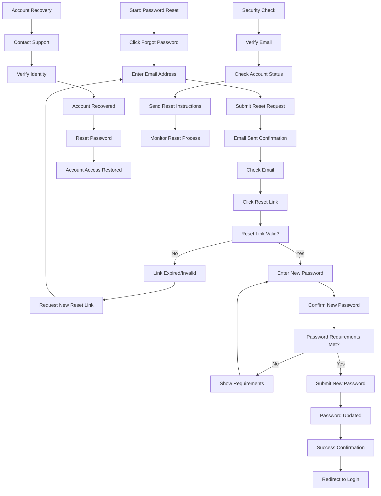

# Missing User Flows for Front-End Specification

## Flow 1: Admin - Review Feature Requests

**User Goal:** Review, manage, and respond to feature requests from the community

**Entry Points:**

- Admin Dashboard "Feature Request Management" section
- Direct navigation to admin feature request panel
- Email notification about new feature requests
- Admin notification about flagged requests

**Success Criteria:**

- Review all submitted feature requests
- Categorize and prioritize requests
- Respond to user comments and questions
- Update request status appropriately
- Manage duplicate and inappropriate content

**Flow Diagram:**

**Edge Cases & Error Handling:**

- High volume of requests
- Inappropriate content requiring immediate attention
- Duplicate request detection failures
- Notification delivery failures
- Bulk action errors
- User complaints about decisions
- Template response failures
- Roadmap update conflicts

**Notes:**

- **Request Queue**: Prioritized by vote count, then admin discretion
- **Filtering/Sorting**: By status, category, topics, submission dates, update dates
- **Response Time**: 2-week expected response time
- **Bulk Actions**: Multiple status updates and bulk responses
- **Escalation**: Custom email to voters for rejected high-vote requests
- **Analytics**: Trends, popular categories, admin workload metrics
- **Templates**: Pre-written responses for common scenarios
- **Auto-Categorization**: System suggests categories based on content
- **User Impact**: Admin-only view of user benefit metrics
- **Development Effort**: Admin estimation of implementation complexity
- **Roadmap**: Visual timeline of planned features
- **Content Moderation**: Flag and remove inappropriate content
- **Notification System**: Keep users informed of status changes
- **Audit Trail**: Log all admin actions for accountability

## Flow 2: Contractor - Managing Testimonials and Reviews

**User Goal:** Manage testimonials received from event managers and request new testimonials

**Entry Points:**

- Contractor Dashboard "Testimonials" section
- Relationship Management "Testimonials" tab
- Email notification about new testimonials
- Profile Management "Testimonials" section

**Success Criteria:**

- View all received testimonials
- Request testimonials from past clients
- Respond to testimonials
- See testimonial impact on profile

**Flow Diagram:**

**Edge Cases & Error Handling:**

- Testimonial request failures
- Client not responding to requests
- Inappropriate testimonial content
- Testimonial display errors
- Response submission failures
- Client contact information issues

**Notes:**

- **Testimonial Status**: Requested, Published
- **Auto-Publishing**: All testimonials get published immediately
- **Profile Summary**: Shows average rating and count in brackets
- **Request System**: Send requests to past clients
- **Response Functionality**: Contractors can respond to testimonials
- **Analytics**: Track testimonial performance and response rates
- **Client Verification**: Verification tick for confirmed events
- **Template System**: Contractors can create custom request templates
- **Rating Breakdown**: Show rating distribution (5 stars, 4 stars, etc.)
- **Recent Testimonials**: Highlight most recent testimonials on profile
- **Notifications**: Notify contractors when new testimonials are received
- **Automated Reminders**: 24h → 2 days → 3 days reminder sequence

## Flow 3: Admin - Content Moderation and Reporting

**User Goal:** Moderate platform content and handle user reports to maintain platform quality

**Entry Points:**

- Admin Dashboard "Content Moderation" section
- Email notification about flagged content
- Direct reports from users
- System alerts about suspicious activity

**Success Criteria:**

- Review and moderate flagged content
- Handle user reports appropriately
- Maintain platform quality standards
- Take appropriate action on violations

**Flow Diagram:**

**Edge Cases & Error Handling:**

- High volume of flagged content
- Conflicting reports on same content
- System errors during content review
- False positive flagging
- User harassment through reporting
- Template response failures
- Content restoration errors

**Notes:**

- **Content Types**: Profiles, testimonials, job postings, feature requests, messages
- **Violation Types**: Inappropriate content, spam, harassment, fake information, policy violations
- **Action Types**: Warning, hide content, delete content, suspend account
- **Template Responses**: Pre-written responses for common moderation actions
- **User Context**: Show related content and user history for better decisions
- **Educational Content**: Send educational material with warnings
- **Automated Flagging**: System flags obvious violations automatically
- **Basic Analytics**: Track violations over time, response times, decision accuracy
- **Content Restoration**: Can restore deleted content if needed
- **User Notifications**: Notify users when content is flagged
- **Flag Removal**: Notify both content creator and reporter when flag is removed
- **Audit Trail**: Log all moderation actions
- **User Communication**: Clear explanations with violation type and details

## Flow 4: Cross-Platform - Password Reset and Account Recovery

**User Goal:** Reset forgotten password and recover account access

**Entry Points:**

- Login modal "Forgot Password" link
- Password reset email
- Account recovery page
- Support contact for account issues

**Success Criteria:**

- Successfully reset password
- Regain access to account
- Secure account recovery process
- Clear confirmation of successful reset

**Flow Diagram:**

**Edge Cases & Error Handling:**

- Invalid email address
- Reset link expiration
- Password requirements not met
- Account locked or suspended
- Email delivery failures
- Multiple reset requests
- Suspicious activity detection

**Notes:**

- **Email Verification**: Verify email before sending reset link
- **Link Expiration**: Reset links expire after 24 hours
- **Password Requirements**: Strong password requirements
- **Security Monitoring**: Monitor for suspicious reset attempts
- **Account Status**: Check if account is active before reset
- **Multiple Requests**: Limit reset requests to prevent abuse
- **Success Confirmation**: Clear confirmation of successful reset
- **Support Contact**: Alternative recovery method through support
